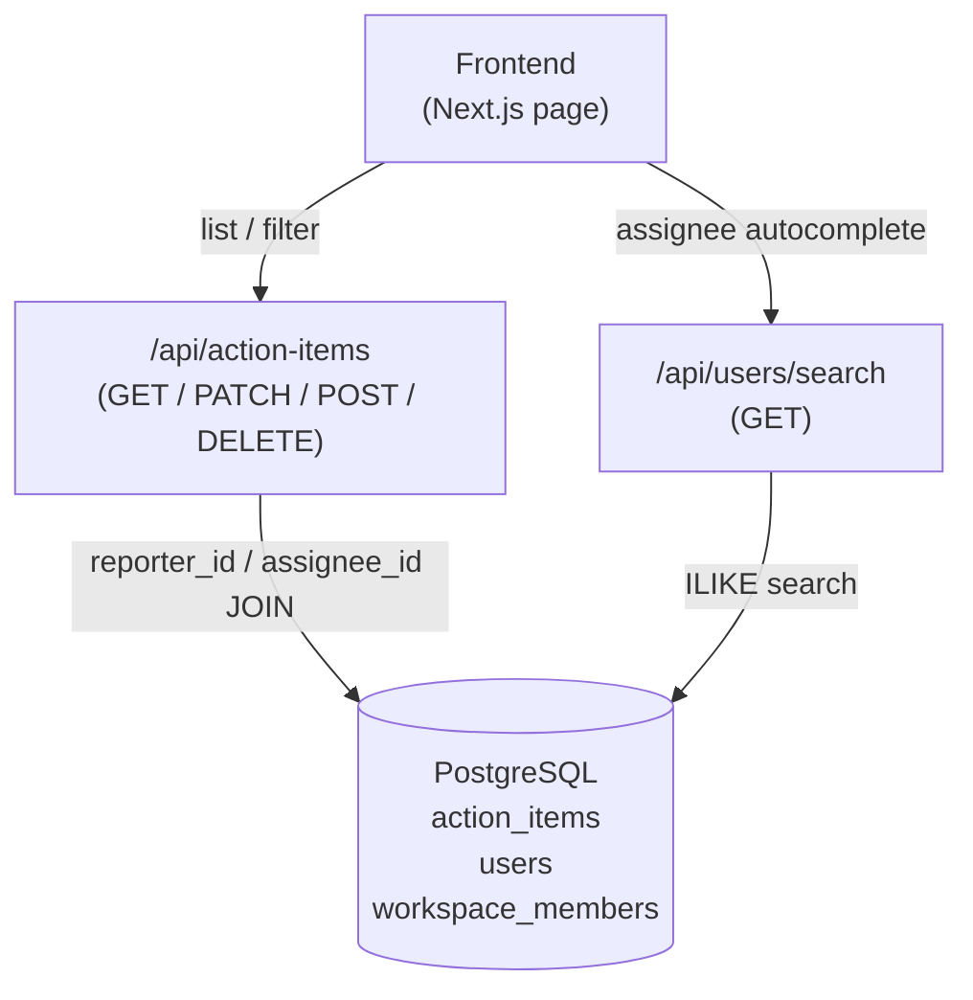

# Design Document: Action Items Reporter / Assignee

## Overview

This feature refactors the `action_items` table to separate the **reporter** (the user who created the item) from the **assignee** (the user responsible for completing it). Currently `user_id` conflates both roles, so the assignee column always shows the meeting recorder. The change mirrors the Jira reporter/assignee pattern.

The scope covers:
- A SQL migration that renames `user_id` → `reporter_id` and adds a nullable `assignee_id` FK.
- Drizzle schema update to match.
- Backend API changes: updated query logic, new authorization rules for `assignee_id`, and a `GET /api/users/search` endpoint.
- Frontend changes: `AssigneeCell` component with searchable dropdown, new "Assigned to Me" and "Created by Me" tabs.

## Architecture



The backend remains a single Express API. No new services are introduced. The migration runs once via `psql` or the existing migration runner.

## Components and Interfaces

### 1. DB Migration (`migration_reporter_assignee.sql`)

A single idempotent SQL file:

```sql
-- Step 1: rename user_id → reporter_id (no-op if already renamed)
DO $$
BEGIN
  IF EXISTS (
    SELECT 1 FROM information_schema.columns
    WHERE table_name = 'action_items' AND column_name = 'user_id'
  ) THEN
    ALTER TABLE action_items RENAME COLUMN user_id TO reporter_id;
  END IF;
END $$;

-- Step 2: add assignee_id if not present
ALTER TABLE action_items
  ADD COLUMN IF NOT EXISTS assignee_id UUID REFERENCES users(id) ON DELETE SET NULL;

-- Step 3: seed assignee_id from reporter_id for existing rows
UPDATE action_items
SET assignee_id = reporter_id
WHERE assignee_id IS NULL;
```

Idempotency is achieved via `IF EXISTS` / `ADD COLUMN IF NOT EXISTS` guards and the conditional `UPDATE`.

### 2. Drizzle Schema (`backend/express-api/src/db/schema/action-items.ts`)

```typescript
export const actionItems = pgTable("action_items", {
  id: uuid("id").defaultRandom().primaryKey(),
  task: text("task").notNull(),
  owner: text("owner").notNull().default("Unassigned"),
  dueDate: text("due_date").notNull().default("Not specified"),
  priority: varchar("priority", { length: 20 }).notNull().default("Medium"),
  completed: boolean("completed").notNull().default(false),
  status: varchar("status", { length: 50 }).notNull().default("pending"),
  meetingId: uuid("meeting_id").references(() => meetingSessions.id, { onDelete: "cascade" }),
  meetingTitle: text("meeting_title"),
  workspaceId: uuid("workspace_id").references(() => workspaces.id, { onDelete: "set null" }),
  reporterId: uuid("reporter_id").notNull().references(() => users.id, { onDelete: "cascade" }),
  assigneeId: uuid("assignee_id").references(() => users.id, { onDelete: "set null" }),
  source: varchar("source", { length: 50 }).notNull().default("meeting"),
  completedAt: timestamp("completed_at", { withTimezone: true }),
  createdAt: timestamp("created_at", { withTimezone: true }).defaultNow().notNull(),
  updatedAt: timestamp("updated_at", { withTimezone: true }).defaultNow().notNull(),
});
```

Key changes from current schema:
- `userId` → `reporterId` (column `reporter_id`)
- New `assigneeId` (column `assignee_id`, nullable FK to `users`)

### 3. `GET /api/action-items/by-user/:userId`

Updated query logic:

| Context | Condition |
|---|---|
| Personal mode (`me`, no workspace header) | `(reporter_id = userId OR assignee_id = userId) AND workspace_id IS NULL` |
| Workspace + Member | `workspace_id = X AND (reporter_id = userId OR assignee_id = userId)` |
| Workspace + Admin | `workspace_id = X` (all items) |
| Workspace + Viewer | `workspace_id = X` (read-only, all items) |

Tab overrides:
- `tab=assigned_to_me` → add `assignee_id = requesterId`
- `tab=created_by_me` → add `reporter_id = requesterId`
- `tab=high_priority` → add `priority = 'High'`
- `tab=completed` → add `status = 'done'`

The JOIN for display names changes from `LEFT JOIN users u ON u.id = ai.user_id` to:
```sql
LEFT JOIN users assignee ON assignee.id = ai.assignee_id
LEFT JOIN users reporter ON reporter.id = ai.reporter_id
```
Response includes `assignee_name`, `assignee_email` (from `assignee` alias) and `reporter_name` (from `reporter` alias).

### 4. `GET /api/action-items` (list endpoint)

Same OR logic as above for non-admin members and personal mode. The existing `memberId` admin filter switches from `ai.user_id = memberId` to `(ai.reporter_id = memberId OR ai.assignee_id = memberId)`.

### 5. `PATCH /api/action-items/:id`

Authorization matrix for `assignee_id` field:

| Requester | Allowed? |
|---|---|
| Admin | ✅ any user in workspace |
| Reporter (item creator) | ✅ any user |
| Member (not reporter) | ❌ HTTP 403 |
| Viewer | ❌ HTTP 403 |
| Unauthenticated | ❌ HTTP 401 |

`reporter_id` is stripped from the update payload unconditionally — it is never written by PATCH.

Validation: if `assignee_id` is provided and non-null, verify the target user exists in `users`; return HTTP 422 if not found.

The `fieldMap` in the existing PATCH handler gains:
```typescript
assigneeId: "assignee_id"
```
And `reporter_id` is explicitly excluded from `allowedFields`.

### 6. `GET /api/users/search`

The endpoint already exists at `backend/express-api/src/routes/users.ts` but needs updates to match requirements:

Current gaps vs. requirements:
- Returns `name` (aliased) instead of `full_name` — needs to return `id`, `full_name`, `email`.
- Minimum query length is 2 chars; requirement says 1 char — update threshold.
- No workspace scoping — add `x-workspace-id` header support.
- Result limit is 8; requirement says 20 — update.
- Missing HTTP 400 for absent/empty `q`.

Updated behaviour:
```
GET /api/users/search?q=<term>
Headers: x-workspace-id (optional)

Response 200: { users: [{ id, full_name, email }] }
Response 400: { error: "q parameter is required" }  (when q absent or empty)
```

When `x-workspace-id` is present, restrict to workspace members via:
```sql
JOIN workspace_members wm ON wm.user_id = u.id
  AND wm.workspace_id = $workspaceId
  AND wm.status = 'active'
```

### 7. Frontend: `AssigneeCell` Component

New component `frontend/src/features/action-items/components/AssigneeCell.tsx`:

```
Props:
  item: ActionItemRow
  currentUserId: string
  role: WorkspaceRole
  onUpdate: (id: string, assigneeId: string | null) => Promise<void>
```

Rendering logic:
- Display: `assignee_name` → `owner` → "Unassigned" (priority order)
- Clickable (opens dropdown) only when: `role === 'admin'` OR `item.reporter_id === currentUserId`
- Dropdown calls `GET /api/users/search?q=<input>` with 400ms debounce
- On select: calls `onUpdate` → `PATCH /api/action-items/:id { assignee_id }`
- Optimistic update on success; revert + error toast on failure

### 8. Frontend: Updated `loadItems` and Tabs

New tab type:
```typescript
type ActionItemTab = "all" | "assigned_to_me" | "created_by_me" | "high_priority" | "completed";
```

Tab → API mapping:
- `assigned_to_me` → `GET /api/action-items/by-user/me?tab=assigned_to_me`
- `created_by_me` → `GET /api/action-items/by-user/me?tab=created_by_me`

The `loadItems` function passes `tab` as a query param; the backend applies the appropriate filter.

Empty state messages:
- `assigned_to_me` → "No items assigned to you"
- `created_by_me` → "No items created by you"

## Data Models

### `action_items` table (post-migration)

| Column | Type | Nullable | Notes |
|---|---|---|---|
| `id` | uuid | NOT NULL | PK |
| `task` | text | NOT NULL | |
| `owner` | text | NOT NULL | AI-extracted free text, display fallback |
| `due_date` | text | NOT NULL | |
| `priority` | varchar(20) | NOT NULL | |
| `completed` | boolean | NOT NULL | |
| `status` | varchar(50) | NOT NULL | |
| `meeting_id` | uuid | NULL | FK → meeting_sessions |
| `meeting_title` | text | NULL | |
| `workspace_id` | uuid | NULL | FK → workspaces |
| `reporter_id` | uuid | NOT NULL | FK → users (renamed from user_id) |
| `assignee_id` | uuid | NULL | FK → users, ON DELETE SET NULL |
| `source` | varchar(50) | NOT NULL | |
| `completed_at` | timestamptz | NULL | |
| `created_at` | timestamptz | NOT NULL | |
| `updated_at` | timestamptz | NOT NULL | |

### API Response Shape (`ActionItemRow`)

```typescript
type ActionItemRow = {
  id: string;
  task: string;
  owner: string;
  due_date: string;
  priority: string;
  status: string;
  source: string;
  meeting_title: string | null;
  meeting_id: string | null;
  created_at: string;
  reporter_id: string;
  reporter_name: string | null;
  assignee_id: string | null;
  assignee_name: string | null;
  assignee_email: string | null;
};
```

Note: `user_id` is removed from the response shape. Frontend references to `item.user_id` must be updated to `item.reporter_id`.

### User Search Response

```typescript
type UserSearchResult = {
  id: string;
  full_name: string | null;
  email: string;
};
```


## Correctness Properties

*A property is a characteristic or behavior that should hold true across all valid executions of a system — essentially, a formal statement about what the system should do. Properties serve as the bridge between human-readable specifications and machine-verifiable correctness guarantees.*

### Property 1: Migration seeds assignee_id from reporter_id

*For any* row that existed in `action_items` before the migration runs, after the migration completes that row's `assignee_id` SHALL equal its `reporter_id`.

**Validates: Requirements 1.3**

---

### Property 2: Migration idempotence

*For any* database state after the migration has been applied once, running the migration a second time SHALL produce an identical schema and identical row data — no errors, no duplicate columns, no data changes.

**Validates: Requirements 1.5**

---

### Property 3: reporter_id is always the authenticated user on creation

*For any* POST or bulk-save request (with or without a client-supplied `reporter_id` field), the resulting action item's `reporter_id` SHALL equal the authenticated user's ID.

**Validates: Requirements 2.1, 13.1**

---

### Property 4: reporter_id is immutable under PATCH

*For any* action item and *any* PATCH request body (including one that explicitly sets `reporter_id`), the item's `reporter_id` value after the PATCH SHALL equal its value before the PATCH.

**Validates: Requirements 2.2, 2.3, 13.3**

---

### Property 5: Authorized users can update assignee_id

*For any* action item and *any* PATCH request that includes `assignee_id`, if the requester is an Admin OR the requester is the item's Reporter, the API SHALL return HTTP 200 and the item's `assignee_id` SHALL reflect the new value.

**Validates: Requirements 3.1, 3.2, 12.1**

---

### Property 6: Unauthorized roles cannot update assignee_id

*For any* action item and *any* PATCH request that includes `assignee_id`, if the requester is a Member who is not the Reporter OR the requester is a Viewer, the API SHALL return HTTP 403 and the item's `assignee_id` SHALL remain unchanged.

**Validates: Requirements 3.3, 3.4, 12.2, 12.3**

---

### Property 7: Invalid assignee_id returns 422

*For any* PATCH request that includes an `assignee_id` value that does not correspond to an existing row in the `users` table, the API SHALL return HTTP 422.

**Validates: Requirements 3.6**

---

### Property 8: Personal mode visibility invariant

*For any* user U and *any* set of action items in the database, every item returned by a personal-mode query (no `x-workspace-id` header) SHALL satisfy `reporter_id = U OR assignee_id = U`, and SHALL have `workspace_id IS NULL`.

**Validates: Requirements 4.1, 4.5, 5.1**

---

### Property 9: Workspace member visibility invariant

*For any* workspace X, *any* Member M of that workspace, and *any* set of action items in the database, every item returned by a workspace-mode query for M SHALL satisfy `workspace_id = X AND (reporter_id = M OR assignee_id = M)`.

**Validates: Requirements 4.2, 4.6, 6.2**

---

### Property 10: Workspace admin/viewer sees all workspace items

*For any* workspace X and *any* Admin or Viewer of that workspace, every item returned by a workspace-mode query SHALL satisfy `workspace_id = X`, with no additional reporter/assignee filter applied.

**Validates: Requirements 4.3, 4.4, 6.1, 6.3**

---

### Property 11: Non-member gets 403

*For any* workspace X and *any* user who is not an active member of X, a workspace-mode request for action items in X SHALL return HTTP 403.

**Validates: Requirements 6.4**

---

### Property 12: User search returns only matching users

*For any* non-empty search term `q`, every user returned by `GET /api/users/search?q=<term>` SHALL have `full_name ILIKE '%q%' OR email ILIKE '%q%'`, and the result count SHALL NOT exceed 20.

**Validates: Requirements 7.2, 7.4**

---

### Property 13: User search response contains only safe fields

*For any* search result, the returned user object SHALL contain exactly the fields `id`, `full_name`, and `email` — no password hashes, clerk IDs, plan data, or other sensitive fields.

**Validates: Requirements 7.3**

---

### Property 14: Workspace-scoped search restricts to workspace members

*For any* search request that includes an `x-workspace-id` header for workspace X, every returned user SHALL be an active member of workspace X.

**Validates: Requirements 7.7**

---

### Property 15: Assignee display priority

*For any* action item, the display name shown in the Assignee column SHALL follow the priority: `assignee_name` (when `assignee_id` is non-null and the JOIN resolves a name) → `owner` text (when `assignee_id` is null and `owner` is non-empty) → "Unassigned" (when both are absent/empty).

**Validates: Requirements 8.1, 8.2, 8.3, 8.4**

---

### Property 16: Assignee dropdown not rendered for unauthorized roles

*For any* action item and *any* user whose role is Viewer OR who is a Member but not the item's Reporter, the AssigneeCell component SHALL NOT render a clickable/editable dropdown — it SHALL render as read-only text.

**Validates: Requirements 9.6, 9.7**

---

### Property 17: CSV export assignee column correctness

*For any* exported action item, the `assignee_name` CSV column SHALL equal the `full_name` of the user referenced by `assignee_id` if `assignee_id` is non-null, otherwise it SHALL equal the `owner` text field. The CSV SHALL NOT contain any UUID values for `reporter_id` or `assignee_id`.

**Validates: Requirements 14.1, 14.2**

---

## Error Handling

| Scenario | HTTP Status | Response |
|---|---|---|
| Unauthenticated request | 401 | `{ error: "Unauthorized" }` |
| Non-member accesses workspace items | 403 | `{ error: "Not a member of this workspace" }` |
| Member/Viewer tries to change `assignee_id` | 403 | `{ error: "Only admins or the reporter can reassign action items" }` |
| Viewer tries any write operation | 403 | `{ error: "Viewers cannot edit action items" }` |
| `assignee_id` references non-existent user | 422 | `{ error: "Assignee user not found" }` |
| Action item not found | 404 | `{ error: "Action item not found" }` |
| `q` absent or empty on user search | 400 | `{ error: "q parameter is required and must be at least 1 character" }` |
| Free plan user on paid endpoint | 403 | `{ error: "upgrade_required", currentPlan: "free" }` |

Frontend error handling:
- Failed PATCH for assignee update: revert optimistic update, show error toast for 3 seconds.
- Failed user search: show inline "Search failed" message in dropdown, allow retry.
- 403 on any write: show toast "You don't have permission to do that."

## Testing Strategy

### Unit Tests

Focus on specific examples, edge cases, and integration points:

- Migration: verify schema before/after, verify idempotence by running twice.
- `PATCH /:id` authorization: specific examples for each role (admin, reporter, non-reporter member, viewer, unauthenticated).
- `GET /api/users/search`: empty `q` returns 400; workspace header restricts results; result shape contains only safe fields.
- `AssigneeCell` rendering: item with assignee_id shows name; item with null assignee_id and owner shows owner; item with both null shows "Unassigned".
- Tab empty states: "Assigned to Me" with no results shows correct message; "Created by Me" with no results shows correct message.

### Property-Based Tests

Use **fast-check** (TypeScript/Node) for backend properties and **fast-check** with React Testing Library for frontend properties.

Each property test runs a minimum of **100 iterations**.

Tag format: `// Feature: action-items-reporter-assignee, Property <N>: <property_text>`

| Property | Test description | Library |
|---|---|---|
| P1 | Generate N rows, run migration, assert all `assignee_id = reporter_id` | fast-check (integration) |
| P2 | Run migration twice on arbitrary DB state, assert schema/data identical | fast-check (integration) |
| P3 | Generate arbitrary POST bodies (with/without reporter_id), assert result.reporter_id = auth user | fast-check |
| P4 | Generate arbitrary PATCH bodies including reporter_id, assert item.reporter_id unchanged | fast-check |
| P5 | Generate items + admin/reporter requesters + valid assignee_ids, assert 200 + updated value | fast-check |
| P6 | Generate items + non-reporter members/viewers + assignee_ids, assert 403 + unchanged value | fast-check |
| P7 | Generate random UUIDs not in users table, assert PATCH returns 422 | fast-check |
| P8 | Generate arbitrary item sets for user U, query personal mode, assert all satisfy OR condition | fast-check |
| P9 | Generate arbitrary item sets for workspace X + member M, assert all returned items satisfy workspace+OR | fast-check |
| P10 | Generate arbitrary item sets for workspace X + admin, assert all returned items have workspace_id = X | fast-check |
| P11 | Generate arbitrary non-member users, assert workspace query returns 403 | fast-check |
| P12 | Generate arbitrary search terms + user data, assert all results match term and count ≤ 20 | fast-check |
| P13 | Generate arbitrary search results, assert response objects have exactly {id, full_name, email} | fast-check |
| P14 | Generate arbitrary workspace + search term, assert all results are workspace members | fast-check |
| P15 | Generate arbitrary ActionItemRow values, assert display name follows priority order | fast-check |
| P16 | Generate arbitrary items + viewer/non-reporter-member users, assert dropdown not rendered | fast-check + RTL |
| P17 | Generate arbitrary item sets, export CSV, assert assignee_name column and no UUID columns | fast-check |

**Property test configuration example:**

```typescript
// Feature: action-items-reporter-assignee, Property 8: Personal mode visibility invariant
it("personal mode returns only items for the querying user", () => {
  fc.assert(
    fc.asyncProperty(
      fc.array(arbitraryActionItem(), { minLength: 0, maxLength: 50 }),
      fc.uuid(),
      async (items, userId) => {
        await seedItems(items);
        const result = await getActionItemsPersonal(userId);
        return result.every(
          (item) => item.reporter_id === userId || item.assignee_id === userId
        );
      }
    ),
    { numRuns: 100 }
  );
});
```
