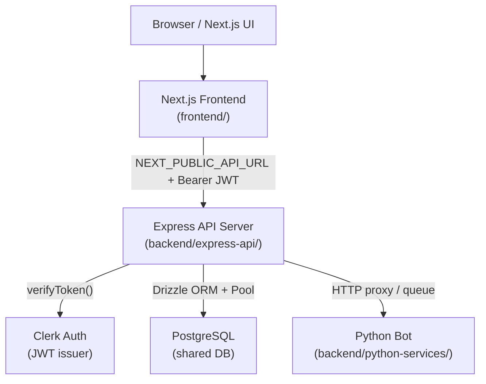

# Design Document: Backend API Migration

## Overview

This migration moves all API logic from Next.js API routes (`frontend/src/app/api/`) into a standalone Express.js server at `backend/express-api/`. The frontend becomes a pure UI layer that communicates with the Express server over HTTP using a Clerk JWT in the `Authorization` header.

The primary goals are:
- Decouple API logic from the Next.js runtime to enable independent scaling and deployment
- Reduce response times from the current 3–4 seconds to under 500ms
- Preserve all existing response shapes so no UI component changes are required
- Maintain incremental migration safety — Next.js routes remain live until each Express route is verified

The Python bot in `backend/python-services/` is out of scope and must not be modified.

---

## Architecture

### High-Level Topology



### Migration Strategy: Incremental (Not Big Bang)

Routes are migrated domain by domain. During migration, the frontend uses a feature-flag-style approach: each API call targets `NEXT_PUBLIC_API_URL` for migrated routes while unmigrated routes continue to be served by Next.js. The Next.js route files are deleted only after the corresponding Express route is verified in staging.

Migration order (lowest risk first):
1. Health + Auth/User Sync (Req 1, 2, 6)
2. Settings (Req 9)
3. Recordings (Req 10)
4. Action Items (Req 8)
5. Workspaces (Req 7)
6. Meetings (Req 3)
7. Calendar (Req 4)
8. Integrations (Req 5)

---

## Components and Interfaces

### Folder / File Organization

```
backend/express-api/
├── src/
│   ├── index.ts                  # Entry point — creates app, starts server
│   ├── app.ts                    # Express app factory (exported for testing)
│   ├── config.ts                 # Env var validation and typed config object
│   ├── db/
│   │   ├── client.ts             # Drizzle + pg Pool setup (min 2, max 10)
│   │   └── schema/               # Symlink or copy of frontend/src/db/schema/
│   ├── middleware/
│   │   ├── clerk-auth.ts         # JWT extraction, verification, user-sync
│   │   ├── error-handler.ts      # Global Express error handler
│   │   ├── request-logger.ts     # Structured JSON request logging
│   │   └── rate-limiter.ts       # express-rate-limit (100 req/min per user)
│   ├── routes/
│   │   ├── health.ts             # GET /health
│   │   ├── meetings.ts           # /api/meetings/*
│   │   ├── calendar.ts           # /api/calendar/*
│   │   ├── integrations.ts       # /api/integrations/*
│   │   ├── webhooks.ts           # /api/webhooks/clerk
│   │   ├── profile.ts            # /api/profile/me
│   │   ├── workspaces.ts         # /api/workspaces/* and /api/workspace/*
│   │   ├── action-items.ts       # /api/action-items/*
│   │   ├── settings.ts           # /api/settings/*
│   │   └── recordings.ts         # /api/recordings/*
│   └── lib/
│       ├── user-sync-cache.ts    # In-memory TTL cache (clerkUserId → AppUser)
│       ├── bot-client.ts         # HTTP client for Python bot endpoints
│       └── errors.ts             # Typed error classes (AppError, NotFoundError, etc.)
├── package.json
├── tsconfig.json
└── .env.example
```

### Key Interfaces

#### `config.ts` — Typed Environment Config

```typescript
export interface Config {
  port: number;                  // PORT env var, default 3001
  databaseUrl: string;           // DATABASE_URL (required, fatal if missing)
  allowedOrigins: string[];      // ALLOWED_ORIGINS (comma-separated)
  clerkSecretKey: string;        // CLERK_SECRET_KEY
  clerkWebhookSecret: string;    // CLERK_WEBHOOK_SECRET
  recordingsDir: string;         // RECORDINGS_DIR, default ./private/recordings
  botBaseUrl: string;            // BOT_BASE_URL for Python bot HTTP interface
}
```

#### `middleware/clerk-auth.ts` — JWT Middleware

```typescript
// Attaches to req after successful verification
declare global {
  namespace Express {
    interface Request {
      clerkUserId: string;
      appUser: AppUser;          // populated after user-sync
    }
  }
}

export async function clerkAuth(req: Request, res: Response, next: NextFunction): Promise<void>
```

Flow:
1. Extract `Authorization: Bearer <token>` header
2. Call `@clerk/backend` `verifyToken(token, { secretKey })` 
3. On failure → 401 `{ "error": "Unauthorized" }`
4. On success → attach `clerkUserId` to `req`
5. Call `syncUser(clerkUserId)` — checks in-memory cache first, upserts to DB if miss
6. Attach `appUser` to `req`, call `next()`

#### `lib/user-sync-cache.ts` — In-Memory Cache

```typescript
interface CacheEntry {
  user: AppUser;
  expiresAt: number;
}

const cache = new Map<string, CacheEntry>();
const TTL_MS = 60_000; // 60 seconds

export function getCachedUser(clerkUserId: string): AppUser | null
export function setCachedUser(clerkUserId: string, user: AppUser): void
export async function syncUser(clerkUserId: string, db: DrizzleDB): Promise<AppUser>
```

This mirrors the existing pattern in `frontend/src/lib/auth/current-user.ts` but adapted for Express middleware context.

#### `db/client.ts` — Connection Pool

```typescript
import { drizzle } from "drizzle-orm/node-postgres";
import { Pool } from "pg";

const pool = new Pool({
  connectionString: config.databaseUrl,
  min: 2,
  max: 10,
  idleTimeoutMillis: 30_000,
  connectionTimeoutMillis: 5_000,
});

export const db = drizzle(pool);
```

#### `lib/errors.ts` — Typed Error Classes

```typescript
export class AppError extends Error {
  constructor(public statusCode: number, message: string) { super(message); }
}
export class NotFoundError extends AppError {
  constructor(message = "Not found") { super(404, message); }
}
export class ForbiddenError extends AppError {
  constructor(message = "Forbidden") { super(403, message); }
}
export class UnauthorizedError extends AppError {
  constructor(message = "Unauthorized") { super(401, message); }
}
export class BadRequestError extends AppError {
  constructor(message: string) { super(400, message); }
}
```

### Route Organization

All routes are registered in `app.ts`:

```typescript
app.use("/health", healthRouter);
app.use("/api/meetings", clerkAuth, rateLimiter, meetingsRouter);
app.use("/api/calendar", clerkAuth, rateLimiter, calendarRouter);
app.use("/api/integrations", clerkAuth, rateLimiter, integrationsRouter);
app.use("/api/webhooks", webhooksRouter);          // no clerkAuth — Svix-signed
app.use("/api/profile", clerkAuth, rateLimiter, profileRouter);
app.use("/api/workspaces", clerkAuth, rateLimiter, workspacesRouter);
app.use("/api/workspace", clerkAuth, rateLimiter, workspacesRouter);
app.use("/api/action-items", clerkAuth, rateLimiter, actionItemsRouter);
app.use("/api/settings", clerkAuth, rateLimiter, settingsRouter);
app.use("/api/recordings", clerkAuth, rateLimiter, recordingsRouter);
app.use(errorHandler);
```

### Frontend API Client Changes

A new `frontend/src/lib/api-client.ts` module wraps all Express API calls:

```typescript
const BASE_URL = process.env.NEXT_PUBLIC_API_URL;
if (!BASE_URL) throw new Error("NEXT_PUBLIC_API_URL is not configured");

export async function apiFetch(
  path: string,
  init?: RequestInit & { workspaceId?: string }
): Promise<Response> {
  const { getToken } = auth();
  const token = await getToken();

  const headers = new Headers(init?.headers);
  headers.set("Authorization", `Bearer ${token}`);
  headers.set("Content-Type", "application/json");
  if (init?.workspaceId) headers.set("x-workspace-id", init.workspaceId);

  return fetch(`${BASE_URL}${path}`, { ...init, headers });
}
```

Existing `workspaceFetch` calls are updated to use `apiFetch` with the workspace ID parameter. Response shapes are preserved exactly — no UI component changes required.

---

## Data Models

The Express server shares the same Drizzle schema as the frontend. The `backend/express-api/src/db/schema/` directory references the same schema files (via a shared package or symlink) to avoid duplication.

### Core Tables (existing, unchanged)

**users**
```
id: uuid PK
clerkUserId: varchar(255) UNIQUE NOT NULL
email: varchar(255) UNIQUE NOT NULL
fullName: varchar(255)
plan: varchar(50) DEFAULT 'free'
createdAt, updatedAt: timestamptz
```

**meeting_sessions**
```
id: uuid PK
userId: uuid FK → users.id
workspaceId: uuid FK → workspaces.id (nullable)
status: varchar(50) DEFAULT 'draft'
visibility: varchar(20) DEFAULT 'workspace'
sharedWithUserIds: jsonb DEFAULT '[]'
recordingFilePath: text (nullable)
scheduledStartTime, scheduledEndTime: timestamptz (nullable)
... (full schema in frontend/src/db/schema/meeting-sessions.ts)
```

**workspaces / workspace_members / workspace_invites**
```
workspaces.id: uuid PK
workspaces.ownerId: uuid FK → users.id
workspace_members.(workspaceId, userId): UNIQUE INDEX
workspace_members.role: varchar(50) — 'owner' | 'admin' | 'member' | 'viewer'
workspace_members.status: varchar(50) — 'active' | 'pending'
workspace_invites.token: varchar(128) UNIQUE
```

**action_items**
```
id: uuid PK
userId: uuid FK → users.id NOT NULL
meetingId: uuid FK → meeting_sessions.id (nullable)
workspaceId: uuid FK → workspaces.id (nullable)
task: text NOT NULL
status: varchar(50) DEFAULT 'pending'
source: varchar(50) DEFAULT 'meeting'
```

**user_preferences**
```
userId: uuid FK → users.id
botDisplayName: varchar
audioSource: varchar
... UI preference fields
```

### Request/Response Shapes

All responses preserve the existing Next.js API route shapes. Error responses always include at minimum `{ "error": string }`. Success responses wrap data directly (no envelope) to match existing frontend expectations.

Pagination response shape (Req 8.8):
```typescript
{
  items: ActionItem[];
  pagination: {
    total: number;
    page: number;
    limit: number;
    totalPages: number;
  }
}
```

---

## Correctness Properties

*A property is a characteristic or behavior that should hold true across all valid executions of a system — essentially, a formal statement about what the system should do. Properties serve as the bridge between human-readable specifications and machine-verifiable correctness guarantees.*


### Property 1: CORS origin allowlist

*For any* HTTP request, if the `Origin` header value is present in `ALLOWED_ORIGINS`, the response should include `Access-Control-Allow-Origin` matching that origin. If the origin is not in the list, the CORS header should be absent or set to a non-matching value.

**Validates: Requirements 1.5**

### Property 2: JSON body size enforcement

*For any* request body, if the body size is ≤ 1MB the server should parse it successfully; if the body size exceeds 1MB the server should return HTTP 413.

**Validates: Requirements 1.6**

### Property 3: Valid JWT attaches clerkUserId

*For any* valid Clerk JWT presented as a Bearer token, the middleware should decode it and attach the correct `clerkUserId` to the request context before the route handler executes.

**Validates: Requirements 2.2**

### Property 4: Missing or invalid token returns 401

*For any* protected route request that either lacks an `Authorization` header or carries an invalid/expired JWT, the server should return HTTP 401 with `{ "error": "Unauthorized" }` and never execute the route handler.

**Validates: Requirements 2.3, 2.4**

### Property 5: Authenticated request upserts user to DB

*For any* authenticated request from a Clerk user ID not yet in the DB, after the request completes the `users` table should contain a record with that `clerkUserId`.

**Validates: Requirements 2.5**

### Property 6: User-sync cache prevents redundant DB writes

*For any* pair of authenticated requests from the same `clerkUserId` within 60 seconds, the second request should not trigger a DB upsert — the cached `AppUser` should be returned instead.

**Validates: Requirements 2.6, 12.4**

### Property 7: Meetings list returns only owner's non-draft sessions

*For any* authenticated user, `GET /api/meetings` should return only meeting sessions where `userId` matches the authenticated user and `status != 'draft'`.

**Validates: Requirements 3.1**

### Property 8: Workspace scoping filters meetings by workspaceId

*For any* `GET /api/meetings?workspaceId=X` request, all returned sessions should have `workspaceId = X`, and no sessions from other workspaces or personal sessions should appear.

**Validates: Requirements 3.12**

### Property 9: Meeting access control enforces ownership and membership

*For any* meeting ID and authenticated user, `GET /api/meetings/:id` should return the session only if the user is the owner or an active workspace member with appropriate role; otherwise it should return HTTP 404.

**Validates: Requirements 3.3, 3.6**

### Property 10: Integration type validation rejects unknown types

*For any* `POST /api/integrations` request where `type` is not one of `slack`, `gmail`, `notion`, `jira`, the server should return HTTP 400 with `{ "error": "Invalid integration type" }`.

**Validates: Requirements 5.3**

### Property 11: Webhook signature validation rejects tampered requests

*For any* `POST /api/webhooks/clerk` request with missing or invalid Svix signature headers, the server should return HTTP 400 with `{ "error": "Invalid webhook signature" }` without processing the payload.

**Validates: Requirements 6.4**

### Property 12: Workspace access control returns 403 for non-members

*For any* workspace-scoped endpoint and any authenticated user who is not an active member of that workspace, the server should return HTTP 403.

**Validates: Requirements 7.7**

### Property 13: Action items list returns only the authenticated user's items

*For any* authenticated user, `GET /api/action-items` should return only `ActionItem` records where `userId` matches the authenticated user's DB ID.

**Validates: Requirements 8.1**

### Property 14: Bulk-save persists all items transactionally

*For any* array of action items submitted to `POST /api/action-items/bulk-save`, after a successful response all items in the array should be retrievable from the DB, and if any item fails the entire batch should be rolled back.

**Validates: Requirements 8.5**

### Property 15: Plan gating returns 403 with upgrade_required for restricted plans

*For any* authenticated user whose `plan` does not include action items, action item endpoints should return HTTP 403 with `{ "error": "upgrade_required", "currentPlan": "<plan>" }`.

**Validates: Requirements 8.7**

### Property 16: Pagination response includes all required fields

*For any* paginated endpoint request with `page` and `limit` parameters, the response should include a `pagination` object with `total`, `page`, `limit`, and `totalPages` fields, where `totalPages = ceil(total / limit)`.

**Validates: Requirements 8.8**

### Property 17: Recording response sets required headers

*For any* valid recording request, the response should include `Content-Type: audio/wav`, `Content-Disposition: inline; filename="recording.wav"`, and `Cache-Control: private, max-age=3600`.

**Validates: Requirements 10.2**

### Property 18: Recording access control returns 403 for unauthorized users

*For any* recording request where the authenticated user is neither the meeting owner nor listed in `sharedWithUserIds`, the server should return HTTP 403.

**Validates: Requirements 10.3**

### Property 19: Frontend API client attaches Bearer token on every request

*For any* call through the `apiFetch` client, the outgoing request should include an `Authorization: Bearer <token>` header where `<token>` is the current Clerk session JWT.

**Validates: Requirements 11.2**

### Property 20: All error responses include an "error" string field

*For any* request that results in an error response (4xx or 5xx), the response body should be valid JSON containing at minimum an `"error"` string field.

**Validates: Requirements 13.1**

### Property 21: Unhandled exceptions return HTTP 500 with correct shape

*For any* route handler that throws an unhandled exception, the global error handler should catch it and return HTTP 500 with `{ "error": "Internal server error" }` without leaking stack traces to the client.

**Validates: Requirements 13.2**

### Property 22: Request log entries include all required fields

*For any* inbound HTTP request, the structured log entry emitted after the response should include `method`, `path`, `statusCode`, and `responseTimeMs` fields.

**Validates: Requirements 1.7, 13.3**

---

## Error Handling

### Global Error Handler (`middleware/error-handler.ts`)

All route handlers use `next(err)` to propagate errors. The global handler:

1. Checks if `err` is an `AppError` instance — uses its `statusCode` and `message`
2. Checks for Drizzle/pg errors:
   - `42P01` (undefined table) or `42703` (undefined column) → HTTP 503 `{ "error": "Database migration required" }`
   - Connection errors → HTTP 503 `{ "error": "Service unavailable" }`
3. All other errors → HTTP 500 `{ "error": "Internal server error" }`, logs full stack trace
4. Never exposes stack traces or internal error details in the response body

### Validation Errors

Route handlers use `zod` schemas for request body validation. On `ZodError`, the handler calls `next(new BadRequestError(zodError.message))` which the global handler converts to HTTP 400.

### Not Found Handler

A catch-all route after all routers returns HTTP 404 `{ "error": "Not found" }` for unmatched paths.

### Rate Limiting

`express-rate-limit` is configured with:
- `windowMs: 60_000` (1 minute)
- `max: 100`
- `keyGenerator: (req) => req.clerkUserId ?? req.ip`
- `handler: (req, res) => res.status(429).json({ "error": "Too many requests" })`

Applied after `clerkAuth` so the key is the authenticated user ID, not IP.

---

## Testing Strategy

### Dual Testing Approach

Both unit tests and property-based tests are required. They are complementary:
- Unit tests catch concrete bugs with specific inputs and verify integration points
- Property tests verify universal correctness across randomized inputs

### Unit Tests

Focus areas:
- `GET /health` returns 200 with `{ "status": "ok" }` (Req 1.4)
- Server exits with non-zero code when `DATABASE_URL` is missing (Req 1.3)
- Webhook returns 503 when `CLERK_WEBHOOK_SECRET` is not set (Req 6.3)
- `NEXT_PUBLIC_API_URL` missing throws at module load time (Req 11.4)
- DB pool is configured with `min: 2, max: 10` (Req 12.3)
- Rate limiter returns 429 after 100 requests in a minute (Req 13.5)
- Calendar provider validation returns 400 for unsupported providers (Req 4.5)

### Property-Based Tests

**Library**: `fast-check` (TypeScript-native, no additional runtime dependencies)

**Configuration**: Each property test runs a minimum of 100 iterations (`numRuns: 100`).

**Tag format**: Each test is tagged with a comment:
```
// Feature: backend-api-migration, Property N: <property_text>
```

Property test mapping:

| Property | Test Description | fast-check Arbitraries |
|----------|-----------------|----------------------|
| P1 | CORS origin allowlist | `fc.webUrl()` for origins |
| P2 | JSON body size limit | `fc.string()` sized around 1MB boundary |
| P3 | Valid JWT → clerkUserId attached | `fc.record({ sub: fc.uuid() })` for JWT payload |
| P4 | Missing/invalid token → 401 | `fc.option(fc.string())` for auth header |
| P5 | Authenticated request upserts user | `fc.record({ clerkUserId: fc.uuid(), email: fc.emailAddress() })` |
| P6 | Cache prevents redundant DB writes | `fc.uuid()` for clerkUserId, time-mocked |
| P7 | Meetings list: owner + non-draft only | `fc.array(fc.record({ userId: fc.uuid(), status: fc.string() }))` |
| P8 | Workspace scoping filters correctly | `fc.uuid()` for workspaceId |
| P9 | Meeting access control | `fc.record({ ownerId: fc.uuid(), requesterId: fc.uuid() })` |
| P10 | Integration type validation | `fc.string()` for type field |
| P11 | Webhook signature validation | `fc.record({ headers: fc.dictionary(...) })` |
| P12 | Workspace 403 for non-members | `fc.uuid()` for userId and workspaceId |
| P13 | Action items ownership | `fc.array(fc.record({ userId: fc.uuid() }))` |
| P14 | Bulk-save transactional correctness | `fc.array(fc.record({ task: fc.string() }), { minLength: 1 })` |
| P15 | Plan gating | `fc.constantFrom('free', 'basic')` for restricted plans |
| P16 | Pagination shape | `fc.integer({ min: 1 })` for page/limit |
| P17 | Recording response headers | `fc.uuid()` for meetingId |
| P18 | Recording access control | `fc.record({ ownerId: fc.uuid(), requesterId: fc.uuid() })` |
| P19 | Frontend Bearer token attachment | `fc.string()` for JWT token |
| P20 | Error responses have "error" field | `fc.constantFrom(400, 401, 403, 404, 500)` for status codes |
| P21 | Unhandled exceptions → 500 | `fc.string()` for error message thrown |
| P22 | Request log fields | `fc.record({ method: fc.constantFrom('GET','POST','PATCH','DELETE'), path: fc.webPath() })` |

### Test File Organization

```
backend/express-api/src/__tests__/
├── unit/
│   ├── health.test.ts
│   ├── config.test.ts
│   ├── rate-limiter.test.ts
│   └── calendar-provider-validation.test.ts
└── property/
    ├── cors.property.test.ts
    ├── auth-middleware.property.test.ts
    ├── user-sync-cache.property.test.ts
    ├── meetings.property.test.ts
    ├── action-items.property.test.ts
    ├── recordings.property.test.ts
    ├── error-handler.property.test.ts
    └── api-client.property.test.ts
```

Each property test file imports the relevant module under test in isolation (no live DB or Clerk calls) using dependency injection and mocks for external services.
