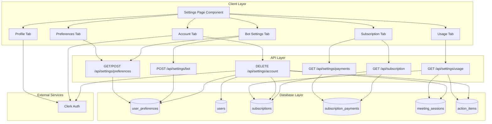
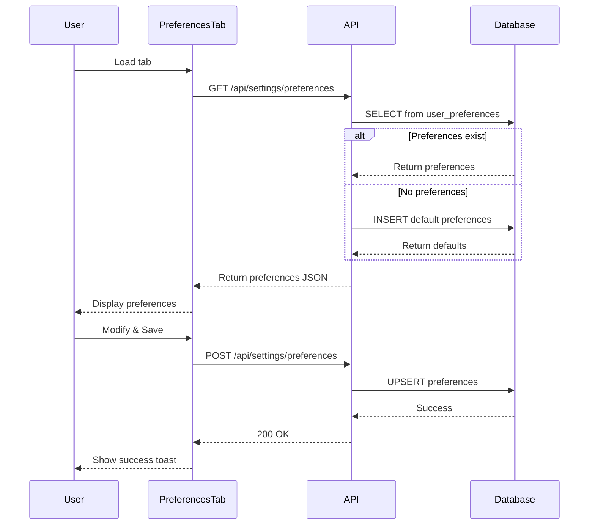
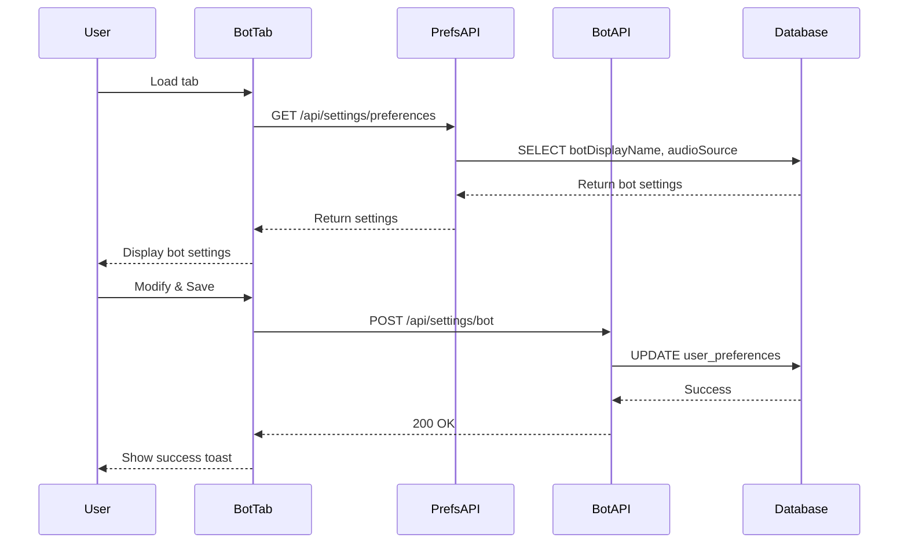
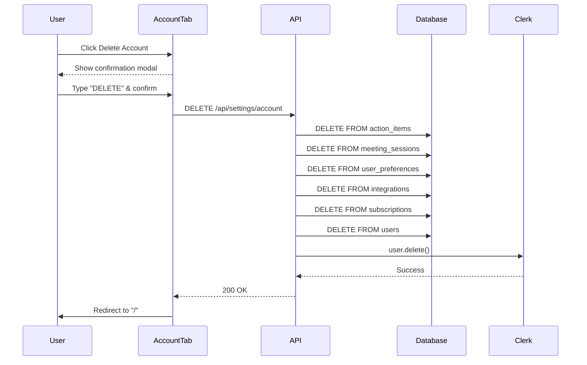
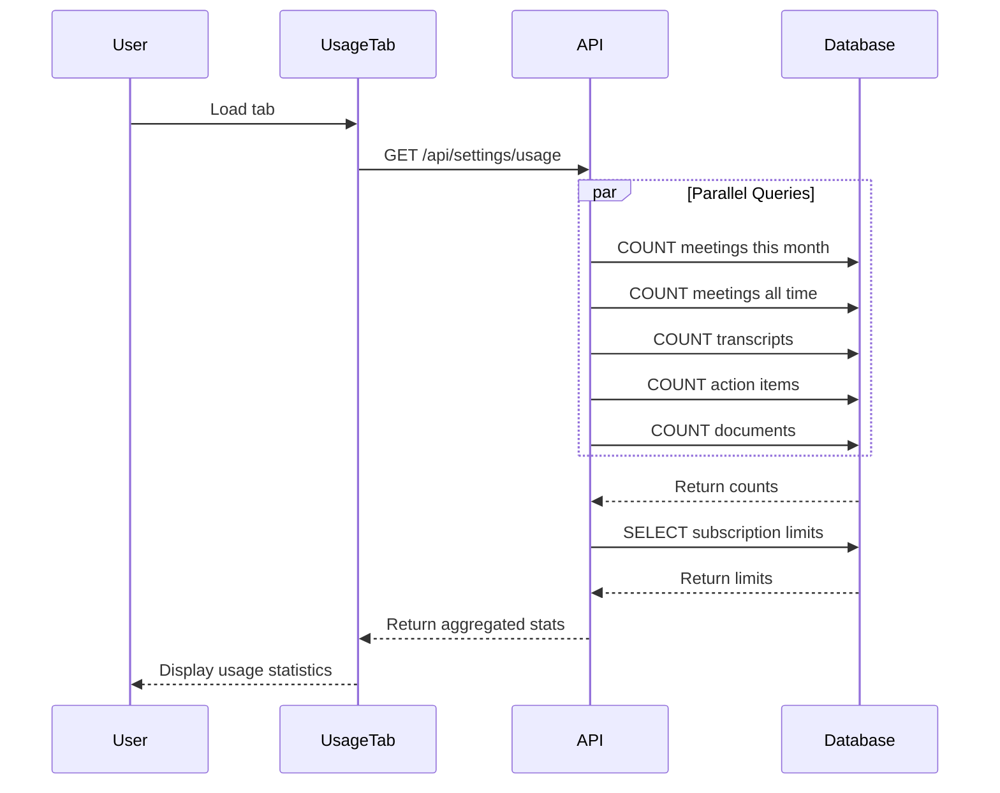
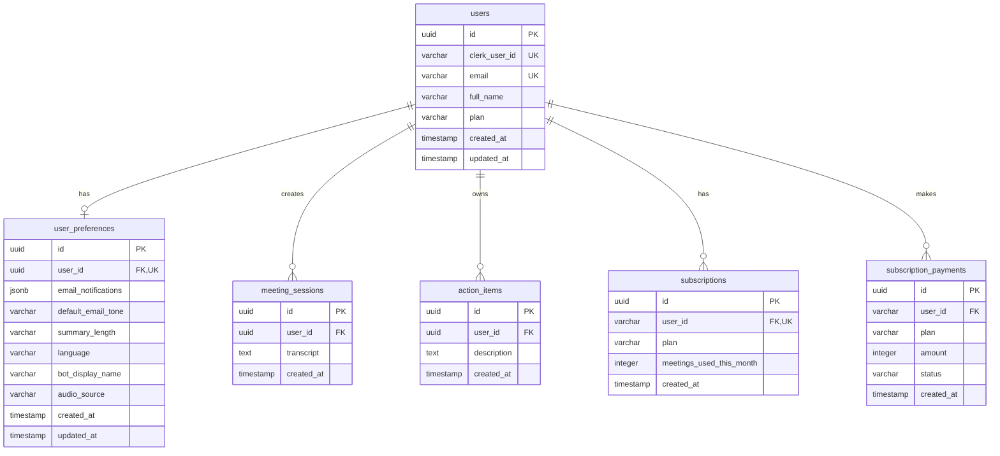

# Design Document: Settings Page Database Integration

## Overview

This design document specifies the technical implementation for integrating the Settings page with PostgreSQL database persistence. Currently, the Settings page incorrectly uses localStorage for preferences and bot settings. This design replaces localStorage with proper database persistence, ensuring data consistency, multi-device synchronization, and proper data management.

The implementation involves:
- Creating a new `user_preferences` table in PostgreSQL
- Implementing 6 new API endpoints for settings management
- Refactoring the Settings page React component to use database-backed state
- Removing all localStorage dependencies from settings functionality

## Architecture

### High-Level Architecture



### Data Flow Patterns

#### 1. User Preferences Save/Load Flow



#### 2. Bot Settings Persistence Flow



#### 3. Account Deletion Cascade Flow



#### 4. Usage Statistics Aggregation Flow



## Components and Interfaces

### Database Schema

#### user_preferences Table

```typescript
// src/db/schema/user-preferences.ts
import { jsonb, pgTable, text, timestamp, uuid, varchar } from "drizzle-orm/pg-core";
import { users } from "./users";

export const userPreferences = pgTable("user_preferences", {
  id: uuid("id").defaultRandom().primaryKey(),
  userId: uuid("user_id")
    .notNull()
    .unique()
    .references(() => users.id, { onDelete: "cascade" }),
  
  // Email notification preferences (JSONB)
  emailNotifications: jsonb("email_notifications")
    .notNull()
    .default({
      meetingSummary: true,
      actionItems: false,
      weeklyDigest: false,
      productUpdates: true
    }),
  
  // AI behavior preferences
  defaultEmailTone: varchar("default_email_tone", { length: 50 })
    .notNull()
    .default("professional"),
  
  summaryLength: varchar("summary_length", { length: 50 })
    .notNull()
    .default("standard"),
  
  language: varchar("language", { length: 10 })
    .notNull()
    .default("en"),
  
  // Bot settings
  botDisplayName: varchar("bot_display_name", { length: 255 })
    .notNull()
    .default("Artivaa Notetaker"),
  
  audioSource: varchar("audio_source", { length: 255 })
    .notNull()
    .default("default"),
  
  // Timestamps
  createdAt: timestamp("created_at", { withTimezone: true })
    .defaultNow()
    .notNull(),
  
  updatedAt: timestamp("updated_at", { withTimezone: true })
    .defaultNow()
    .notNull()
});

export type UserPreferences = typeof userPreferences.$inferSelect;
export type NewUserPreferences = typeof userPreferences.$inferInsert;
```

**Schema Rationale:**
- `userId` has a unique constraint ensuring one preferences record per user
- `emailNotifications` uses JSONB for flexible nested structure
- Enum-like fields (`defaultEmailTone`, `summaryLength`, `language`) use VARCHAR for flexibility
- `onDelete: "cascade"` ensures preferences are deleted when user is deleted
- All fields have sensible defaults matching current localStorage defaults

### API Endpoints

#### 1. GET /api/settings/preferences

**Purpose:** Retrieve user preferences from database

**Request:**
```typescript
// No body required
// Authentication via Clerk session
```

**Response (200 OK):**
```typescript
{
  success: true,
  preferences: {
    emailNotifications: {
      meetingSummary: boolean,
      actionItems: boolean,
      weeklyDigest: boolean,
      productUpdates: boolean
    },
    defaultEmailTone: "professional" | "friendly" | "formal" | "concise",
    summaryLength: "brief" | "standard" | "detailed",
    language: "en" | "hi",
    botDisplayName: string,
    audioSource: string
  }
}
```

**Error Responses:**
- `401 Unauthorized`: User not authenticated
- `500 Internal Server Error`: Database error

**Behavior:**
- If no preferences exist, create default preferences and return them (idempotent)
- Uses upsert pattern to ensure exactly one record per user

#### 2. POST /api/settings/preferences

**Purpose:** Save user preferences to database

**Request:**
```typescript
{
  emailNotifications?: {
    meetingSummary?: boolean,
    actionItems?: boolean,
    weeklyDigest?: boolean,
    productUpdates?: boolean
  },
  defaultEmailTone?: "professional" | "friendly" | "formal" | "concise",
  summaryLength?: "brief" | "standard" | "detailed",
  language?: "en" | "hi"
}
```

**Response (200 OK):**
```typescript
{
  success: true,
  preferences: {
    // Full preferences object after save
  }
}
```

**Error Responses:**
- `400 Bad Request`: Invalid preference data
- `401 Unauthorized`: User not authenticated
- `500 Internal Server Error`: Database error

**Validation Rules:**
- `defaultEmailTone` must be one of: professional, friendly, formal, concise
- `summaryLength` must be one of: brief, standard, detailed
- `language` must be one of: en, hi
- Partial updates are supported (only provided fields are updated)

#### 3. POST /api/settings/bot

**Purpose:** Save bot-specific settings to database

**Request:**
```typescript
{
  botDisplayName: string,
  audioSource: string
}
```

**Response (200 OK):**
```typescript
{
  success: true
}
```

**Error Responses:**
- `400 Bad Request`: botDisplayName is empty or null
- `401 Unauthorized`: User not authenticated
- `500 Internal Server Error`: Database error

**Validation Rules:**
- `botDisplayName` must not be empty
- `audioSource` defaults to "default" if not provided

#### 4. GET /api/settings/usage

**Purpose:** Retrieve usage statistics and limits

**Request:**
```typescript
// No body required
// Authentication via Clerk session
```

**Response (200 OK):**
```typescript
{
  success: true,
  meetingsThisMonth: number,
  meetingsAllTime: number,
  transcriptsGenerated: number,
  actionItemsCreated: number,
  documentsAnalyzed: number,
  memberSince: string, // ISO 8601 date
  limits: {
    meetingBot: boolean,
    transcription: boolean,
    summary: boolean,
    actionItems: boolean,
    history: boolean,
    meetingsPerMonth: number,
    unlimited: boolean
  }
}
```

**Error Responses:**
- `401 Unauthorized`: User not authenticated
- `500 Internal Server Error`: Database error

**Data Sources:**
- `meetingsThisMonth`: COUNT from meeting_sessions WHERE userId = user.id AND createdAt >= month_start
- `meetingsAllTime`: COUNT from meeting_sessions WHERE userId = user.id
- `transcriptsGenerated`: COUNT from meeting_sessions WHERE userId = user.id AND transcript IS NOT NULL
- `actionItemsCreated`: COUNT from action_items WHERE userId = user.id
- `documentsAnalyzed`: COUNT from uploaded_files WHERE userId = user.id
- `memberSince`: users.createdAt
- `limits`: Derived from subscriptions table and plan definitions

#### 5. DELETE /api/settings/account

**Purpose:** Delete user account and all associated data

**Request:**
```typescript
// No body required
// Authentication via Clerk session
```

**Response (200 OK):**
```typescript
{
  success: true
}
```

**Error Responses:**
- `401 Unauthorized`: User not authenticated
- `500 Internal Server Error`: Database or Clerk error

**Deletion Order (Critical for referential integrity):**
1. DELETE FROM action_items WHERE userId = user.id
2. DELETE FROM meeting_sessions WHERE userId = user.id
3. DELETE FROM user_preferences WHERE userId = user.id
4. DELETE FROM user_integrations WHERE userId = user.id
5. DELETE FROM subscriptions WHERE userId = user.clerkUserId
6. DELETE FROM users WHERE id = user.id
7. Call Clerk API: user.delete()

**Note:** This endpoint is destructive and irreversible. Frontend must require "DELETE" confirmation.

#### 6. GET /api/settings/payments

**Purpose:** Retrieve payment history

**Request:**
```typescript
// No body required
// Authentication via Clerk session
```

**Response (200 OK):**
```typescript
{
  success: true,
  payments: Array<{
    id: string,
    date: string, // ISO 8601
    plan: string,
    amount: number, // in paise
    currency: string,
    status: string,
    invoiceNumber: string | null
  }>
}
```

**Error Responses:**
- `401 Unauthorized`: User not authenticated
- `500 Internal Server Error`: Database error

**Query:**
```sql
SELECT * FROM subscription_payments 
WHERE userId = :userId 
ORDER BY createdAt DESC
```

### React Component Architecture

#### Settings Page Component Structure

```typescript
// src/app/dashboard/settings/page.tsx

type ActiveTab = "profile" | "account" | "subscription" | "preferences" | "bot" | "integrations" | "usage";

interface PreferencesState {
  emailNotifications: {
    meetingSummary: boolean;
    actionItems: boolean;
    weeklyDigest: boolean;
    productUpdates: boolean;
  };
  defaultEmailTone: "professional" | "friendly" | "formal" | "concise";
  summaryLength: "brief" | "standard" | "detailed";
  language: "en" | "hi";
  botDisplayName: string;
  audioSource: string;
}

interface UsageStats {
  meetingsThisMonth: number;
  meetingsAllTime: number;
  transcriptsGenerated: number;
  actionItemsCreated: number;
  documentsAnalyzed: number;
  memberSince: string;
  limits: {
    meetingBot: boolean;
    transcription: boolean;
    summary: boolean;
    actionItems: boolean;
    history: boolean;
    meetingsPerMonth: number;
    unlimited: boolean;
  };
}

interface PaymentRecord {
  id: string;
  date: string;
  plan: string;
  amount: number;
  currency: string;
  status: string;
  invoiceNumber: string | null;
}

export default function SettingsPage() {
  // State management
  const [activeTab, setActiveTab] = useState<ActiveTab>("profile");
  const [preferences, setPreferences] = useState<PreferencesState | null>(null);
  const [usageStats, setUsageStats] = useState<UsageStats | null>(null);
  const [payments, setPayments] = useState<PaymentRecord[]>([]);
  const [isLoading, setIsLoading] = useState(true);
  const [toast, setToast] = useState<ToastState | null>(null);
  
  // Data fetching on mount
  useEffect(() => {
    async function loadSettings() {
      setIsLoading(true);
      try {
        const [prefsRes, usageRes, paymentsRes] = await Promise.all([
          fetch("/api/settings/preferences"),
          fetch("/api/settings/usage"),
          fetch("/api/settings/payments")
        ]);
        
        if (prefsRes.ok) {
          const data = await prefsRes.json();
          setPreferences(data.preferences);
        }
        
        if (usageRes.ok) {
          const data = await usageRes.json();
          setUsageStats(data);
        }
        
        if (paymentsRes.ok) {
          const data = await paymentsRes.json();
          setPayments(data.payments);
        }
      } catch (error) {
        showToast("Failed to load settings", "error");
      } finally {
        setIsLoading(false);
      }
    }
    
    loadSettings();
  }, []);
  
  // Save preferences handler
  async function savePreferences() {
    try {
      const response = await fetch("/api/settings/preferences", {
        method: "POST",
        headers: { "Content-Type": "application/json" },
        body: JSON.stringify(preferences)
      });
      
      if (response.ok) {
        showToast("Preferences saved", "success");
      } else {
        throw new Error("Failed to save");
      }
    } catch (error) {
      showToast("Failed to save preferences", "error");
    }
  }
  
  // Save bot settings handler
  async function saveBotSettings() {
    try {
      const response = await fetch("/api/settings/bot", {
        method: "POST",
        headers: { "Content-Type": "application/json" },
        body: JSON.stringify({
          botDisplayName: preferences?.botDisplayName,
          audioSource: preferences?.audioSource
        })
      });
      
      if (response.ok) {
        showToast("Bot settings saved", "success");
      } else {
        throw new Error("Failed to save");
      }
    } catch (error) {
      showToast("Failed to save bot settings", "error");
    }
  }
  
  // Delete account handler
  async function deleteAccount() {
    try {
      const response = await fetch("/api/settings/account", {
        method: "DELETE"
      });
      
      if (response.ok) {
        window.location.href = "/";
      } else {
        throw new Error("Failed to delete");
      }
    } catch (error) {
      showToast("Failed to delete account", "error");
    }
  }
  
  // Render tabs based on activeTab state
  return (
    <div>
      {/* Tab navigation */}
      {/* Tab content based on activeTab */}
    </div>
  );
}
```

#### Custom Hooks

```typescript
// src/hooks/usePreferences.ts
export function usePreferences() {
  const [preferences, setPreferences] = useState<PreferencesState | null>(null);
  const [isLoading, setIsLoading] = useState(true);
  const [error, setError] = useState<string | null>(null);
  
  useEffect(() => {
    async function fetchPreferences() {
      try {
        const response = await fetch("/api/settings/preferences");
        if (!response.ok) throw new Error("Failed to fetch");
        const data = await response.json();
        setPreferences(data.preferences);
      } catch (err) {
        setError(err instanceof Error ? err.message : "Unknown error");
      } finally {
        setIsLoading(false);
      }
    }
    
    fetchPreferences();
  }, []);
  
  async function savePreferences(newPreferences: Partial<PreferencesState>) {
    try {
      const response = await fetch("/api/settings/preferences", {
        method: "POST",
        headers: { "Content-Type": "application/json" },
        body: JSON.stringify(newPreferences)
      });
      
      if (!response.ok) throw new Error("Failed to save");
      const data = await response.json();
      setPreferences(data.preferences);
      return { success: true };
    } catch (err) {
      return { success: false, error: err instanceof Error ? err.message : "Unknown error" };
    }
  }
  
  return { preferences, isLoading, error, savePreferences };
}

// src/hooks/useUsageStats.ts
export function useUsageStats() {
  const [stats, setStats] = useState<UsageStats | null>(null);
  const [isLoading, setIsLoading] = useState(true);
  const [error, setError] = useState<string | null>(null);
  
  useEffect(() => {
    async function fetchStats() {
      try {
        const response = await fetch("/api/settings/usage");
        if (!response.ok) throw new Error("Failed to fetch");
        const data = await response.json();
        setStats(data);
      } catch (err) {
        setError(err instanceof Error ? err.message : "Unknown error");
      } finally {
        setIsLoading(false);
      }
    }
    
    fetchStats();
  }, []);
  
  return { stats, isLoading, error };
}
```

## Data Models

### TypeScript Interfaces

```typescript
// src/types/settings.ts

export interface EmailNotifications {
  meetingSummary: boolean;
  actionItems: boolean;
  weeklyDigest: boolean;
  productUpdates: boolean;
}

export type EmailTone = "professional" | "friendly" | "formal" | "concise";
export type SummaryLength = "brief" | "standard" | "detailed";
export type Language = "en" | "hi";

export interface UserPreferences {
  emailNotifications: EmailNotifications;
  defaultEmailTone: EmailTone;
  summaryLength: SummaryLength;
  language: Language;
  botDisplayName: string;
  audioSource: string;
}

export interface UsageStatistics {
  meetingsThisMonth: number;
  meetingsAllTime: number;
  transcriptsGenerated: number;
  actionItemsCreated: number;
  documentsAnalyzed: number;
  memberSince: string;
  limits: PlanLimits;
}

export interface PlanLimits {
  meetingBot: boolean;
  transcription: boolean;
  summary: boolean;
  actionItems: boolean;
  history: boolean;
  meetingsPerMonth: number;
  unlimited: boolean;
}

export interface PaymentRecord {
  id: string;
  date: string;
  plan: string;
  amount: number;
  currency: string;
  status: string;
  invoiceNumber: string | null;
}

export interface APIResponse<T> {
  success: boolean;
  data?: T;
  error?: string;
}
```

### Database Relationships



## Correctness Properties

*A property is a characteristic or behavior that should hold true across all valid executions of a system—essentially, a formal statement about what the system should do. Properties serve as the bridge between human-readable specifications and machine-verifiable correctness guarantees.*


### Property Reflection

After analyzing all acceptance criteria, I've identified the following redundancies and consolidations:

**Redundant Properties to Remove:**
1. Individual field validation properties (1.3, 1.4, 1.5) can be combined into one comprehensive property about valid enum values
2. HTTP 401 authentication checks (2.7, 3.4, 4.7, 5.5, 6.5) can be combined into one property about API authentication
3. Success toast properties (7.5, 10.7, 11.7) can be combined into one property about UI feedback on success
4. Error toast properties (7.6, 10.8, 11.8) can be combined into one property about UI feedback on errors
5. localStorage removal checks (15.1-15.8) can be combined into one property about no localStorage usage
6. UI rendering checks for static elements can be tested as examples rather than properties

**Properties to Combine:**
- Payment ordering (6.3) and payment field structure (6.4) can be combined into one comprehensive payment response property
- Usage statistics properties (4.2, 4.3, 4.4, 4.5, 4.6) can be combined into one comprehensive usage response property
- Toast timing properties (13.3, 13.4) can be combined into one metamorphic property about toast duration

**Final Property Set:**
After reflection, we have 15 unique, non-redundant properties that provide comprehensive validation coverage.

### Property 1: Preferences Persistence Round-Trip

*For any* valid user preferences object p:
- WHEN p is saved via POST /api/settings/preferences
- AND subsequently fetched via GET /api/settings/preferences
- THEN the fetched preferences SHALL equal p

**Pattern:** Round-trip property ensuring data integrity through save and load operations.

**Validates: Requirements 2.2, 2.5**

### Property 2: User Preferences Uniqueness Invariant

*For any* user u:
- THE database SHALL contain at most one user_preferences record WHERE userId = u.id
- This invariant SHALL be maintained by the unique constraint on userId

**Pattern:** Invariant ensuring database constraint enforcement.

**Validates: Requirements 1.1**

### Property 3: Default Preferences Creation Idempotence

*For any* user u without existing preferences:
- WHEN GET /api/settings/preferences is called multiple times without intervening POST
- THEN all calls SHALL return the same preferences object
- AND only one database record SHALL be created

**Pattern:** Idempotence ensuring consistent initialization behavior.

**Validates: Requirements 2.3**

### Property 4: Preferences Upsert Behavior

*For any* preference object p:
- WHEN p is POSTed to /api/settings/preferences twice
- THEN the second POST SHALL update the existing record
- AND only one user_preferences record SHALL exist for the user
- AND the final state SHALL equal p

**Pattern:** Idempotence ensuring upsert (insert or update) behavior.

**Validates: Requirements 2.5**

### Property 5: API Authentication Invariant

*For all* Settings API endpoints (preferences, bot, usage, account, payments):
- IF the request does not include valid authentication
- THEN the endpoint SHALL return status 401
- AND no database operations SHALL be performed

**Pattern:** Invariant ensuring security across all endpoints.

**Validates: Requirements 2.7, 3.4, 4.7, 5.5, 6.5**

### Property 6: Bot Settings Validation

*For any* POST request to /api/settings/bot:
- IF botDisplayName is empty or null
- THEN the API SHALL return status 400
- AND no database update SHALL occur

**Pattern:** Error condition validation ensuring input constraints.

**Validates: Requirements 3.5**

### Property 7: Usage Statistics Non-Negative Invariant

*For all* usage statistics returned by GET /api/settings/usage:
- meetingsThisMonth >= 0
- meetingsAllTime >= 0
- actionItemsCreated >= 0
- documentsAnalyzed >= 0
- transcriptsGenerated >= 0
- AND meetingsThisMonth <= meetingsAllTime

**Pattern:** Invariant ensuring logical consistency of aggregated data.

**Validates: Requirements 4.2, 4.3, 4.4**


### Property 8: Payment History Ordering and Structure

*For all* payment records returned by GET /api/settings/payments:
- THE records SHALL be ordered by date in descending order
- FOR ALL adjacent records (r1, r2): r1.date >= r2.date
- AND each record SHALL contain fields: id, date, plan, amount, currency, status, invoiceNumber

**Pattern:** Invariant ensuring consistent ordering and structure of response data.

**Validates: Requirements 6.3, 6.4**

### Property 9: Account Deletion Cascade Invariant

*When* a user account is deleted via DELETE /api/settings/account:
- ALL action_items WHERE userId = deleted_user.id SHALL be deleted
- ALL meeting_sessions WHERE userId = deleted_user.id SHALL be deleted
- ALL user_preferences WHERE userId = deleted_user.id SHALL be deleted
- ALL user_integrations WHERE userId = deleted_user.id SHALL be deleted
- ALL subscriptions WHERE userId = deleted_user.clerkUserId SHALL be deleted
- THE user record SHALL be deleted last
- AND the user SHALL be deleted from Clerk

**Pattern:** Invariant ensuring referential integrity during cascading deletes.

**Validates: Requirements 5.2, 5.3, 5.6**

### Property 10: Toast Auto-Dismiss Timing

*For all* toast notifications t:
- IF t.type = "success" OR t.type = "info", THEN dismissTime = 3000ms
- IF t.type = "error", THEN dismissTime = 5000ms
- AND dismissTime(error) > dismissTime(success)

**Pattern:** Metamorphic property ensuring consistent timing behavior.

**Validates: Requirements 13.3, 13.4**

### Property 11: Toast Timer Replacement

*For any* sequence of toast notifications:
- WHEN a new toast is triggered while another is active
- THEN the previous toast timer SHALL be cleared
- AND only the new toast timer SHALL be active

**Pattern:** Invariant ensuring proper state management of timers.

**Validates: Requirements 13.8**

### Property 12: Preferences Tab State Consistency

*While* the Preferences Tab is displayed:
- THE displayed preferences SHALL match the most recent successful GET response
- AFTER a successful POST, the displayed preferences SHALL match the posted data
- NO localStorage data SHALL influence the displayed preferences

**Pattern:** Invariant ensuring UI state consistency with backend.

**Validates: Requirements 10.6, 10.7, 10.9**

### Property 13: Bot Settings Tab State Consistency

*While* the Bot Settings Tab is displayed:
- THE displayed bot settings SHALL match the most recent successful GET response
- AFTER a successful POST, the displayed bot settings SHALL match the posted data
- NO localStorage data SHALL influence the displayed bot settings

**Pattern:** Invariant ensuring UI state consistency with backend.

**Validates: Requirements 11.6, 11.7, 11.9**

### Property 14: localStorage Elimination

*For all* settings-related operations in the Settings Page:
- NO localStorage.getItem() calls SHALL be made for preferences or bot settings
- NO localStorage.setItem() calls SHALL be made for preferences or bot settings
- NO references to preferencesStorageKey or botSettingsStorageKey SHALL exist

**Pattern:** Invariant ensuring complete removal of localStorage dependency.

**Validates: Requirements 15.1, 15.2, 15.3, 15.4, 15.5, 15.6, 15.7, 15.8**

### Property 15: Settings Page Resilience

*For any* Settings Page load:
- IF some API calls fail, THEN the page SHALL still render
- AND available data SHALL be displayed
- AND error toasts SHALL be shown for failed calls
- AND the page SHALL remain functional

**Pattern:** Invariant ensuring graceful degradation and resilience.

**Validates: Requirements 14.4, 14.5**

## Error Handling

### API Error Handling Strategy

All API endpoints follow a consistent error handling pattern:

```typescript
// src/lib/api-responses.ts
export function apiError(message: string, status: number) {
  return Response.json(
    { success: false, error: message },
    { status }
  );
}

export function apiSuccess<T>(data: T) {
  return Response.json(data, { status: 200 });
}
```

### Error Categories

1. **Authentication Errors (401)**
   - Trigger: Missing or invalid Clerk session
   - Response: `{ success: false, error: "Unauthorized." }`
   - Client Action: Redirect to login

2. **Validation Errors (400)**
   - Trigger: Invalid request data
   - Response: `{ success: false, error: "Validation error details" }`
   - Client Action: Display error toast with details

3. **Not Found Errors (404)**
   - Trigger: Resource doesn't exist
   - Response: `{ success: false, error: "Resource not found" }`
   - Client Action: Display error toast

4. **Server Errors (500)**
   - Trigger: Database errors, unexpected exceptions
   - Response: `{ success: false, error: "Internal server error" }`
   - Client Action: Display error toast, log to monitoring

### Database Error Handling

```typescript
// Example from preferences API
try {
  const preferences = await db
    .select()
    .from(userPreferences)
    .where(eq(userPreferences.userId, user.id))
    .limit(1);
    
  if (preferences.length === 0) {
    // Create default preferences
    const [newPrefs] = await db
      .insert(userPreferences)
      .values({
        userId: user.id,
        emailNotifications: defaultEmailNotifications,
        defaultEmailTone: "professional",
        summaryLength: "standard",
        language: "en",
        botDisplayName: "Artivaa Notetaker",
        audioSource: "default"
      })
      .returning();
    
    return apiSuccess({ success: true, preferences: newPrefs });
  }
  
  return apiSuccess({ success: true, preferences: preferences[0] });
} catch (error) {
  console.error("Database error:", error);
  return apiError(
    error instanceof Error ? error.message : "Failed to fetch preferences",
    500
  );
}
```

### Client-Side Error Handling

```typescript
// Settings Page error handling pattern
async function savePreferences() {
  try {
    const response = await fetch("/api/settings/preferences", {
      method: "POST",
      headers: { "Content-Type": "application/json" },
      body: JSON.stringify(preferences)
    });
    
    const data = await response.json();
    
    if (!response.ok) {
      throw new Error(data.error || "Failed to save preferences");
    }
    
    showToast("Preferences saved successfully", "success");
    setPreferences(data.preferences);
  } catch (error) {
    console.error("Save error:", error);
    showToast(
      error instanceof Error ? error.message : "Failed to save preferences",
      "error"
    );
  }
}
```

### Validation Error Details

```typescript
// Input validation for bot settings
function validateBotSettings(data: unknown): { valid: boolean; error?: string } {
  if (typeof data !== "object" || data === null) {
    return { valid: false, error: "Invalid request body" };
  }
  
  const { botDisplayName, audioSource } = data as Record<string, unknown>;
  
  if (typeof botDisplayName !== "string" || botDisplayName.trim() === "") {
    return { valid: false, error: "botDisplayName must be a non-empty string" };
  }
  
  if (audioSource !== undefined && typeof audioSource !== "string") {
    return { valid: false, error: "audioSource must be a string" };
  }
  
  return { valid: true };
}
```


## Testing Strategy

### Dual Testing Approach

This feature requires both unit tests and property-based tests for comprehensive coverage:

**Unit Tests:**
- Specific examples and edge cases
- Integration points between components
- Error conditions and boundary cases
- UI component rendering and interactions

**Property-Based Tests:**
- Universal properties across all inputs
- Comprehensive input coverage through randomization
- Data integrity and consistency validation
- API contract verification

### Property-Based Testing Configuration

**Library Selection:** We will use **fast-check** for TypeScript/JavaScript property-based testing.

```bash
npm install --save-dev fast-check @types/fast-check
```

**Test Configuration:**
- Minimum 100 iterations per property test (due to randomization)
- Each property test must reference its design document property
- Tag format: `Feature: settings-page-database-integration, Property {number}: {property_text}`

### Property Test Examples

#### Property 1: Preferences Persistence Round-Trip

```typescript
// tests/api/settings/preferences.property.test.ts
import fc from "fast-check";
import { describe, it, expect } from "vitest";

/**
 * Feature: settings-page-database-integration
 * Property 1: Preferences Persistence Round-Trip
 * 
 * For any valid user preferences object p:
 * - WHEN p is saved via POST /api/settings/preferences
 * - AND subsequently fetched via GET /api/settings/preferences
 * - THEN the fetched preferences SHALL equal p
 */
describe("Property 1: Preferences Persistence Round-Trip", () => {
  it("should preserve preferences through save and load", async () => {
    await fc.assert(
      fc.asyncProperty(
        fc.record({
          emailNotifications: fc.record({
            meetingSummary: fc.boolean(),
            actionItems: fc.boolean(),
            weeklyDigest: fc.boolean(),
            productUpdates: fc.boolean()
          }),
          defaultEmailTone: fc.constantFrom("professional", "friendly", "formal", "concise"),
          summaryLength: fc.constantFrom("brief", "standard", "detailed"),
          language: fc.constantFrom("en", "hi")
        }),
        async (preferences) => {
          // Save preferences
          const saveResponse = await fetch("/api/settings/preferences", {
            method: "POST",
            headers: { "Content-Type": "application/json" },
            body: JSON.stringify(preferences)
          });
          
          expect(saveResponse.ok).toBe(true);
          
          // Fetch preferences
          const fetchResponse = await fetch("/api/settings/preferences");
          const fetchedData = await fetchResponse.json();
          
          // Verify round-trip
          expect(fetchedData.preferences.emailNotifications).toEqual(preferences.emailNotifications);
          expect(fetchedData.preferences.defaultEmailTone).toBe(preferences.defaultEmailTone);
          expect(fetchedData.preferences.summaryLength).toBe(preferences.summaryLength);
          expect(fetchedData.preferences.language).toBe(preferences.language);
        }
      ),
      { numRuns: 100 }
    );
  });
});
```

#### Property 3: Default Preferences Creation Idempotence

```typescript
/**
 * Feature: settings-page-database-integration
 * Property 3: Default Preferences Creation Idempotence
 * 
 * For any user u without existing preferences:
 * - WHEN GET /api/settings/preferences is called multiple times
 * - THEN all calls SHALL return the same preferences object
 * - AND only one database record SHALL be created
 */
describe("Property 3: Default Preferences Creation Idempotence", () => {
  it("should create defaults only once for new users", async () => {
    await fc.assert(
      fc.asyncProperty(
        fc.integer({ min: 2, max: 10 }), // Number of GET requests
        async (numRequests) => {
          // Clear any existing preferences for test user
          await clearUserPreferences();
          
          // Make multiple GET requests
          const responses = await Promise.all(
            Array.from({ length: numRequests }, () =>
              fetch("/api/settings/preferences")
            )
          );
          
          const data = await Promise.all(
            responses.map(r => r.json())
          );
          
          // All responses should be identical
          const firstPrefs = data[0].preferences;
          for (let i = 1; i < data.length; i++) {
            expect(data[i].preferences).toEqual(firstPrefs);
          }
          
          // Verify only one database record exists
          const count = await countUserPreferences();
          expect(count).toBe(1);
        }
      ),
      { numRuns: 100 }
    );
  });
});
```

#### Property 5: API Authentication Invariant

```typescript
/**
 * Feature: settings-page-database-integration
 * Property 5: API Authentication Invariant
 * 
 * For all Settings API endpoints:
 * - IF the request does not include valid authentication
 * - THEN the endpoint SHALL return status 401
 * - AND no database operations SHALL be performed
 */
describe("Property 5: API Authentication Invariant", () => {
  const endpoints = [
    { method: "GET", path: "/api/settings/preferences" },
    { method: "POST", path: "/api/settings/preferences" },
    { method: "POST", path: "/api/settings/bot" },
    { method: "GET", path: "/api/settings/usage" },
    { method: "DELETE", path: "/api/settings/account" },
    { method: "GET", path: "/api/settings/payments" }
  ];
  
  it("should return 401 for unauthenticated requests", async () => {
    await fc.assert(
      fc.asyncProperty(
        fc.constantFrom(...endpoints),
        async (endpoint) => {
          const initialDbState = await captureDbState();
          
          // Make request without authentication
          const response = await fetch(endpoint.path, {
            method: endpoint.method,
            headers: { "Content-Type": "application/json" }
            // No auth headers
          });
          
          expect(response.status).toBe(401);
          
          const finalDbState = await captureDbState();
          expect(finalDbState).toEqual(initialDbState);
        }
      ),
      { numRuns: 100 }
    );
  });
});
```

#### Property 7: Usage Statistics Non-Negative Invariant

```typescript
/**
 * Feature: settings-page-database-integration
 * Property 7: Usage Statistics Non-Negative Invariant
 * 
 * For all usage statistics returned by GET /api/settings/usage:
 * - All counts >= 0
 * - meetingsThisMonth <= meetingsAllTime
 */
describe("Property 7: Usage Statistics Non-Negative Invariant", () => {
  it("should always return non-negative statistics", async () => {
    await fc.assert(
      fc.asyncProperty(
        fc.nat(), // Random number of times to call the endpoint
        async () => {
          const response = await fetch("/api/settings/usage");
          const data = await response.json();
          
          expect(data.meetingsThisMonth).toBeGreaterThanOrEqual(0);
          expect(data.meetingsAllTime).toBeGreaterThanOrEqual(0);
          expect(data.transcriptsGenerated).toBeGreaterThanOrEqual(0);
          expect(data.actionItemsCreated).toBeGreaterThanOrEqual(0);
          expect(data.documentsAnalyzed).toBeGreaterThanOrEqual(0);
          
          // Logical consistency
          expect(data.meetingsThisMonth).toBeLessThanOrEqual(data.meetingsAllTime);
        }
      ),
      { numRuns: 100 }
    );
  });
});
```

### Unit Test Examples

#### Unit Test: Default Preferences Values

```typescript
// tests/api/settings/preferences.test.ts
import { describe, it, expect, beforeEach } from "vitest";

describe("GET /api/settings/preferences - Default Values", () => {
  beforeEach(async () => {
    await clearUserPreferences();
  });
  
  it("should create default preferences for new users", async () => {
    const response = await fetch("/api/settings/preferences");
    const data = await response.json();
    
    expect(response.status).toBe(200);
    expect(data.success).toBe(true);
    expect(data.preferences).toMatchObject({
      emailNotifications: {
        meetingSummary: true,
        actionItems: false,
        weeklyDigest: false,
        productUpdates: true
      },
      defaultEmailTone: "professional",
      summaryLength: "standard",
      language: "en",
      botDisplayName: "Artivaa Notetaker",
      audioSource: "default"
    });
  });
});
```

#### Unit Test: Bot Settings Validation

```typescript
describe("POST /api/settings/bot - Validation", () => {
  it("should reject empty botDisplayName", async () => {
    const response = await fetch("/api/settings/bot", {
      method: "POST",
      headers: { "Content-Type": "application/json" },
      body: JSON.stringify({
        botDisplayName: "",
        audioSource: "default"
      })
    });
    
    expect(response.status).toBe(400);
    const data = await response.json();
    expect(data.success).toBe(false);
    expect(data.error).toContain("botDisplayName");
  });
  
  it("should accept valid bot settings", async () => {
    const response = await fetch("/api/settings/bot", {
      method: "POST",
      headers: { "Content-Type": "application/json" },
      body: JSON.stringify({
        botDisplayName: "My Custom Bot",
        audioSource: "pulse"
      })
    });
    
    expect(response.status).toBe(200);
    const data = await response.json();
    expect(data.success).toBe(true);
  });
});
```

#### Unit Test: Account Deletion Order

```typescript
describe("DELETE /api/settings/account - Deletion Order", () => {
  it("should delete data in correct order", async () => {
    const deletionLog: string[] = [];
    
    // Mock database operations to track order
    const mockDb = createMockDb((table: string) => {
      deletionLog.push(table);
    });
    
    await deleteAccount(mockDb);
    
    expect(deletionLog).toEqual([
      "action_items",
      "meeting_sessions",
      "user_preferences",
      "user_integrations",
      "subscriptions",
      "users"
    ]);
  });
});
```

### Integration Test Examples

#### Integration Test: Settings Page Data Loading

```typescript
// tests/integration/settings-page.test.tsx
import { render, screen, waitFor } from "@testing-library/react";
import { describe, it, expect, vi } from "vitest";
import SettingsPage from "@/app/dashboard/settings/page";

describe("Settings Page Integration", () => {
  it("should load all data in parallel on mount", async () => {
    const fetchSpy = vi.spyOn(global, "fetch");
    
    render(<SettingsPage />);
    
    await waitFor(() => {
      expect(screen.queryByText("Loading settings data...")).not.toBeInTheDocument();
    });
    
    // Verify parallel fetching
    expect(fetchSpy).toHaveBeenCalledWith("/api/settings/preferences");
    expect(fetchSpy).toHaveBeenCalledWith("/api/settings/usage");
    expect(fetchSpy).toHaveBeenCalledWith("/api/subscription");
    expect(fetchSpy).toHaveBeenCalledWith("/api/bot/profile-status");
  });
  
  it("should display error toast on API failure", async () => {
    vi.spyOn(global, "fetch").mockRejectedValueOnce(new Error("Network error"));
    
    render(<SettingsPage />);
    
    await waitFor(() => {
      expect(screen.getByText(/Failed to load settings/i)).toBeInTheDocument();
    });
  });
});
```

### Test Coverage Goals

- **API Endpoints:** 100% coverage of all routes
- **Database Operations:** 100% coverage of CRUD operations
- **Error Handling:** 100% coverage of error paths
- **UI Components:** 80%+ coverage of component logic
- **Property Tests:** All 15 correctness properties implemented
- **Unit Tests:** All edge cases and examples covered

### Test Execution

```bash
# Run all tests
npm test

# Run property tests only
npm test -- --grep "Property"

# Run unit tests only
npm test -- --grep -v "Property"

# Run with coverage
npm test -- --coverage
```


## Implementation Details

### Database Migration

#### Step 1: Create user_preferences Table

```sql
-- migrations/XXXX_create_user_preferences.sql
CREATE TABLE IF NOT EXISTS user_preferences (
  id UUID PRIMARY KEY DEFAULT gen_random_uuid(),
  user_id UUID NOT NULL UNIQUE REFERENCES users(id) ON DELETE CASCADE,
  email_notifications JSONB NOT NULL DEFAULT '{"meetingSummary": true, "actionItems": false, "weeklyDigest": false, "productUpdates": true}'::jsonb,
  default_email_tone VARCHAR(50) NOT NULL DEFAULT 'professional',
  summary_length VARCHAR(50) NOT NULL DEFAULT 'standard',
  language VARCHAR(10) NOT NULL DEFAULT 'en',
  bot_display_name VARCHAR(255) NOT NULL DEFAULT 'Artivaa Notetaker',
  audio_source VARCHAR(255) NOT NULL DEFAULT 'default',
  created_at TIMESTAMPTZ NOT NULL DEFAULT NOW(),
  updated_at TIMESTAMPTZ NOT NULL DEFAULT NOW()
);

-- Create index on user_id for faster lookups
CREATE INDEX idx_user_preferences_user_id ON user_preferences(user_id);

-- Create trigger to update updated_at timestamp
CREATE OR REPLACE FUNCTION update_updated_at_column()
RETURNS TRIGGER AS $$
BEGIN
  NEW.updated_at = NOW();
  RETURN NEW;
END;
$$ LANGUAGE plpgsql;

CREATE TRIGGER update_user_preferences_updated_at
  BEFORE UPDATE ON user_preferences
  FOR EACH ROW
  EXECUTE FUNCTION update_updated_at_column();
```

#### Step 2: Run Migration

```bash
# Using Drizzle
npx drizzle-kit generate:pg
npx drizzle-kit push:pg

# Or using raw SQL
psql $DATABASE_URL -f migrations/XXXX_create_user_preferences.sql
```

### API Implementation

#### GET /api/settings/preferences

```typescript
// src/app/api/settings/preferences/route.ts
import { auth } from "@clerk/nextjs/server";
import { eq } from "drizzle-orm";
import { apiError, apiSuccess } from "@/lib/api-responses";
import { ensureDatabaseReady } from "@/lib/db/bootstrap";
import { syncCurrentUserToDatabase } from "@/lib/auth/current-user";
import { db } from "@/lib/db/client";
import { userPreferences } from "@/db/schema";

export const runtime = "nodejs";

const defaultEmailNotifications = {
  meetingSummary: true,
  actionItems: false,
  weeklyDigest: false,
  productUpdates: true
};

export async function GET() {
  const { userId } = await auth();

  if (!userId) {
    return apiError("Unauthorized.", 401);
  }

  try {
    await ensureDatabaseReady();
    const user = await syncCurrentUserToDatabase(userId);

    // Try to fetch existing preferences
    const [existingPrefs] = await db
      .select()
      .from(userPreferences)
      .where(eq(userPreferences.userId, user.id))
      .limit(1);

    // If preferences don't exist, create defaults
    if (!existingPrefs) {
      const [newPrefs] = await db
        .insert(userPreferences)
        .values({
          userId: user.id,
          emailNotifications: defaultEmailNotifications,
          defaultEmailTone: "professional",
          summaryLength: "standard",
          language: "en",
          botDisplayName: "Artivaa Notetaker",
          audioSource: "default"
        })
        .returning();

      return apiSuccess({
        success: true,
        preferences: {
          emailNotifications: newPrefs.emailNotifications,
          defaultEmailTone: newPrefs.defaultEmailTone,
          summaryLength: newPrefs.summaryLength,
          language: newPrefs.language,
          botDisplayName: newPrefs.botDisplayName,
          audioSource: newPrefs.audioSource
        }
      });
    }

    return apiSuccess({
      success: true,
      preferences: {
        emailNotifications: existingPrefs.emailNotifications,
        defaultEmailTone: existingPrefs.defaultEmailTone,
        summaryLength: existingPrefs.summaryLength,
        language: existingPrefs.language,
        botDisplayName: existingPrefs.botDisplayName,
        audioSource: existingPrefs.audioSource
      }
    });
  } catch (error) {
    console.error("Failed to fetch preferences:", error);
    return apiError(
      error instanceof Error ? error.message : "Failed to fetch preferences.",
      500
    );
  }
}
```

#### POST /api/settings/preferences

```typescript
// src/app/api/settings/preferences/route.ts (continued)
import { z } from "zod";

const preferencesSchema = z.object({
  emailNotifications: z
    .object({
      meetingSummary: z.boolean().optional(),
      actionItems: z.boolean().optional(),
      weeklyDigest: z.boolean().optional(),
      productUpdates: z.boolean().optional()
    })
    .optional(),
  defaultEmailTone: z
    .enum(["professional", "friendly", "formal", "concise"])
    .optional(),
  summaryLength: z.enum(["brief", "standard", "detailed"]).optional(),
  language: z.enum(["en", "hi"]).optional()
});

export async function POST(request: Request) {
  const { userId } = await auth();

  if (!userId) {
    return apiError("Unauthorized.", 401);
  }

  try {
    await ensureDatabaseReady();
    const user = await syncCurrentUserToDatabase(userId);

    const body = await request.json();
    const validation = preferencesSchema.safeParse(body);

    if (!validation.success) {
      return apiError(
        `Invalid request data: ${validation.error.message}`,
        400
      );
    }

    const updates = validation.data;

    // Fetch existing preferences to merge with updates
    const [existingPrefs] = await db
      .select()
      .from(userPreferences)
      .where(eq(userPreferences.userId, user.id))
      .limit(1);

    if (!existingPrefs) {
      // Create new preferences with provided values
      const [newPrefs] = await db
        .insert(userPreferences)
        .values({
          userId: user.id,
          emailNotifications: updates.emailNotifications ?? defaultEmailNotifications,
          defaultEmailTone: updates.defaultEmailTone ?? "professional",
          summaryLength: updates.summaryLength ?? "standard",
          language: updates.language ?? "en",
          botDisplayName: "Artivaa Notetaker",
          audioSource: "default"
        })
        .returning();

      return apiSuccess({
        success: true,
        preferences: {
          emailNotifications: newPrefs.emailNotifications,
          defaultEmailTone: newPrefs.defaultEmailTone,
          summaryLength: newPrefs.summaryLength,
          language: newPrefs.language,
          botDisplayName: newPrefs.botDisplayName,
          audioSource: newPrefs.audioSource
        }
      });
    }

    // Update existing preferences (partial update)
    const updateData: Record<string, unknown> = {};

    if (updates.emailNotifications) {
      updateData.emailNotifications = {
        ...(existingPrefs.emailNotifications as Record<string, boolean>),
        ...updates.emailNotifications
      };
    }

    if (updates.defaultEmailTone) {
      updateData.defaultEmailTone = updates.defaultEmailTone;
    }

    if (updates.summaryLength) {
      updateData.summaryLength = updates.summaryLength;
    }

    if (updates.language) {
      updateData.language = updates.language;
    }

    const [updatedPrefs] = await db
      .update(userPreferences)
      .set(updateData)
      .where(eq(userPreferences.userId, user.id))
      .returning();

    return apiSuccess({
      success: true,
      preferences: {
        emailNotifications: updatedPrefs.emailNotifications,
        defaultEmailTone: updatedPrefs.defaultEmailTone,
        summaryLength: updatedPrefs.summaryLength,
        language: updatedPrefs.language,
        botDisplayName: updatedPrefs.botDisplayName,
        audioSource: updatedPrefs.audioSource
      }
    });
  } catch (error) {
    console.error("Failed to save preferences:", error);
    return apiError(
      error instanceof Error ? error.message : "Failed to save preferences.",
      500
    );
  }
}
```

#### POST /api/settings/bot

```typescript
// src/app/api/settings/bot/route.ts
import { auth } from "@clerk/nextjs/server";
import { eq } from "drizzle-orm";
import { z } from "zod";
import { apiError, apiSuccess } from "@/lib/api-responses";
import { ensureDatabaseReady } from "@/lib/db/bootstrap";
import { syncCurrentUserToDatabase } from "@/lib/auth/current-user";
import { db } from "@/lib/db/client";
import { userPreferences } from "@/db/schema";

export const runtime = "nodejs";

const botSettingsSchema = z.object({
  botDisplayName: z.string().min(1, "Bot display name cannot be empty"),
  audioSource: z.string().optional()
});

export async function POST(request: Request) {
  const { userId } = await auth();

  if (!userId) {
    return apiError("Unauthorized.", 401);
  }

  try {
    await ensureDatabaseReady();
    const user = await syncCurrentUserToDatabase(userId);

    const body = await request.json();
    const validation = botSettingsSchema.safeParse(body);

    if (!validation.success) {
      return apiError(
        `Invalid request data: ${validation.error.message}`,
        400
      );
    }

    const { botDisplayName, audioSource } = validation.data;

    // Update bot settings in user_preferences
    await db
      .update(userPreferences)
      .set({
        botDisplayName,
        audioSource: audioSource ?? "default"
      })
      .where(eq(userPreferences.userId, user.id));

    return apiSuccess({ success: true });
  } catch (error) {
    console.error("Failed to save bot settings:", error);
    return apiError(
      error instanceof Error ? error.message : "Failed to save bot settings.",
      500
    );
  }
}
```


#### GET /api/settings/usage

```typescript
// src/app/api/settings/usage/route.ts
import { auth } from "@clerk/nextjs/server";
import { and, eq, gte, isNotNull, ne, sql } from "drizzle-orm";
import { apiError, apiSuccess } from "@/lib/api-responses";
import { ensureDatabaseReady } from "@/lib/db/bootstrap";
import { syncCurrentUserToDatabase } from "@/lib/auth/current-user";
import { db } from "@/lib/db/client";
import { actionItems, meetingSessions, uploadedFiles } from "@/db/schema";
import { getUserSubscription } from "@/lib/subscription.server";
import { getPlanLimits } from "@/lib/subscription";

export const runtime = "nodejs";

export async function GET() {
  const { userId } = await auth();

  if (!userId) {
    return apiError("Unauthorized.", 401);
  }

  try {
    await ensureDatabaseReady();
    const user = await syncCurrentUserToDatabase(userId);
    const subscription = await getUserSubscription(userId);

    // Calculate month start
    const monthStart = new Date();
    monthStart.setDate(1);
    monthStart.setHours(0, 0, 0, 0);

    // Parallel queries for statistics
    const [
      meetingsThisMonthRow,
      meetingsAllTimeRow,
      transcriptsGeneratedRow,
      actionItemsCreatedRow,
      documentsAnalyzedRow
    ] = await Promise.all([
      db
        .select({ value: sql<number>`count(*)::int` })
        .from(meetingSessions)
        .where(
          and(
            eq(meetingSessions.userId, user.id),
            gte(meetingSessions.createdAt, monthStart)
          )
        ),
      db
        .select({ value: sql<number>`count(*)::int` })
        .from(meetingSessions)
        .where(eq(meetingSessions.userId, user.id)),
      db
        .select({ value: sql<number>`count(*)::int` })
        .from(meetingSessions)
        .where(
          and(
            eq(meetingSessions.userId, user.id),
            isNotNull(meetingSessions.transcript),
            ne(meetingSessions.transcript, "")
          )
        ),
      db
        .select({ value: sql<number>`count(*)::int` })
        .from(actionItems)
        .where(eq(actionItems.userId, user.id)),
      db
        .select({ value: sql<number>`count(*)::int` })
        .from(uploadedFiles)
        .where(eq(uploadedFiles.userId, user.id))
    ]);

    const limits = getPlanLimits(subscription.plan);

    return apiSuccess({
      success: true,
      meetingsThisMonth: meetingsThisMonthRow[0]?.value ?? 0,
      meetingsAllTime: meetingsAllTimeRow[0]?.value ?? 0,
      transcriptsGenerated: transcriptsGeneratedRow[0]?.value ?? 0,
      actionItemsCreated: actionItemsCreatedRow[0]?.value ?? 0,
      documentsAnalyzed: documentsAnalyzedRow[0]?.value ?? 0,
      memberSince: user.createdAt.toISOString(),
      limits
    });
  } catch (error) {
    console.error("Failed to fetch usage stats:", error);
    return apiError(
      error instanceof Error ? error.message : "Failed to fetch usage stats.",
      500
    );
  }
}
```

#### DELETE /api/settings/account

```typescript
// src/app/api/settings/account/route.ts
import { auth, clerkClient } from "@clerk/nextjs/server";
import { eq } from "drizzle-orm";
import { apiError, apiSuccess } from "@/lib/api-responses";
import { ensureDatabaseReady } from "@/lib/db/bootstrap";
import { syncCurrentUserToDatabase } from "@/lib/auth/current-user";
import { db } from "@/lib/db/client";
import {
  actionItems,
  meetingSessions,
  userPreferences,
  userIntegrations,
  subscriptions,
  users
} from "@/db/schema";

export const runtime = "nodejs";

export async function DELETE() {
  const { userId } = await auth();

  if (!userId) {
    return apiError("Unauthorized.", 401);
  }

  try {
    await ensureDatabaseReady();
    const user = await syncCurrentUserToDatabase(userId);

    // Delete in correct order to maintain referential integrity
    await db.delete(actionItems).where(eq(actionItems.userId, user.id));
    await db.delete(meetingSessions).where(eq(meetingSessions.userId, user.id));
    await db.delete(userPreferences).where(eq(userPreferences.userId, user.id));
    await db.delete(userIntegrations).where(eq(userIntegrations.userId, user.id));
    await db.delete(subscriptions).where(eq(subscriptions.userId, user.clerkUserId));
    await db.delete(users).where(eq(users.id, user.id));

    // Delete from Clerk
    await clerkClient.users.deleteUser(userId);

    return apiSuccess({ success: true });
  } catch (error) {
    console.error("Failed to delete account:", error);
    return apiError(
      error instanceof Error ? error.message : "Failed to delete account.",
      500
    );
  }
}
```

#### GET /api/settings/payments

```typescript
// src/app/api/settings/payments/route.ts
import { auth } from "@clerk/nextjs/server";
import { desc, eq } from "drizzle-orm";
import { apiError, apiSuccess } from "@/lib/api-responses";
import { ensureDatabaseReady } from "@/lib/db/bootstrap";
import { syncCurrentUserToDatabase } from "@/lib/auth/current-user";
import { db } from "@/lib/db/client";
import { subscriptionPayments } from "@/db/schema";

export const runtime = "nodejs";

export async function GET() {
  const { userId } = await auth();

  if (!userId) {
    return apiError("Unauthorized.", 401);
  }

  try {
    await ensureDatabaseReady();
    const user = await syncCurrentUserToDatabase(userId);

    const payments = await db
      .select()
      .from(subscriptionPayments)
      .where(eq(subscriptionPayments.userId, user.clerkUserId))
      .orderBy(desc(subscriptionPayments.createdAt));

    return apiSuccess({
      success: true,
      payments: payments.map((payment) => ({
        id: payment.id,
        date: payment.createdAt.toISOString(),
        plan: payment.plan,
        amount: payment.amount,
        currency: payment.currency,
        status: payment.status,
        invoiceNumber: payment.invoiceNumber
      }))
    });
  } catch (error) {
    console.error("Failed to fetch payments:", error);
    return apiError(
      error instanceof Error ? error.message : "Failed to fetch payments.",
      500
    );
  }
}
```

### React Component Refactoring

#### Settings Page Component Updates

```typescript
// src/app/dashboard/settings/page.tsx
"use client";

import { useEffect, useState } from "react";
import { useUser } from "@clerk/nextjs";

// Remove these localStorage constants
// const preferencesStorageKey = "Artivaa.settings.preferences.v1";
// const botSettingsStorageKey = "Artivaa.settings.bot.v1";

export default function SettingsPage() {
  const { user, isLoaded } = useUser();
  const [activeTab, setActiveTab] = useState<ActiveTab>("profile");
  const [preferences, setPreferences] = useState<PreferencesState | null>(null);
  const [usageStats, setUsageStats] = useState<UsageStatsResponse | null>(null);
  const [payments, setPayments] = useState<PaymentRecord[]>([]);
  const [isLoading, setIsLoading] = useState(true);
  const [toast, setToast] = useState<ToastState | null>(null);

  // Load data from API on mount (NOT from localStorage)
  useEffect(() => {
    if (!isLoaded) return;

    let isMounted = true;

    async function loadSettings() {
      setIsLoading(true);

      try {
        const [prefsRes, usageRes, paymentsRes, subscriptionRes, botStatusRes] = await Promise.all([
          fetch("/api/settings/preferences", { cache: "no-store" }),
          fetch("/api/settings/usage", { cache: "no-store" }),
          fetch("/api/settings/payments", { cache: "no-store" }),
          fetch("/api/subscription", { cache: "no-store" }),
          fetch("/api/bot/profile-status", { cache: "no-store" })
        ]);

        if (!isMounted) return;

        if (prefsRes.ok) {
          const data = await prefsRes.json();
          if (data.success) {
            setPreferences({
              meetingSummaryEmail: data.preferences.emailNotifications.meetingSummary,
              actionItemsEmail: data.preferences.emailNotifications.actionItems,
              weeklyDigest: data.preferences.emailNotifications.weeklyDigest,
              productUpdates: data.preferences.emailNotifications.productUpdates,
              defaultTone: data.preferences.defaultEmailTone,
              language: data.preferences.language,
              summaryLength: data.preferences.summaryLength
            });
            setBotName(data.preferences.botDisplayName);
            setAudioSource(data.preferences.audioSource);
          }
        }

        if (usageRes.ok) {
          const data = await usageRes.json();
          if (data.success) {
            setUsageStats(data);
          }
        }

        if (paymentsRes.ok) {
          const data = await paymentsRes.json();
          if (data.success) {
            setPayments(data.payments);
          }
        }

        if (subscriptionRes.ok) {
          const data = await subscriptionRes.json();
          if (data.success) {
            setSubscription(data);
          }
        }

        if (botStatusRes.ok) {
          const data = await botStatusRes.json();
          setBotStatus(data);
        }
      } catch (error) {
        showToast("Failed to load settings data.", "error");
      } finally {
        if (isMounted) {
          setIsLoading(false);
        }
      }
    }

    void loadSettings();

    return () => {
      isMounted = false;
    };
  }, [isLoaded]);

  // Save preferences to API (NOT to localStorage)
  async function savePreferences() {
    if (!preferences) return;

    try {
      const response = await fetch("/api/settings/preferences", {
        method: "POST",
        headers: { "Content-Type": "application/json" },
        body: JSON.stringify({
          emailNotifications: {
            meetingSummary: preferences.meetingSummaryEmail,
            actionItems: preferences.actionItemsEmail,
            weeklyDigest: preferences.weeklyDigest,
            productUpdates: preferences.productUpdates
          },
          defaultEmailTone: preferences.defaultTone,
          summaryLength: preferences.summaryLength,
          language: preferences.language
        })
      });

      if (!response.ok) {
        throw new Error("Failed to save preferences");
      }

      showToast("Preferences saved", "success");
    } catch (error) {
      showToast("Failed to save preferences", "error");
    }
  }

  // Save bot settings to API (NOT to localStorage)
  async function saveBotSettings() {
    try {
      const response = await fetch("/api/settings/bot", {
        method: "POST",
        headers: { "Content-Type": "application/json" },
        body: JSON.stringify({
          botDisplayName: botName,
          audioSource: audioSource
        })
      });

      if (!response.ok) {
        throw new Error("Failed to save bot settings");
      }

      showToast("Bot settings saved", "success");
    } catch (error) {
      showToast("Failed to save bot settings", "error");
    }
  }

  // Rest of component remains similar...
}
```

### Data Validation Utilities

```typescript
// src/lib/validation/preferences.ts
import { z } from "zod";

export const emailNotificationsSchema = z.object({
  meetingSummary: z.boolean(),
  actionItems: z.boolean(),
  weeklyDigest: z.boolean(),
  productUpdates: z.boolean()
});

export const emailToneSchema = z.enum([
  "professional",
  "friendly",
  "formal",
  "concise"
]);

export const summaryLengthSchema = z.enum(["brief", "standard", "detailed"]);

export const languageSchema = z.enum(["en", "hi"]);

export const preferencesSchema = z.object({
  emailNotifications: emailNotificationsSchema.optional(),
  defaultEmailTone: emailToneSchema.optional(),
  summaryLength: summaryLengthSchema.optional(),
  language: languageSchema.optional()
});

export const botSettingsSchema = z.object({
  botDisplayName: z.string().min(1, "Bot display name cannot be empty"),
  audioSource: z.string().optional()
});

export type EmailNotifications = z.infer<typeof emailNotificationsSchema>;
export type EmailTone = z.infer<typeof emailToneSchema>;
export type SummaryLength = z.infer<typeof summaryLengthSchema>;
export type Language = z.infer<typeof languageSchema>;
export type PreferencesInput = z.infer<typeof preferencesSchema>;
export type BotSettingsInput = z.infer<typeof botSettingsSchema>;
```


## Deployment Considerations

### Database Migration Strategy

1. **Pre-Deployment:**
   - Run migration to create `user_preferences` table
   - Verify table creation in staging environment
   - Test with sample data

2. **Deployment:**
   - Deploy API endpoints first (backward compatible)
   - Deploy frontend changes
   - Monitor error rates and performance

3. **Post-Deployment:**
   - Monitor database query performance
   - Check for any migration errors
   - Verify user preferences are being created correctly

### Rollback Plan

If issues arise after deployment:

1. **Immediate Rollback:**
   - Revert frontend to use localStorage temporarily
   - Keep API endpoints active (no harm)
   - Investigate issues

2. **Data Preservation:**
   - User preferences in database are preserved
   - No data loss occurs during rollback
   - Can re-deploy after fixes

### Performance Considerations

1. **Database Indexes:**
   - Index on `user_id` for fast lookups
   - Consider composite index if querying by multiple fields

2. **API Response Times:**
   - Target: < 200ms for GET requests
   - Target: < 300ms for POST requests
   - Use connection pooling for database

3. **Caching Strategy:**
   - Consider caching user preferences in Redis for high-traffic scenarios
   - Cache TTL: 5 minutes
   - Invalidate on POST

### Monitoring and Observability

1. **Metrics to Track:**
   - API response times (p50, p95, p99)
   - Error rates by endpoint
   - Database query performance
   - User preferences creation rate

2. **Alerts:**
   - Alert if error rate > 5%
   - Alert if response time p95 > 500ms
   - Alert if database connection pool exhausted

3. **Logging:**
   - Log all API errors with stack traces
   - Log database query failures
   - Log authentication failures

## Security Considerations

### Authentication and Authorization

1. **Clerk Integration:**
   - All API endpoints require valid Clerk session
   - User ID extracted from Clerk auth token
   - No user can access another user's preferences

2. **CSRF Protection:**
   - Next.js provides built-in CSRF protection
   - All POST/DELETE requests require valid session

3. **Input Validation:**
   - All inputs validated with Zod schemas
   - SQL injection prevented by Drizzle ORM parameterization
   - XSS prevented by React's automatic escaping

### Data Privacy

1. **User Data:**
   - Preferences are user-specific and private
   - No sharing of preferences between users
   - Account deletion removes all user data

2. **GDPR Compliance:**
   - Users can download their data (future feature)
   - Users can delete all their data
   - Data retention policies enforced

### Rate Limiting

Consider implementing rate limiting for API endpoints:

```typescript
// src/middleware/rate-limit.ts
import { Ratelimit } from "@upstash/ratelimit";
import { Redis } from "@upstash/redis";

const ratelimit = new Ratelimit({
  redis: Redis.fromEnv(),
  limiter: Ratelimit.slidingWindow(10, "10 s"),
  analytics: true
});

export async function checkRateLimit(userId: string) {
  const { success } = await ratelimit.limit(userId);
  return success;
}
```

## Future Enhancements

### Phase 2 Features

1. **Preference Versioning:**
   - Track changes to preferences over time
   - Allow users to revert to previous settings

2. **Preference Presets:**
   - Provide preset configurations (e.g., "Minimal Notifications", "Full Engagement")
   - Allow users to switch between presets

3. **Team Preferences:**
   - Share preferences across team members
   - Organization-level default preferences

4. **Advanced Bot Settings:**
   - Multiple bot profiles for different meeting types
   - Conditional bot behavior based on meeting context

5. **Export/Import:**
   - Export preferences as JSON
   - Import preferences from file
   - Sync preferences across accounts

### Technical Debt

1. **Refactoring Opportunities:**
   - Extract settings logic into custom hooks
   - Create reusable form components
   - Implement optimistic UI updates

2. **Performance Optimizations:**
   - Implement request deduplication
   - Add client-side caching with SWR or React Query
   - Lazy load tab content

3. **Testing Improvements:**
   - Add E2E tests with Playwright
   - Increase property test coverage
   - Add visual regression tests

## Appendix

### API Request/Response Examples

#### GET /api/settings/preferences

**Request:**
```http
GET /api/settings/preferences HTTP/1.1
Host: api.artivaa.com
Authorization: Bearer <clerk_token>
```

**Response:**
```json
{
  "success": true,
  "preferences": {
    "emailNotifications": {
      "meetingSummary": true,
      "actionItems": false,
      "weeklyDigest": false,
      "productUpdates": true
    },
    "defaultEmailTone": "professional",
    "summaryLength": "standard",
    "language": "en",
    "botDisplayName": "Artivaa Notetaker",
    "audioSource": "default"
  }
}
```

#### POST /api/settings/preferences

**Request:**
```http
POST /api/settings/preferences HTTP/1.1
Host: api.artivaa.com
Authorization: Bearer <clerk_token>
Content-Type: application/json

{
  "emailNotifications": {
    "meetingSummary": false,
    "actionItems": true
  },
  "defaultEmailTone": "friendly"
}
```

**Response:**
```json
{
  "success": true,
  "preferences": {
    "emailNotifications": {
      "meetingSummary": false,
      "actionItems": true,
      "weeklyDigest": false,
      "productUpdates": true
    },
    "defaultEmailTone": "friendly",
    "summaryLength": "standard",
    "language": "en",
    "botDisplayName": "Artivaa Notetaker",
    "audioSource": "default"
  }
}
```

#### POST /api/settings/bot

**Request:**
```http
POST /api/settings/bot HTTP/1.1
Host: api.artivaa.com
Authorization: Bearer <clerk_token>
Content-Type: application/json

{
  "botDisplayName": "My Custom Bot",
  "audioSource": "pulse"
}
```

**Response:**
```json
{
  "success": true
}
```

#### GET /api/settings/usage

**Request:**
```http
GET /api/settings/usage HTTP/1.1
Host: api.artivaa.com
Authorization: Bearer <clerk_token>
```

**Response:**
```json
{
  "success": true,
  "meetingsThisMonth": 5,
  "meetingsAllTime": 23,
  "transcriptsGenerated": 20,
  "actionItemsCreated": 47,
  "documentsAnalyzed": 12,
  "memberSince": "2024-01-15T10:30:00.000Z",
  "limits": {
    "meetingBot": true,
    "transcription": true,
    "summary": true,
    "actionItems": true,
    "history": true,
    "meetingsPerMonth": 10,
    "unlimited": false
  }
}
```

#### DELETE /api/settings/account

**Request:**
```http
DELETE /api/settings/account HTTP/1.1
Host: api.artivaa.com
Authorization: Bearer <clerk_token>
```

**Response:**
```json
{
  "success": true
}
```

#### GET /api/settings/payments

**Request:**
```http
GET /api/settings/payments HTTP/1.1
Host: api.artivaa.com
Authorization: Bearer <clerk_token>
```

**Response:**
```json
{
  "success": true,
  "payments": [
    {
      "id": "pay_123abc",
      "date": "2024-02-01T00:00:00.000Z",
      "plan": "pro",
      "amount": 9900,
      "currency": "INR",
      "status": "paid",
      "invoiceNumber": "INV-2024-001"
    },
    {
      "id": "pay_456def",
      "date": "2024-01-01T00:00:00.000Z",
      "plan": "pro",
      "amount": 9900,
      "currency": "INR",
      "status": "paid",
      "invoiceNumber": "INV-2024-002"
    }
  ]
}
```

### Database Schema Reference

```sql
-- Complete user_preferences table definition
CREATE TABLE user_preferences (
  id UUID PRIMARY KEY DEFAULT gen_random_uuid(),
  user_id UUID NOT NULL UNIQUE REFERENCES users(id) ON DELETE CASCADE,
  email_notifications JSONB NOT NULL DEFAULT '{"meetingSummary": true, "actionItems": false, "weeklyDigest": false, "productUpdates": true}'::jsonb,
  default_email_tone VARCHAR(50) NOT NULL DEFAULT 'professional',
  summary_length VARCHAR(50) NOT NULL DEFAULT 'standard',
  language VARCHAR(10) NOT NULL DEFAULT 'en',
  bot_display_name VARCHAR(255) NOT NULL DEFAULT 'Artivaa Notetaker',
  audio_source VARCHAR(255) NOT NULL DEFAULT 'default',
  created_at TIMESTAMPTZ NOT NULL DEFAULT NOW(),
  updated_at TIMESTAMPTZ NOT NULL DEFAULT NOW()
);

-- Indexes
CREATE INDEX idx_user_preferences_user_id ON user_preferences(user_id);

-- Constraints
ALTER TABLE user_preferences ADD CONSTRAINT user_preferences_user_id_unique UNIQUE (user_id);
ALTER TABLE user_preferences ADD CONSTRAINT user_preferences_user_id_fkey FOREIGN KEY (user_id) REFERENCES users(id) ON DELETE CASCADE;

-- Triggers
CREATE TRIGGER update_user_preferences_updated_at
  BEFORE UPDATE ON user_preferences
  FOR EACH ROW
  EXECUTE FUNCTION update_updated_at_column();
```

### Implementation Checklist

- [ ] Create `user_preferences` table schema in Drizzle
- [ ] Add `userPreferences` export to `src/db/schema/index.ts`
- [ ] Run database migration
- [ ] Implement GET `/api/settings/preferences`
- [ ] Implement POST `/api/settings/preferences`
- [ ] Implement POST `/api/settings/bot`
- [ ] Implement GET `/api/settings/usage`
- [ ] Implement DELETE `/api/settings/account`
- [ ] Implement GET `/api/settings/payments`
- [ ] Refactor Settings Page to use API instead of localStorage
- [ ] Remove all localStorage references from Settings Page
- [ ] Add input validation with Zod schemas
- [ ] Add error handling for all API endpoints
- [ ] Add loading states to Settings Page
- [ ] Add toast notifications for user feedback
- [ ] Write unit tests for API endpoints
- [ ] Write property-based tests for correctness properties
- [ ] Write integration tests for Settings Page
- [ ] Test in staging environment
- [ ] Deploy to production
- [ ] Monitor error rates and performance
- [ ] Verify user preferences are being created correctly

---

**Document Version:** 1.0  
**Last Updated:** 2024-01-20  
**Author:** Kiro AI Assistant  
**Status:** Ready for Review
