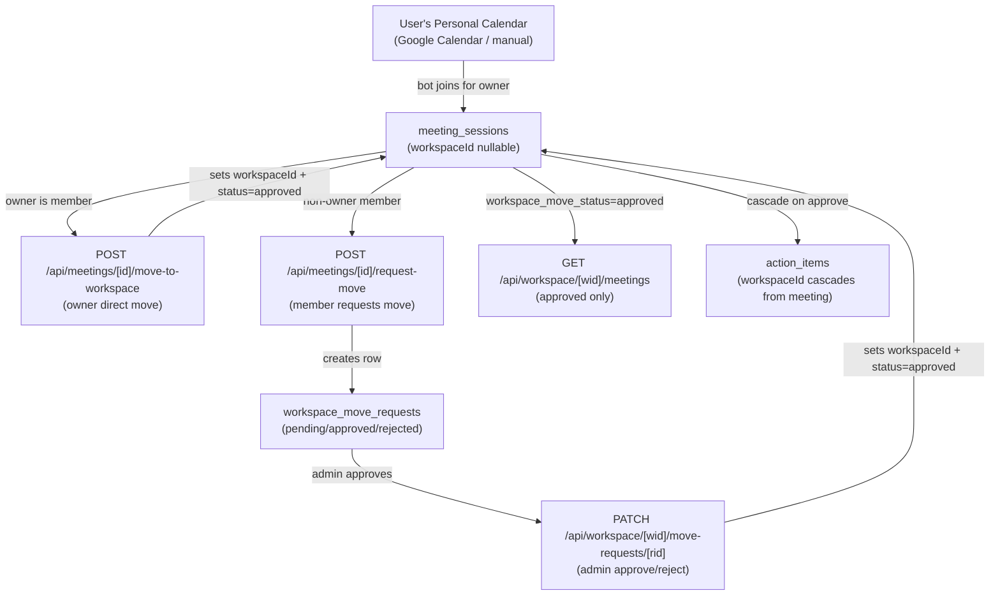
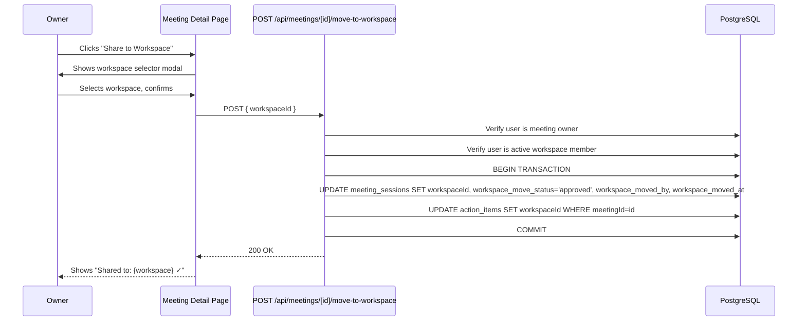
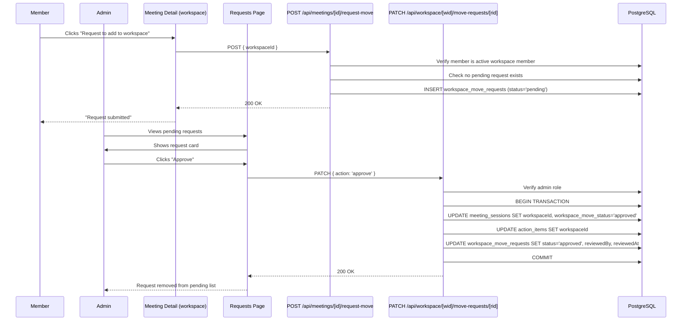
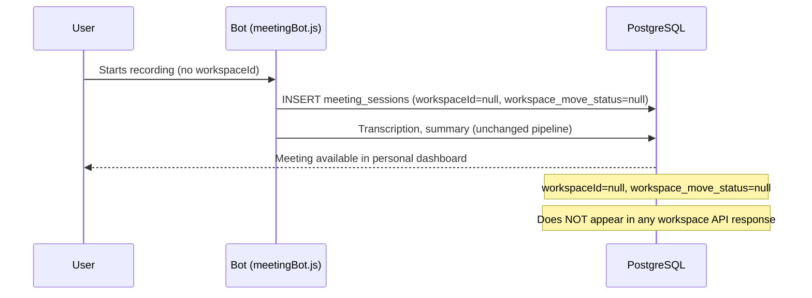

# Design Document: Workspace Integration

## Overview

This feature adds a **workspace sharing layer** on top of the existing personal meeting system. The core principle is:

> Meetings ALWAYS originate from a user's personal calendar. The workspace is a sharing mechanism, not a meeting creator. A meeting can exist without any workspace (personal mode) and is shared to a workspace explicitly by the owner or via an admin-approved member request.

### What changes

1. Three new columns on `meeting_sessions`: `workspace_move_status`, `workspace_moved_by`, `workspace_moved_at`
2. A new `workspace_move_requests` table for member-initiated share requests
3. New API routes for move operations, workspace-scoped meeting/action-item access, and admin review
4. New dashboard pages under `/dashboard/workspace/[workspaceId]/`
5. Workspace sub-navigation in the sidebar (personal section unchanged)

### What does NOT change

- Bot join flow (`bot/meetingBot.js`, `bot/transcribe.py`)
- Recording pipeline, transcription, Gemini summary generation
- Billing / Razorpay integration
- Clerk authentication
- All personal dashboard pages and personal API routes
- The `workspaceId` field on `meeting_sessions` and `action_items` remains nullable

---

## Architecture

The system follows the existing Next.js App Router pattern: server components for data fetching, client components for interactivity, Drizzle ORM for DB access, Clerk for auth.



### Key design decisions

**workspaceId is optional on meeting_sessions.** The bot join flow reads `workspaceId` from the session but the field is nullable — personal mode (workspaceId=null) is fully supported. No changes to bot or recording code.

**Move is a one-way operation.** Once a meeting is approved into a workspace, it stays there. The `workspace_move_status` column tracks the lifecycle: `null → pending_approval → approved/rejected`.

**Action items cascade automatically.** When a meeting's `workspace_move_status` transitions to `'approved'`, all `action_items` with that `meetingId` have their `workspaceId` updated in the same transaction.

**Workspace-scoped routes use `[workspaceId]` in the path**, not the `x-workspace-id` header pattern. This makes authorization explicit and avoids ambiguity for workspace-specific operations.

---

## Components and Interfaces

### 1. Database Schema Changes

#### 1a. `meeting_sessions` — three new columns

```typescript
// frontend/src/db/schema/meeting-sessions.ts (additions)
workspaceMoveStatus: varchar("workspace_move_status", { length: 50 }),
// null | 'pending_approval' | 'approved' | 'rejected'

workspaceMovedBy: varchar("workspace_moved_by", { length: 255 }),
// userId of the user who initiated the move

workspaceMovedAt: timestamp("workspace_moved_at", { withTimezone: true }),
// when the move was executed (approved)
```

The existing `workspaceId` column remains nullable and unchanged.

#### 1b. New `workspace_move_requests` table

```typescript
// frontend/src/db/schema/workspaces.ts (addition)
export const workspaceMoveRequests = pgTable("workspace_move_requests", {
  id: uuid("id").defaultRandom().primaryKey(),
  meetingId: uuid("meeting_id").notNull()
    .references(() => meetingSessions.id, { onDelete: "cascade" }),
  workspaceId: uuid("workspace_id").notNull()
    .references(() => workspaces.id, { onDelete: "cascade" }),
  requestedBy: uuid("requested_by").notNull()
    .references(() => users.id, { onDelete: "cascade" }),
  status: varchar("status", { length: 50 }).notNull().default("pending"),
  // 'pending' | 'approved' | 'rejected'
  adminNote: text("admin_note"),
  reviewedBy: uuid("reviewed_by").references(() => users.id, { onDelete: "set null" }),
  reviewedAt: timestamp("reviewed_at", { withTimezone: true }),
  createdAt: timestamp("created_at", { withTimezone: true }).defaultNow().notNull()
});
```

### 2. API Routes

All new workspace-scoped routes follow the pattern `/api/workspace/[workspaceId]/...` and verify workspace membership before any operation.

#### 2a. Owner Move — `POST /api/meetings/[id]/move-to-workspace`

```
Body: { workspaceId: string }

Auth checks:
  1. Authenticated user must be the meeting owner (meeting_sessions.userId = user.id)
  2. Authenticated user must be an active workspace_member of the target workspace

On success (transaction):
  - meeting_sessions: set workspaceId, workspace_move_status='approved',
    workspace_moved_by=userId, workspace_moved_at=now()
  - action_items: set workspaceId=targetWorkspaceId WHERE meetingId=id

Errors:
  403 — not owner or not workspace member
  409 — workspace_move_status already 'approved' (error: 'already_in_workspace')
  404 — meeting not found
```

#### 2b. Member Request Move — `POST /api/meetings/[id]/request-move`

```
Body: { workspaceId: string }

Auth checks:
  1. Authenticated user must be an active workspace_member of the target workspace

On success:
  - workspace_move_requests: insert row with status='pending', requestedBy=userId

Errors:
  403 — not a workspace member
  409 — pending request already exists for same meetingId+workspaceId (error: 'request_already_pending')
```

#### 2c. Admin Review — `PATCH /api/workspace/[workspaceId]/move-requests/[requestId]`

```
Body: { action: 'approve' | 'reject', adminNote?: string }

Auth checks:
  1. Authenticated user must have role 'admin' or 'owner' in the workspace

On approve (transaction):
  - meeting_sessions: set workspaceId, workspace_move_status='approved',
    workspace_moved_by=adminUserId, workspace_moved_at=now()
  - action_items: set workspaceId WHERE meetingId=request.meetingId
  - workspace_move_requests: set status='approved', reviewedBy, reviewedAt

On reject:
  - workspace_move_requests: set status='rejected', reviewedBy, reviewedAt, adminNote
  - meeting_sessions: NO changes

Errors:
  403 — not admin/owner
  404 — request not found
```

#### 2d. Workspace Meetings — `GET /api/workspace/[workspaceId]/meetings`

```
Auth: active workspace member

Query params: search, page, limit

Returns: meeting_sessions WHERE workspaceId=wid AND workspace_move_status='approved'
  - Includes: id, title, userId (owner), status, workspace_move_status, createdAt,
    scheduledStartTime, summary (truncated), participants
```

#### 2e. Move Requests List — `GET /api/workspace/[workspaceId]/move-requests`

```
Auth: active workspace member

Returns: workspace_move_requests WHERE workspaceId=wid
  - Includes meeting title (joined), requestedBy user name (joined), status, createdAt
  - Default filter: status='pending' (query param ?status=all for all)
```

#### 2f. Workspace Dashboard — `GET /api/workspace/[workspaceId]/dashboard`

```
Auth: active workspace member

Returns:
  - totalMeetings: COUNT(meeting_sessions WHERE workspaceId=wid AND workspace_move_status='approved')
  - meetingsThisMonth: same filter + createdAt in current calendar month
  - totalActionItems: COUNT(action_items WHERE workspaceId=wid)
  - pendingActionItems: COUNT(action_items WHERE workspaceId=wid AND status='pending')
  - recentMeetings: 5 most recent approved meetings (desc by workspace_moved_at)
  - actionItemsByAssignee: GROUP BY owner, COUNT(*)
  - members: workspace_members WHERE workspaceId=wid AND status='active'
  - pendingMoveRequestsCount: COUNT(workspace_move_requests WHERE workspaceId=wid AND status='pending')
    (only included if requester is admin/owner)
```

#### 2g. Action Item Assignment — `PATCH /api/workspace/[workspaceId]/action-items/[itemId]/assign`

```
Body: { memberId: string, memberName: string }

Auth: admin or owner role in workspace

On success: action_items SET owner=memberName WHERE id=itemId AND workspaceId=wid
```

#### 2h. Action Item Status Update — `PATCH /api/workspace/[workspaceId]/action-items/[itemId]/status`

```
Body: { status: 'pending' | 'in_progress' | 'done' | 'hold' }

Auth: assigned member (owner matches user name) OR admin/owner role

On success:
  - action_items SET status=status, updatedAt=now()
  - If status='done': also SET completedAt=now()
  - If status!='done': also SET completedAt=null
```

### 3. UI Pages

All new pages live under `/dashboard/workspace/[workspaceId]/` and are server components that fetch data directly, with client components for interactive elements.

#### 3a. Workspace Dashboard — `/dashboard/workspace/[workspaceId]`

Displays: stats cards (total meetings, this month, total action items, pending items), recent meetings list, action items by assignee, members list, pending requests count (admin only).

#### 3b. Workspace Meetings — `/dashboard/workspace/[workspaceId]/meetings`

Displays: meeting cards with title, recorded-by user, status badge, date, "View Report" link. Search input for filtering.

#### 3c. Workspace Meeting Detail — `/dashboard/workspace/[workspaceId]/meetings/[meetingId]`

Role-based rendering:
- **Not started**: waiting screen with scheduled time
- **Recording/in-progress**: live status; no "Stop Recording" for MEMBER/VIEWER
- **Completed**: full report for all roles, with role-gated controls:
  - ADMIN: full report + assign action items + delete from workspace + download
  - MEMBER: full report + status updates for own action items + download + request-move
  - VIEWER: full report, read-only

#### 3d. Move Requests — `/dashboard/workspace/[workspaceId]/requests`

Admin-only page. Lists pending move requests as cards: meeting title, requested-by, date, Approve/Reject buttons with optional admin note input.

#### 3e. Meeting Detail — Share to Workspace UI (personal page)

On `/dashboard/meetings/[id]`, the existing meeting detail page gains:
- "Share to Workspace" button (shown when: user is owner AND workspace_move_status=null AND user has at least one workspace membership)
- On click: modal with workspace selector (lists user's active memberships)
- On confirm: calls `POST /api/meetings/[id]/move-to-workspace`
- After success: replaces button with "Shared to: {workspace name} ✓" badge

### 4. Sidebar Navigation

The sidebar gains a WORKSPACES section below the existing PERSONAL section. The PERSONAL section is unchanged.

```
PERSONAL
  Dashboard
  Meetings
  Reports
  Action Items
  History
  Tools
  Settings
  Billing

WORKSPACES
  [Workspace A]  →  /dashboard/workspace/[idA]
  [Workspace B]  →  /dashboard/workspace/[idB]
  + Create workspace

(when inside /dashboard/workspace/[workspaceId]/*)
  Workspace sub-nav:
    Overview
    Meetings
    Action Items
    Members
    Requests  [badge: N pending]  (admin only)
    Settings
```

---

## Data Models

### `meeting_sessions` — additions

| Column | Type | Nullable | Default | Notes |
|--------|------|----------|---------|-------|
| `workspace_move_status` | `varchar(50)` | yes | null | `null` \| `'pending_approval'` \| `'approved'` \| `'rejected'` |
| `workspace_moved_by` | `varchar(255)` | yes | null | userId who initiated the move |
| `workspace_moved_at` | `timestamp` | yes | null | when move was executed |

Existing `workspace_id` column: nullable, unchanged.

### Workspace Move Status Invariant

| `workspace_move_status` | `workspaceId` |
|------------------------|---------------|
| `null` | must be `null` |
| `'pending_approval'` | may be `null` (not yet approved) |
| `'approved'` | must be non-null |
| `'rejected'` | may be `null` |

### `workspace_move_requests`

| Column | Type | Nullable | Default |
|--------|------|----------|---------|
| `id` | `uuid` | no | random |
| `meetingId` | `uuid` | no | — |
| `workspaceId` | `uuid` | no | — |
| `requestedBy` | `uuid` | no | — |
| `status` | `varchar(50)` | no | `'pending'` |
| `adminNote` | `text` | yes | null |
| `reviewedBy` | `uuid` | yes | null |
| `reviewedAt` | `timestamp` | yes | null |
| `createdAt` | `timestamp` | no | now() |

### `action_items` — no schema changes

`workspaceId` FK already present and nullable. Updated via cascade when meeting is approved.

### Role-Based Access Matrix

| Operation | OWNER (meeting) | ADMIN/OWNER (workspace) | MEMBER | VIEWER |
|-----------|-----------------|------------------------|--------|--------|
| Move meeting to workspace | ✅ (direct) | ✅ (approve request) | ❌ | ❌ |
| Request meeting move | ✅ | ✅ | ✅ | ❌ |
| View workspace meetings | ✅ | ✅ | ✅ | ✅ |
| View full meeting report | ✅ | ✅ | ✅ | ✅ |
| Assign action items | ❌ | ✅ | ❌ | ❌ |
| Update own action item status | ✅ | ✅ | ✅ (own only) | ❌ |
| Delete meeting from workspace | ❌ | ✅ | ❌ | ❌ |
| Download report | ✅ | ✅ | ✅ | ❌ |
| Stop recording | ✅ | ✅ | ❌ | ❌ |
| Review move requests | ❌ | ✅ | ❌ | ❌ |

---

## Data Flow Diagrams

### Flow 1: Owner Moves Meeting to Workspace



### Flow 2: Member Requests Move, Admin Approves



### Flow 3: Personal Mode (No Workspace)



---

## Correctness Properties

*A property is a characteristic or behavior that should hold true across all valid executions of a system — essentially, a formal statement about what the system should do. Properties serve as the bridge between human-readable specifications and machine-verifiable correctness guarantees.*

### Property 1: workspace_move_status / workspaceId consistency invariant

*For any* `meeting_session` row, if `workspace_move_status` is `null` then `workspaceId` must also be `null`; if `workspace_move_status` is `'approved'` then `workspaceId` must be non-null. This invariant must hold after every write operation.

**Validates: Requirements 1.5, 1.6**

### Property 2: Personal meetings excluded from workspace responses

*For any* `meeting_session` with `workspaceId = null`, a request to `GET /api/workspace/[workspaceId]/meetings` for any workspace must return zero rows matching that session's id.

**Validates: Requirements 15.4**

### Property 3: Workspace meetings API returns only approved meetings

*For any* workspace, all rows returned by `GET /api/workspace/[workspaceId]/meetings` must have `workspace_move_status = 'approved'` and `workspaceId` equal to the requested workspace id. No row with any other status may appear.

**Validates: Requirements 8.4, 8.5**

### Property 4: Owner-move authorization

*For any* meeting and any authenticated user who is either (a) not the meeting owner or (b) not an active member of the target workspace, `POST /api/meetings/[id]/move-to-workspace` must return HTTP 403.

**Validates: Requirements 4.2, 4.3**

### Property 5: Owner-move sets all required fields

*For any* successful `POST /api/meetings/[id]/move-to-workspace` call, the resulting `meeting_session` row must have: `workspaceId` equal to the requested workspace id, `workspace_move_status = 'approved'`, `workspace_moved_by` equal to the authenticated user's id, and `workspace_moved_at` non-null.

**Validates: Requirements 4.4, 4.7**

### Property 6: Action items cascade workspaceId from meeting on approval

*For any* meeting that transitions to `workspace_move_status = 'approved'` (via owner move or admin approval), all `action_items` rows with that `meetingId` must have `workspaceId` equal to the meeting's `workspaceId` after the operation completes.

**Validates: Requirements 2.2, 2.3, 4.5, 7.3**

### Property 7: Move request status invariant

*For any* `workspace_move_requests` row, `status` must be one of `'pending'`, `'approved'`, or `'rejected'`. No other value is permitted.

**Validates: Requirements 3.3**

### Property 8: Member request creates pending row

*For any* valid `POST /api/meetings/[id]/request-move` call by an active workspace member, the created `workspace_move_requests` row must have `status = 'pending'` and `requestedBy` equal to the authenticated user's id.

**Validates: Requirements 6.3, 6.4, 6.5**

### Property 9: Member request authorization

*For any* user who is not an active member of the target workspace, `POST /api/meetings/[id]/request-move` must return HTTP 403.

**Validates: Requirements 6.2**

### Property 10: Admin review authorization

*For any* user who does not have role `'admin'` or `'owner'` in the workspace, `PATCH /api/workspace/[workspaceId]/move-requests/[requestId]` must return HTTP 403.

**Validates: Requirements 7.2**

### Property 11: Rejection does not modify meeting

*For any* `PATCH` with `action = 'reject'`, the associated `meeting_session`'s `workspaceId` and `workspace_move_status` must remain unchanged after the operation.

**Validates: Requirements 7.6**

### Property 12: Action item assignment authorization and effect

*For any* user who is not an admin/owner of the workspace, `PATCH /api/workspace/[workspaceId]/action-items/[itemId]/assign` must return HTTP 403. For any successful assignment, the `action_items.owner` field must equal the `memberName` provided in the request body.

**Validates: Requirements 10.2, 10.5**

### Property 13: completedAt invariant

*For any* `action_items` row where `status = 'done'`, `completedAt` must be non-null. *For any* row where `status != 'done'`, `completedAt` must be null (or reset to null when status changes away from `'done'`).

**Validates: Requirements 11.3, 11.4, 11.5**

### Property 14: Dashboard stats consistency

*For any* workspace, the `totalMeetings` value returned by `GET /api/workspace/[workspaceId]/dashboard` must equal the actual count of `meeting_sessions` rows with that `workspaceId` and `workspace_move_status = 'approved'`, and `totalActionItems` must equal the actual count of `action_items` rows with that `workspaceId`.

**Validates: Requirements 13.4**

### Property 15: Workspace membership required for all workspace-scoped routes

*For any* user who is not an active member of a workspace, all `GET /api/workspace/[workspaceId]/*` routes must return HTTP 403.

**Validates: Requirements 8.3, 12.3, 13.3**

---

## Error Handling

| Scenario | HTTP Status | Error Code |
|----------|-------------|------------|
| Unauthenticated request | 401 | `Unauthorized.` |
| User not a workspace member | 403 | `forbidden` |
| Non-owner attempting direct move | 403 | `not_meeting_owner` |
| Non-admin attempting admin action | 403 | `admin_required` |
| Meeting already in workspace | 409 | `already_in_workspace` |
| Pending request already exists | 409 | `request_already_pending` |
| Meeting not found | 404 | `not_found` |
| Move request not found | 404 | `not_found` |
| Invalid UUID in path/query | 400 | Zod validation error |
| Database not configured | 503 | Standard DB error message |

All error responses use the existing `apiError(message, status, details?)` pattern from `src/lib/api-responses.ts`.

All write operations that touch both `meeting_sessions` and `action_items` (owner move, admin approve) are wrapped in a single Drizzle transaction to ensure atomicity.

---

## Testing Strategy

### Dual Testing Approach

Both unit tests and property-based tests are required and complementary:
- Unit tests: specific examples, integration points, edge cases
- Property tests: universal correctness across randomized inputs

### Property-Based Testing

Library: **fast-check** (already used in the codebase)

Each property test runs a minimum of 100 iterations. Each test is tagged:

```typescript
// Feature: workspace-integration, Property N: <property text>
```

Each correctness property maps to exactly one property-based test.

Key generators:
- `fc.uuid()` — workspaceId, userId, meetingId, requestId
- `fc.constantFrom('pending', 'approved', 'rejected')` — move request status
- `fc.constantFrom(null, 'pending_approval', 'approved', 'rejected')` — workspace_move_status
- `fc.constantFrom('owner', 'admin', 'member', 'viewer')` — workspace member role
- `fc.constantFrom('pending', 'in_progress', 'done', 'hold')` — action item status
- `fc.string({ minLength: 1 })` — member names, search terms

### Unit Tests

Focus areas:
- `POST /api/meetings/[id]/move-to-workspace`: owner check, membership check, 409 on duplicate, transaction atomicity
- `POST /api/meetings/[id]/request-move`: membership check, 409 on duplicate pending
- `PATCH /api/workspace/[wid]/move-requests/[rid]`: admin check, approve sets all fields, reject leaves meeting unchanged
- `GET /api/workspace/[wid]/meetings`: only approved meetings returned, non-member gets 403
- `PATCH /api/workspace/[wid]/action-items/[id]/status`: completedAt set/cleared correctly
- Personal routes: verify no workspaceId required, personal meetings not in workspace responses

### Test File Locations

```
frontend/src/tests/workspace-integration/
  move-status-invariant.property.test.ts      (Property 1)
  personal-exclusion.property.test.ts         (Property 2)
  workspace-meetings-approved.property.test.ts (Property 3)
  owner-move-auth.property.test.ts            (Property 4)
  owner-move-fields.property.test.ts          (Property 5)
  action-items-cascade.property.test.ts       (Property 6)
  move-request-status.property.test.ts        (Property 7)
  member-request-creation.property.test.ts    (Property 8)
  member-request-auth.property.test.ts        (Property 9)
  admin-review-auth.property.test.ts          (Property 10)
  rejection-no-modify.property.test.ts        (Property 11)
  assignment-auth-effect.property.test.ts     (Property 12)
  completed-at-invariant.property.test.ts     (Property 13)
  dashboard-stats.property.test.ts            (Property 14)
  workspace-membership-required.property.test.ts (Property 15)
  move-to-workspace.unit.test.ts
  request-move.unit.test.ts
  admin-review.unit.test.ts
```
