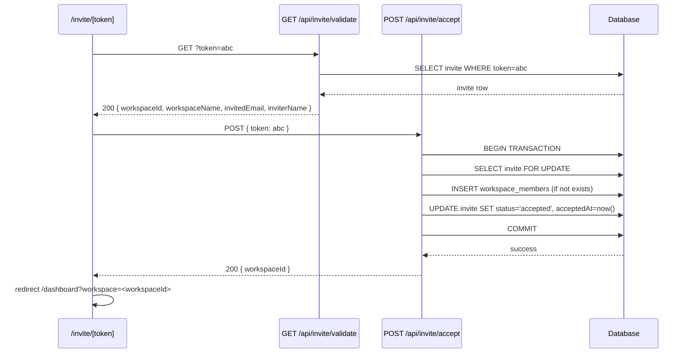
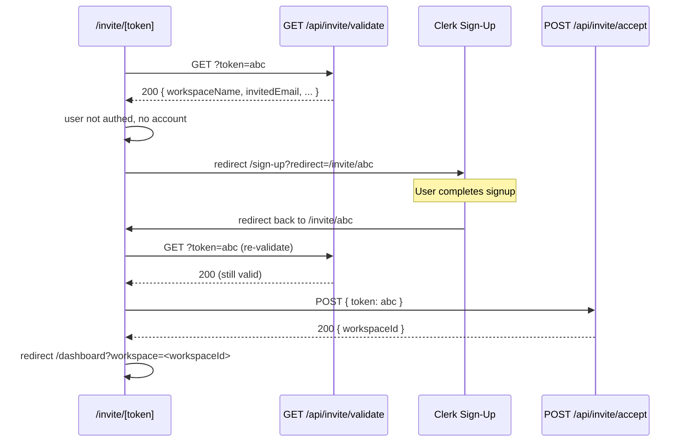

# Design Document: Workspace Invite Flow

## Overview

The workspace invite flow adds a token-based email invitation system to the existing Artivaa workspace system. Workspace owners and admins can invite any email address from the Workspace Management page. The system sends a transactional email containing a secure link. When the recipient clicks the link, the `/invite/[token]` page handles all routing: unauthenticated users are redirected to sign-in or sign-up (with the invite URL preserved as a `redirect` param), and authenticated users are automatically accepted into the workspace and redirected to the Workspace Dashboard.

The feature is purely additive — no existing tables, routes, or flows are modified.

### Key Design Decisions

- **Single acceptance point**: `/invite/[token]` is the only place where invite acceptance happens. There is no separate post-signup callback. Clerk's `redirect` param naturally returns the user to this page after auth.
- **Identity from session only**: The `POST /api/invite/accept` route reads the accepting user's identity exclusively from the Clerk session. The request body carries only the token.
- **Atomic accept transaction**: Membership creation and invite status update happen in a single DB transaction to prevent race conditions.
- **Email-first token delivery**: The token is never returned in any API response body — it exists only in the invite email.
- **Transactional email via Nodemailer/SMTP**: The app already has Gmail OAuth sending for meeting emails. For invite emails we use a dedicated SMTP transactional email service (e.g. Resend, SendGrid, or any SMTP provider configured via env vars) so invite delivery is not tied to a user's personal Gmail OAuth token.

---

## Architecture

```mermaid
graph TD
    subgraph "Invite Creation"
        A[Workspace Management Page] -->|POST /api/workspace/[id]/invite| B[Create Invite API]
        B --> C[(workspace_invites table)]
        B --> D[Email Service]
        D -->|Invite Email| E[Invitee Inbox]
    end

    subgraph "Invite Acceptance"
        E -->|Click Accept Link| F[/invite/[token] Page]
        F -->|GET /api/invite/validate| G[Validate Token API]
        G --> C
        F -->|Not authed, no account| H[/sign-up?redirect=/invite/token]
        F -->|Not authed, has account| I[/sign-in?redirect=/invite/token]
        H -->|After signup| F
        I -->|After sign-in| F
        F -->|Authed| J[POST /api/invite/accept]
        J --> C
        J --> K[(workspace_members table)]
        J -->|Success| L[/dashboard?workspace=id]
    end

    subgraph "Invite Management"
        A -->|GET suggestions| M[Suggestions API]
        A -->|DELETE /api/workspace/[id]/invite/[inviteId]| N[Revoke Invite API]
        N --> C
    end
```

### Component Responsibilities

| Layer | Component | Responsibility |
|---|---|---|
| DB Schema | `workspace_invites` | Stores invite state, token, expiry |
| API | `POST /api/workspace/[id]/invite` | Auth check, validation, token gen, email send |
| API | `GET /api/workspace/[id]/invite/suggestions` | Email autocomplete with exclusions |
| API | `GET /api/workspace/[id]/invite` | List pending invites for management UI |
| API | `DELETE /api/workspace/[id]/invite/[inviteId]` | Revoke a pending invite |
| API | `GET /api/invite/validate` | Public token validation (no auth required) |
| API | `POST /api/invite/accept` | Authenticated acceptance, atomic DB transaction |
| Page | `/invite/[token]` | Client-side routing orchestrator |
| Component | `InviteMembersCard` | Invite form + pending list in workspace management |
| Lib | `lib/invites/token.ts` | Token generation utility |
| Lib | `lib/invites/email.ts` | Invite email sending |

---

## Components and Interfaces

### API Routes

#### `GET /api/workspace/[workspaceId]/invite/suggestions`

Query params: `q` (partial email string)

- Requires authenticated session with `owner` or `admin` role in the workspace
- Returns `{ suggestions: string[] }` — email addresses only, max 5
- Returns `{ suggestions: [] }` when `q` is absent or fewer than 2 characters
- Excludes emails with a `pending` invite for this workspace
- Excludes emails of existing active members

#### `GET /api/workspace/[workspaceId]/invite`

- Requires authenticated session with `owner` or `admin` role
- Returns `{ invites: PendingInvite[] }` where each item has `id`, `invitedEmail`, `createdAt`, `expiresAt`

#### `POST /api/workspace/[workspaceId]/invite`

Request body: `{ email: string }`

- Requires authenticated session with `owner` or `admin` role
- Validates email format
- Checks for duplicate pending invite → 409 `invite_already_pending`
- Checks if already a member → 409 `already_a_member`
- Creates invite row, sends email
- Returns 201 `{ id, expiresAt }` on success
- Returns 502 `email_send_failed` and rolls back invite row if email fails

#### `DELETE /api/workspace/[workspaceId]/invite/[inviteId]`

- Requires authenticated session with `owner` or `admin` role
- Sets invite `status` to `'revoked'`
- Returns 200 on success

#### `GET /api/invite/validate`

Query params: `token`

- No authentication required (public)
- Checks existence → 404 `token_not_found`
- Checks expiry → 410 `token_expired`
- Checks status → 410 `token_already_used` or `token_revoked`
- Returns 200 `{ workspaceId, workspaceName, invitedEmail, inviterName }`

#### `POST /api/invite/accept`

Request body: `{ token: string }`

- Requires authenticated Clerk session
- Resolves user identity from session only (never from body)
- Validates token (same checks as validate endpoint)
- Checks email match → 403 `email_mismatch`
- Creates `workspace_members` row + marks invite `accepted` in a single transaction
- Idempotent: if already a member, still marks invite accepted and returns 200
- Returns 200 `{ workspaceId }`

### Frontend Pages and Components

#### `/invite/[token]` Page (`app/invite/[token]/page.tsx`)

Client component. On mount:
1. Calls `GET /api/invite/validate?token=<token>`
2. If invalid/expired → renders error state with reason and link to `/dashboard`
3. If valid and user is not authenticated:
   - Checks if the `invitedEmail` has an existing account (via `GET /api/users/exists?email=<email>`)
   - Redirects to `/sign-up?redirect=/invite/<token>` or `/sign-in?redirect=/invite/<token>`
4. If valid and user is authenticated → calls `POST /api/invite/accept`
   - On success → redirects to `/dashboard?workspace=<workspaceId>`
   - On 403 `email_mismatch` → renders mismatch UI with switch-account option
   - On other errors → renders error state

The page shows a loading spinner during all async operations. No manual user input is required beyond authentication.

#### `InviteMembersCard` Component (`components/workspace/InviteMembersCard.tsx`)

Rendered inside `WorkspaceManagementView` when `canManage` is true. Contains:
- Email input with debounced autocomplete (calls suggestions API after 2+ chars)
- Autocomplete dropdown showing email addresses only
- Submit button calling `POST /api/workspace/[workspaceId]/invite`
- Inline success/error messages
- Pending invites list with `invitedEmail`, `createdAt`, `expiresAt`, and Revoke button

#### Sign-up/Sign-in Pages

The existing Clerk `<SignUp>` and `<SignIn>` components already support `forceRedirectUrl` / `fallbackRedirectUrl`. The `/invite/[token]` page passes the redirect via the URL query param (`?redirect=/invite/<token>`), and Clerk's hosted UI will redirect back after auth. No changes to the existing auth pages are needed — Clerk handles the redirect param natively.

### Utility Libraries

#### `lib/invites/token.ts`

```typescript
import crypto from "node:crypto";

export function generateInviteToken(): string {
  return crypto.randomBytes(32).toString("hex"); // 64-char hex string
}
```

#### `lib/invites/email.ts`

Sends invite email via SMTP (Nodemailer or Resend SDK). Uses env vars:
- `INVITE_EMAIL_FROM` — sender address
- `SMTP_HOST`, `SMTP_PORT`, `SMTP_USER`, `SMTP_PASS` (or `RESEND_API_KEY`)

Template renders workspace name, inviter display name, and the accept link.

---

## Data Models

### `workspace_invites` Table (Drizzle Schema)

```typescript
export const workspaceInvites = pgTable(
  "workspace_invites",
  {
    id: uuid("id").defaultRandom().primaryKey(),
    workspaceId: uuid("workspace_id")
      .notNull()
      .references(() => workspaces.id, { onDelete: "cascade" }),
    invitedEmail: varchar("invited_email", { length: 255 }).notNull(),
    invitedBy: uuid("invited_by")
      .notNull()
      .references(() => users.id, { onDelete: "cascade" }),
    token: varchar("token", { length: 128 }).notNull().unique(),
    status: varchar("status", { length: 20 }).notNull().default("pending"),
    expiresAt: timestamp("expires_at", { withTimezone: true }).notNull(),
    acceptedAt: timestamp("accepted_at", { withTimezone: true }),
    createdAt: timestamp("created_at", { withTimezone: true }).defaultNow().notNull(),
  },
  (table) => ({
    tokenIdx: uniqueIndex("workspace_invites_token_uidx").on(table.token),
    pendingEmailWorkspaceIdx: uniqueIndex("workspace_invites_pending_email_workspace_uidx")
      .on(table.workspaceId, table.invitedEmail)
      .where(sql`status = 'pending'`),
    workspaceIdx: index("workspace_invites_workspace_id_idx").on(table.workspaceId),
  })
);
```

**Status state machine:**

```
pending → accepted  (via POST /api/invite/accept)
pending → revoked   (via DELETE /api/workspace/[id]/invite/[inviteId])
pending → expired   (logical: expiresAt in the past; no background job required)
```

Once `accepted` or `revoked`, status is immutable.

### Existing Tables (unchanged)

- `workspaces` — no changes
- `workspace_members` — no changes; new members are inserted with `role = 'member'`, `status = 'active'`
- `users` — no changes; email lookup uses existing `getUserByEmail`

### Data Flow: Accept Invite (Registered User)



### Data Flow: Accept Invite (New User)



---

## Correctness Properties

*A property is a characteristic or behavior that should hold true across all valid executions of a system — essentially, a formal statement about what the system should do. Properties serve as the bridge between human-readable specifications and machine-verifiable correctness guarantees.*


### Property 1: Token uniqueness and entropy

*For any* two independently generated invite tokens, they should be different strings, and each token should be at least 64 characters long (representing ≥ 32 bytes of entropy) composed entirely of valid hex characters.

**Validates: Requirements 1.4, 9.1**

### Property 2: Expiry invariant

*For any* newly created invite, `expiresAt` should equal `createdAt` plus exactly 7 days (604800 seconds).

**Validates: Requirements 1.5, 3.6**

### Property 3: Suggestions authorization

*For any* authenticated user who is not an `owner` or `admin` of the workspace, calling `GET /api/workspace/[workspaceId]/invite/suggestions` should return HTTP 403.

**Validates: Requirements 2.2**

### Property 4: Suggestions return only email addresses

*For any* suggestions query that returns results, every item in the `suggestions` array should be a plain string (email address) with no additional fields such as name, userId, or other personal data.

**Validates: Requirements 2.4, 2.9, 8.3**

### Property 5: Suggestions count bound

*For any* suggestions query against any backing dataset, the number of returned suggestions should be at most 5.

**Validates: Requirements 2.5**

### Property 6: Suggestions exclusions

*For any* workspace and any query string, no returned suggestion should be the email of either (a) a user with a `pending` invite for that workspace, or (b) an existing active `workspace_members` row for that workspace.

**Validates: Requirements 2.6, 2.7**

### Property 7: Short query returns empty

*For any* query string `q` with fewer than 2 characters (including the empty string), the suggestions endpoint should return an empty array without performing a database query.

**Validates: Requirements 2.8**

### Property 8: Send invite authorization

*For any* authenticated user who is not an `owner` or `admin` of the workspace, calling `POST /api/workspace/[workspaceId]/invite` should return HTTP 403.

**Validates: Requirements 3.2**

### Property 9: Invalid email rejected

*For any* string that is not a syntactically valid email address (e.g. missing `@`, missing domain, empty string), calling `POST /api/workspace/[workspaceId]/invite` with that string should return HTTP 400 with error code `invalid_email`.

**Validates: Requirements 3.3**

### Property 10: Invite email contains required content

*For any* successfully created invite, the email sent to `invitedEmail` should contain the workspace name, the inviter's display name, and a URL of the form `/invite/<token>`.

**Validates: Requirements 3.7**

### Property 11: Token absent from API responses

*For any* API response from the invite system (suggestions, list, validate, accept, revoke), the response body should not contain a field named `token` or the raw token value.

**Validates: Requirements 9.2**

### Property 12: Validate response contains required fields

*For any* valid token (status `pending`, `expiresAt` in the future), calling `GET /api/invite/validate` should return HTTP 200 with all four fields: `workspaceId`, `workspaceName`, `invitedEmail`, and `inviterName`.

**Validates: Requirements 4.6**

### Property 13: Validation check ordering

*For any* invite token that simultaneously fails multiple checks (e.g. both expired and accepted), the validate endpoint should return the error corresponding to the first failing check in the order: existence → expiry → status.

**Validates: Requirements 4.7**

### Property 14: Email mismatch rejected

*For any* authenticated user whose session email does not match the invite's `invitedEmail`, calling `POST /api/invite/accept` with that invite's token should return HTTP 403 with error code `email_mismatch`.

**Validates: Requirements 5.4, 9.4**

### Property 15: Successful accept creates workspace member

*For any* authenticated user whose email matches a valid pending invite's `invitedEmail`, calling `POST /api/invite/accept` should result in a `workspace_members` row existing for that user in the invite's workspace with `role = 'member'` and `status = 'active'`.

**Validates: Requirements 5.5**

### Property 16: Accept atomicity

*For any* successful accept operation, the `workspace_members` row creation and the invite `status = 'accepted'` / `acceptedAt` update should both be present after the operation — there should be no state where one is committed without the other.

**Validates: Requirements 5.6, 5.9**

### Property 17: Accept idempotency for existing members

*For any* authenticated user who is already an active `workspace_members` of the workspace and holds a valid matching invite, calling `POST /api/invite/accept` should return HTTP 200 with `workspaceId` and should mark the invite as `accepted` without creating a duplicate `workspace_members` row.

**Validates: Requirements 5.8**

### Property 18: Unauthenticated accept rejected

*For any* request to `POST /api/invite/accept` without a valid Clerk session, the response should be HTTP 401.

**Validates: Requirements 5.2, 9.3, 7.10**

### Property 19: Invite handler routing for unauthenticated users

*For any* valid token and any unauthenticated visitor, the invite handler page should redirect to `/sign-up?redirect=/invite/<token>` if the invitedEmail has no existing account, or to `/sign-in?redirect=/invite/<token>` if the invitedEmail has an existing account.

**Validates: Requirements 7.4, 6.1**

### Property 20: Auto-accept for all authenticated users

*For any* authenticated user with a valid matching invite token, the invite handler page should call `POST /api/invite/accept` and redirect to `/dashboard?workspace=<workspaceId>` on success — regardless of whether the user arrived via sign-in or sign-up.

**Validates: Requirements 7.6, 7.8, 6.4, 6.5, 7.5**

### Property 21: Revoke authorization

*For any* authenticated user who is not an `owner` or `admin` of the workspace, calling `DELETE /api/workspace/[workspaceId]/invite/[inviteId]` should return HTTP 403.

**Validates: Requirements 8.10**

### Property 22: Terminal status immutability

*For any* invite with `status = 'revoked'` or `status = 'accepted'`, attempting to accept it via `POST /api/invite/accept` should return an error (HTTP 410) and should not create a new `workspace_members` row or change the invite's status.

**Validates: Requirements 9.6**

### Property 23: Logical expiry independent of status column

*For any* invite row where `expiresAt` is in the past and `status = 'pending'`, calling `GET /api/invite/validate` should return HTTP 410 with `token_expired` — even if no background job has updated the `status` column to `'expired'`.

**Validates: Requirements 9.7**

### Property 24: Double-accept prevention

*For any* valid pending invite, if two concurrent requests attempt to accept it simultaneously, at most one should succeed in creating a `workspace_members` row and marking the invite `accepted`; the other should receive an error response.

**Validates: Requirements 9.5**

---

## Error Handling

### API Error Codes

| Scenario | HTTP Status | Error Code |
|---|---|---|
| No authenticated session | 401 | — |
| Not workspace owner/admin | 403 | `forbidden` |
| Email mismatch on accept | 403 | `email_mismatch` |
| Invalid email format | 400 | `invalid_email` |
| Pending invite already exists | 409 | `invite_already_pending` |
| Invitee already a member | 409 | `already_a_member` |
| Token not found | 404 | `token_not_found` |
| Token expired | 410 | `token_expired` |
| Token already used | 410 | `token_already_used` |
| Token revoked | 410 | `token_revoked` |
| Email send failure | 502 | `email_send_failed` |
| Database not configured | 503 | — |

### Rollback on Email Failure

When `POST /api/workspace/[workspaceId]/invite` creates an invite row but the email send fails, the route must delete the invite row before returning 502. This prevents orphaned `pending` invites that can never be accepted. Implementation uses a try/catch around the email send with a compensating delete.

### Race Condition Handling

The `POST /api/invite/accept` route uses a database transaction with `SELECT ... FOR UPDATE` on the invite row to serialize concurrent accept attempts. The unique index on `workspace_members(workspaceId, userId)` provides a second layer of protection against duplicate membership rows.

### Expired Invite Handling

Expiry is evaluated at query time by comparing `expiresAt` against `NOW()`. No background job is required. The `status` column is only updated to `'expired'` opportunistically (e.g. during a revoke or list operation) but is never relied upon for expiry logic.

### Frontend Error States

The `/invite/[token]` page handles these states:
- **Loading**: spinner while validate/accept calls are in flight
- **Invalid token**: error card with reason (expired / already used / not found) and link to `/dashboard`
- **Email mismatch**: message showing both emails, button to sign out and switch account
- **Accept failure**: error card with message, no redirect

---

## Testing Strategy

### Dual Testing Approach

Both unit tests and property-based tests are required. Unit tests cover specific examples, integration points, and error conditions. Property tests verify universal correctness across randomized inputs.

### Property-Based Testing

The project uses **fast-check** (already in `devDependencies`) with **vitest** as the test runner.

Each property test must:
- Run a minimum of **100 iterations** (fast-check default is 100; use `{ numRuns: 100 }`)
- Include a comment tag referencing the design property:
  `// Feature: workspace-invite-flow, Property N: <property_text>`

Property test files live in `frontend/src/tests/workspace-integration/` following the existing naming convention (e.g. `invite-token.property.test.ts`, `invite-accept.property.test.ts`).

**Properties to implement as property-based tests:**

| Property | Test File | fast-check Arbitraries |
|---|---|---|
| P1: Token uniqueness | `invite-token.property.test.ts` | `fc.integer()` to seed multiple generations |
| P2: Expiry invariant | `invite-token.property.test.ts` | `fc.date()` for createdAt |
| P4: Suggestions content | `invite-suggestions.property.test.ts` | `fc.array(fc.emailAddress())` |
| P5: Suggestions count | `invite-suggestions.property.test.ts` | `fc.array(fc.emailAddress(), { minLength: 10 })` |
| P6: Suggestions exclusions | `invite-suggestions.property.test.ts` | `fc.array(fc.emailAddress())` |
| P7: Short query empty | `invite-suggestions.property.test.ts` | `fc.string({ maxLength: 1 })` |
| P9: Invalid email rejected | `invite-send.property.test.ts` | `fc.string()` filtered to non-email strings |
| P14: Email mismatch rejected | `invite-accept.property.test.ts` | `fc.emailAddress()` pairs where emails differ |
| P17: Accept idempotency | `invite-accept.property.test.ts` | `fc.uuid()` for workspaceId/userId |
| P22: Terminal status immutability | `invite-accept.property.test.ts` | `fc.constantFrom('revoked', 'accepted')` |
| P23: Logical expiry | `invite-validate.property.test.ts` | `fc.date()` for past expiresAt |

### Unit Tests

Unit tests cover:
- Token generation: correct length, valid characters
- Email template rendering: contains workspace name, inviter name, accept link
- Validate endpoint: each error code (404, 410 variants)
- Accept endpoint: 401 without session, 403 email mismatch, 200 success, 409 duplicate
- Revoke endpoint: 403 for non-admin, 200 success
- Suggestions endpoint: 403 for non-admin, empty for short query, correct exclusions
- `/invite/[token]` page: renders error state for invalid token, renders mismatch UI for 403

### Integration Tests

- Full invite flow: create invite → validate token → accept → verify workspace_members row
- Rollback on email failure: create invite → mock email failure → verify invite row deleted
- Concurrent accept: two simultaneous accept requests → only one workspace_members row created
