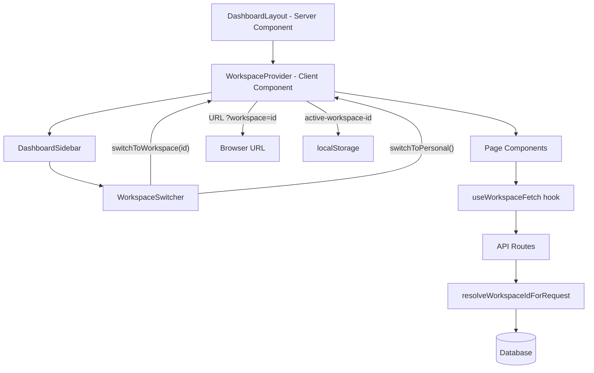

# Design Document: Workspace Redesign

## Overview

The workspace redesign replaces the current architecture — where workspace features live on separate, dedicated URL paths (`/dashboard/workspace/[workspaceId]/...`) — with a context-switching model. A `WorkspaceContext` provider mounted in the dashboard layout holds the active workspace state. Every existing page (`/dashboard`, `/dashboard/reports`, `/dashboard/action-items`, `/dashboard/meetings`) becomes dual-mode: it shows personal data when no workspace is active, and workspace-scoped data when one is. The sidebar adapts its navigation items based on `workspace.type` rather than URL path matching. A single management page at `/dashboard/workspace` replaces all the old workspace-specific sub-pages.

The key architectural shift is moving from **URL-path-based workspace routing** to **query-parameter + context-based workspace switching**. The URL `?workspace=<id>` is the authoritative source of truth; localStorage is a secondary UX cache for continuity across navigations.

### Key Design Decisions

1. **URL param as source of truth** — `?workspace=ws_id` makes workspace context shareable via link and survives page refresh without server-side session state.
2. **`workspace.type` field for sidebar logic** — Using a DB column (`'personal' | 'team'`) rather than null checks or name conventions makes sidebar visibility deterministic and avoids fragile heuristics.
3. **Fix `resolveWorkspaceIdForRequest` fallback** — The current auto-select fallback silently returns workspace data when the user intends personal mode. Removing it makes the resolver a strict pass-through: no header → `null` (personal mode).
4. **Single `useWorkspaceFetch` hook** — Centralises header injection so every API call automatically carries the correct `x-workspace-id` without per-component boilerplate.

---

## Architecture



### Data Flow

1. User lands on `/dashboard` — `WorkspaceProvider` reads `?workspace` from URL (primary) or `localStorage` (secondary). If neither, `activeWorkspaceId = null`.
2. User picks a workspace in `WorkspaceSwitcher` → `WorkspaceProvider.switchToWorkspace(id)` updates URL param and localStorage.
3. Page components call `useWorkspaceFetch` to get a fetch wrapper. When `activeWorkspaceId` is set, the wrapper injects `x-workspace-id: <id>` header.
4. API routes call `resolveWorkspaceIdForRequest` — if header present, verify membership and return `workspaceId`; if absent, return `null` (personal mode).
5. DB queries branch on `workspaceId`: present → `WHERE workspaceId = ?`, absent → `WHERE userId = ?`.

---

## Components and Interfaces

### WorkspaceContext (`frontend/src/contexts/workspace-context.tsx`)

```typescript
type WorkspaceMode = 'personal' | 'workspace';

type WorkspaceInfo = {
  id: string;
  name: string;
  type: 'personal' | 'team';
  role: 'owner' | 'admin' | 'member';
};

type WorkspaceContextValue = {
  mode: WorkspaceMode;
  activeWorkspaceId: string | null;
  activeWorkspace: WorkspaceInfo | null;
  workspaces: WorkspaceInfo[];
  switchToPersonal: () => void;
  switchToWorkspace: (id: string) => void;
};
```

**Behaviour:**
- On mount: read `?workspace` from `useSearchParams()`. If present and valid, set as active. If absent, check `localStorage['active-workspace-id']`. If found, set active and sync to URL. Otherwise, `activeWorkspaceId = null`.
- `switchToWorkspace(id)`: update `router.replace` with `?workspace=id`, write to localStorage.
- `switchToPersonal()`: remove `?workspace` from URL via `router.replace`, set localStorage to `null`.
- Fetches workspace list from `/api/workspaces` on mount to populate `workspaces[]` and resolve `activeWorkspace` details.

### useWorkspaceFetch (`frontend/src/hooks/useWorkspaceFetch.ts`)

```typescript
function useWorkspaceFetch(): (input: RequestInfo, init?: RequestInit) => Promise<Response>
```

Returns a `fetch` wrapper that automatically appends `x-workspace-id: <activeWorkspaceId>` to request headers when `activeWorkspaceId` is non-null. When in personal mode, no header is added.

### WorkspaceSwitcher (updated `frontend/src/components/workspace/WorkspaceSwitcher.tsx`)

- Reads workspace list and active state from `WorkspaceContext` (no more direct localStorage reads).
- Renders "Personal" as the first option.
- On select: calls `context.switchToWorkspace(id)` or `context.switchToPersonal()`.
- On "Create workspace": navigates to `/dashboard/workspace`.
- Removes direct `router.refresh()` call — URL update in context triggers re-render naturally.

### DashboardSidebar (updated)

- Removes `WorkspaceSubNav` component entirely.
- Removes pathname regex for `activeWorkspaceId` detection.
- Reads `activeWorkspace` from `WorkspaceContext`.
- Nav item visibility based on `activeWorkspace?.type`:
  - `type === 'personal'` or `activeWorkspace === null`: show History, Workspace link, Tools.
  - `type !== 'personal'` (i.e. `'team'`): hide History, Workspace link, Tools.
- Adds "Manage Workspace" link to `/dashboard/workspace` when `activeWorkspaceId` is set.

### resolveWorkspaceIdForRequest (updated `frontend/src/lib/workspaces/server.ts`)

```typescript
async function resolveWorkspaceIdForRequest(
  request: Pick<Request, 'headers'> | undefined,
  userId: string
): Promise<string | null>
```

**New behaviour:**
- If `request` is undefined → return `null` (personal mode; removes the `"test-workspace"` hack).
- If `x-workspace-id` header is absent or empty → return `null` (personal mode, no fallback).
- If `x-workspace-id` header is present → verify active membership → return `workspaceId` or `null` (non-member treated as personal, caller may return 403).

The `getFirstActiveWorkspaceIdForUser` fallback is removed entirely.

---

## Data Models

### DB Schema Addition: `workspaces.type`

Add a `type` column to the `workspaces` table:

```typescript
// frontend/src/db/schema/workspaces.ts
type: varchar("type", { length: 50 }).notNull().default("team")
// values: 'personal' | 'team'
```

**Rationale:** Using a DB column rather than a naming convention (`name === 'Personal'`) makes sidebar logic deterministic. The `type` field is set at workspace creation time and never changes.

**Migration:** Existing workspaces default to `'team'`. Personal workspaces (if any exist) need a one-time data migration to set `type = 'personal'`.

### WorkspaceInfo (API response shape)

```typescript
type WorkspaceInfo = {
  id: string;
  name: string;
  type: 'personal' | 'team';
  role: 'owner' | 'admin' | 'member';
};
```

The `/api/workspaces` endpoint must include `type` in its response.

### Action Items Ownership (workspace mode)

Current query: `WHERE workspaceId = ? AND userId = ?` — this is too restrictive for workspace mode.

New workspace-mode query for members:
```sql
WHERE workspaceId = ?
  AND (
    userId = currentUser          -- own items
    OR assignedTo = currentUser   -- assigned to them
    OR meetingId IN (             -- from meetings they participated in
      SELECT meetingId FROM meeting_participants WHERE userId = currentUser
    )
  )
```

Admin/owner: `WHERE workspaceId = ?` (all items).

---

## Correctness Properties

*A property is a characteristic or behavior that should hold true across all valid executions of a system — essentially, a formal statement about what the system should do. Properties serve as the bridge between human-readable specifications and machine-verifiable correctness guarantees.*

### Property 1: URL param is authoritative on initialisation

*For any* workspace id present in the URL `?workspace=<id>` parameter at page load, the `WorkspaceContext` must initialise `activeWorkspaceId` to that exact id — regardless of what localStorage contains.

**Validates: Requirements 1.4**

### Property 2: localStorage fallback when URL param absent

*For any* valid workspace id stored in `localStorage['active-workspace-id']` when the URL contains no `?workspace` parameter, the `WorkspaceContext` must initialise `activeWorkspaceId` from localStorage and sync it to the URL.

**Validates: Requirements 1.5**

### Property 3: Empty context initialises to null

*For any* page load where neither the URL nor localStorage contains a valid workspace identifier, the `WorkspaceContext` must initialise `activeWorkspaceId` to `null` (personal mode).

**Validates: Requirements 1.6**

### Property 4: switchToWorkspace syncs URL and localStorage

*For any* workspace id passed to `switchToWorkspace(id)`, both the URL `?workspace` parameter and `localStorage['active-workspace-id']` must be updated to that same id after the call.

**Validates: Requirements 1.2, 1.8**

### Property 5: switchToPersonal clears URL and localStorage

*For any* prior workspace state, calling `switchToPersonal()` must result in the URL containing no `?workspace` parameter and `localStorage['active-workspace-id']` being `null` or absent.

**Validates: Requirements 1.3, 1.8**

### Property 6: WorkspaceSwitcher displays correct active label

*For any* `WorkspaceContext` state, the `WorkspaceSwitcher` must display the name of the active workspace when `activeWorkspaceId` is set, or "Personal" when `activeWorkspaceId` is `null`.

**Validates: Requirements 2.1**

### Property 7: WorkspaceSwitcher lists exactly active memberships

*For any* authenticated user, the workspace list rendered by `WorkspaceSwitcher` must contain exactly the workspaces where that user has an active membership record — no more, no less.

**Validates: Requirements 2.2**

### Property 8: Sidebar item visibility determined by workspace.type

*For any* active workspace with `type = 'personal'`, the sidebar must show the History, Workspace, and Tools navigation items. *For any* active workspace with `type = 'team'`, those same items must be hidden. The sidebar must produce the same result regardless of workspace name or whether `activeWorkspaceId` is null vs. a personal-type workspace.

**Validates: Requirements 3.2, 3.3**

### Property 9: Sidebar management link presence

*For any* non-null `activeWorkspaceId`, the sidebar must include a link to `/dashboard/workspace`. *For any* null `activeWorkspaceId`, that link must be absent.

**Validates: Requirements 3.5**

### Property 10: API resolver returns null without x-workspace-id header

*For any* API request that does not include an `x-workspace-id` header, `resolveWorkspaceIdForRequest` must return `null` — it must never auto-select a workspace via fallback.

**Validates: Requirements 7.3**

### Property 11: API resolver enforces active membership

*For any* API request with an `x-workspace-id` header where the authenticated user is not an active member of that workspace, `resolveWorkspaceIdForRequest` must return `null` and the API route must respond with 403 Forbidden.

**Validates: Requirements 7.4, 7.5**

### Property 12: Personal mode API returns only user-owned records

*For any* API request in personal mode (no `x-workspace-id` header), every record in the response must have `userId = authenticatedUser` — never records from other users or from any workspace.

**Validates: Requirements 7.3, 4.1, 5.1**

### Property 13: Workspace mode API returns only workspace-scoped records

*For any* API request with a valid `x-workspace-id` header, every record in the response must have `workspaceId = resolvedWorkspaceId` — never personal records from other users or records from other workspaces.

**Validates: Requirements 7.2, 4.2, 5.2, 6.2**

### Property 14: Personal action items ownership filter

*For any* user in personal mode, the action items API must return only items where the user is the owner, is assigned to the item, or participated in the meeting from which the item was extracted — never items from other users with no such relationship.

**Validates: Requirements 6.1**

### Property 15: Workspace management page redirects when no active workspace

*For any* navigation to `/dashboard/workspace` when `activeWorkspaceId` is `null`, the system must redirect the user to `/dashboard`.

**Validates: Requirements 8.11**

### Property 16: Workspace management admin actions gated by role

*For any* workspace member with role `'owner'` or `'admin'`, the management page must expose role-change, member-removal, and join-request actions. *For any* member with role `'member'`, those actions must not be available.

**Validates: Requirements 8.3, 8.4, 8.5, 8.6**

### Property 17: Workspace CRUD operations are consistent

*For any* workspace, the following round-trip operations must leave the system in a consistent state: (a) updating the name — fetching the workspace afterwards must return the new name; (b) a member leaving — that member must no longer appear in the member list; (c) transferring ownership — the new owner must have role `'owner'` and the previous owner must have a non-owner role.

**Validates: Requirements 8.7, 8.9, 8.10**

### Property 18: Meeting workspace controls visibility

*For any* meeting detail page in workspace mode where the meeting belongs to the active workspace, a workspace badge must be present and no "Move to workspace" button must appear. *For any* personal meeting in workspace mode, a "Move to workspace" button must be present and no workspace badge must appear. *For any* meeting in personal mode, neither control must appear.

**Validates: Requirements 10.1, 10.2, 10.5**

### Property 19: Removed page URLs redirect to unified pages

*For any* previously valid URL that has been removed (e.g. `/dashboard/workspace/[id]/meetings`, `/dashboard/workspace/action-items`, `/dashboard/workspaces`), accessing that URL must result in a redirect to the equivalent unified page rather than a 404.

**Validates: Requirements 9.9**

---

## Error Handling

| Scenario | Behaviour |
|---|---|
| `resolveWorkspaceIdForRequest` — user not a member | Return `null`; API route returns 403 |
| `resolveWorkspaceIdForRequest` — DB unavailable | Throw; API route returns 500 |
| `WorkspaceSwitcher` fetch fails | Display inline error; keep last known state |
| `WorkspaceContext` — stored workspace ID no longer valid (membership revoked) | Fall back to personal mode; clear localStorage |
| Workspace management page — no active workspace | Redirect to `/dashboard` |
| Move request submission fails | Show inline error; do not navigate away |
| Removed page URL accessed | 301 redirect to equivalent unified page |

---

## Testing Strategy

### Unit Tests

Focus on specific examples, integration points, and error conditions:

- `resolveWorkspaceIdForRequest`: test with no header (returns null), valid header + member (returns id), valid header + non-member (returns null), undefined request (returns null).
- `WorkspaceContext`: test URL-param initialisation, localStorage fallback, sync behaviour on switch.
- Sidebar nav item visibility: test with `type = 'personal'`, `type = 'team'`, and `activeWorkspace = null`.
- Workspace management page redirect: test navigation to `/dashboard/workspace` with null active workspace.

### Property-Based Tests

Using **fast-check** (TypeScript PBT library). Each test runs a minimum of **100 iterations**.

Tag format: `Feature: workspace-redesign, Property <N>: <property_text>`

| Property | Test Description |
|---|---|
| P1: URL param authoritative | Generate random workspace IDs; set as URL param with any localStorage value; assert context initialises to URL value |
| P2: localStorage fallback | Generate valid localStorage IDs with absent URL param; assert context initialises from localStorage and syncs to URL |
| P3: Empty context → null | Generate absent/invalid URL and localStorage combinations; assert activeWorkspaceId = null |
| P4: switchToWorkspace syncs | Generate random workspace IDs; call switchToWorkspace; assert URL param and localStorage both match |
| P5: switchToPersonal clears | From any workspace state, call switchToPersonal; assert URL param absent and localStorage null |
| P6: Switcher displays correct label | Generate context states; assert switcher label matches active workspace name or "Personal" |
| P7: Switcher lists exact memberships | Generate random membership sets; assert switcher list matches exactly |
| P8: Sidebar type-based visibility | Generate workspaces with type='personal' and type='team'; assert correct item visibility |
| P9: Sidebar management link | Generate null and non-null activeWorkspaceId values; assert link presence/absence |
| P10: Resolver null without header | Generate random requests without x-workspace-id; assert resolver returns null |
| P11: Resolver enforces membership | Generate workspace IDs not in user's memberships; assert null + 403 response |
| P12: Personal mode data isolation | Generate random userId; assert all returned records have userId = that user |
| P13: Workspace mode data isolation | Generate random workspaceId; assert all returned records have workspaceId = that workspace |
| P14: Personal action items ownership | Generate action items with varied ownership/assignment; assert only eligible items returned |
| P15: Management page redirect | Generate null activeWorkspaceId; navigate to /dashboard/workspace; assert redirect to /dashboard |
| P16: Admin actions gated by role | Generate members with owner/admin vs member roles; assert action availability matches role |
| P17: Workspace CRUD consistency | Generate workspace mutations (rename, leave, transfer); assert post-state matches expected |
| P18: Meeting controls visibility | Generate meetings with varied workspace membership and mode; assert correct control visibility |
| P19: Removed URLs redirect | Generate removed URL paths; assert each redirects to the correct unified page |

Each property-based test must include a comment:
```typescript
// Feature: workspace-redesign, Property N: <property_text>
```
