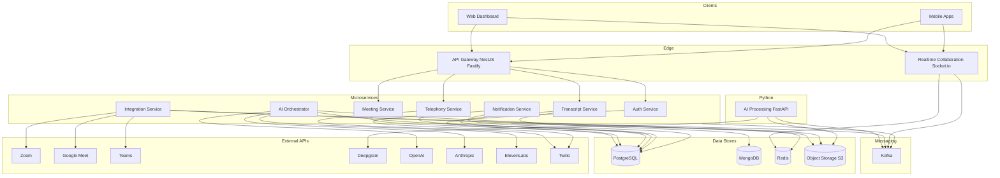
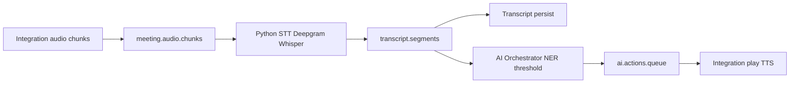
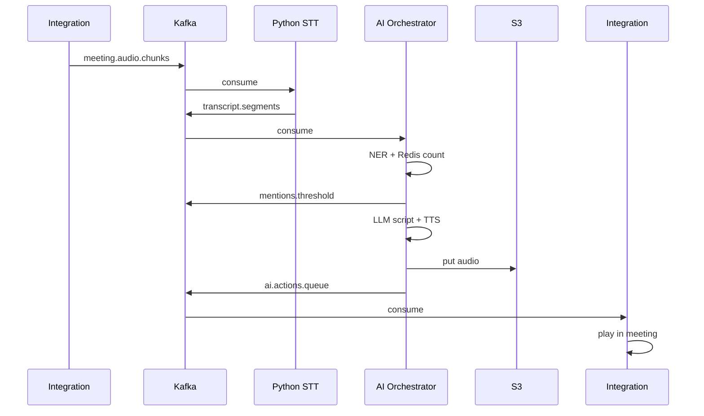
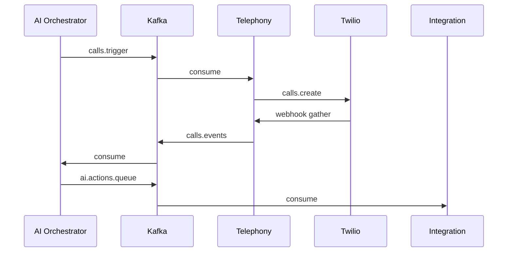
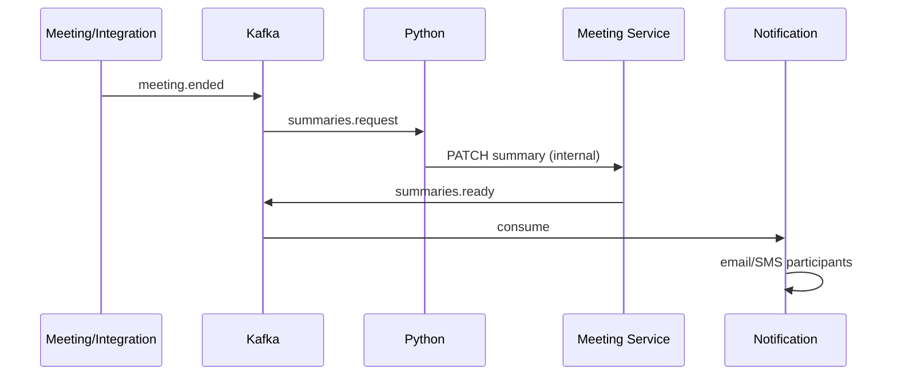
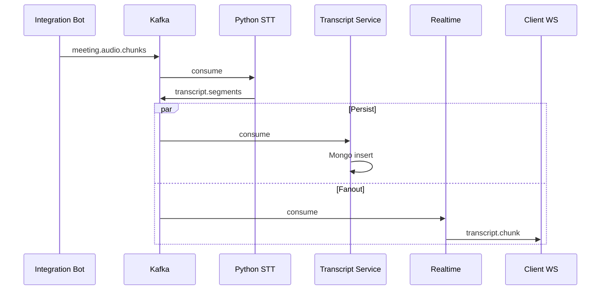

# RFC: AI Meeting Assistant Platform — Production Architecture

**Document type:** Request for Comments (Architecture)  
**Status:** Draft for implementation  
**Version:** 2.0  
**Date:** April 5, 2026  
**Supersedes:** `ai_meeting_assistant_architecture.md` v1.0  

---

## Table of Contents

1. [Executive Summary](#1-executive-summary)
2. [Goals and Non-Goals](#2-goals-and-non-goals)
3. [System Overview](#3-system-overview)
4. [High-Level Architecture](#4-high-level-architecture)
5. [Detailed Microservice Architecture](#5-detailed-microservice-architecture)
6. [Service Responsibilities](#6-service-responsibilities)
7. [API Gateway Design](#7-api-gateway-design)
8. [Detailed REST API Endpoints](#8-detailed-rest-api-endpoints)
9. [WebSocket Event Design](#9-websocket-event-design)
10. [Kafka Topics and Event Contracts](#10-kafka-topics-and-event-contracts)
11. [Data Models and Database Schema](#11-data-models-and-database-schema)
12. [Redis Caching Strategy](#12-redis-caching-strategy)
13. [AI Processing Pipeline](#13-ai-processing-pipeline)
14. [Telephony Call Flow (Twilio)](#14-telephony-call-flow-twilio)
15. [Meeting Recording and Processing Flow](#15-meeting-recording-and-processing-flow)
16. [Real-time Transcription Flow](#16-real-time-transcription-flow)
17. [Batch Transcription Flow](#17-batch-transcription-flow)
18. [AI Summary Generation Flow](#18-ai-summary-generation-flow)
19. [Text-to-Speech Response Flow](#19-text-to-speech-response-flow)
20. [Error Handling Strategy](#20-error-handling-strategy)
21. [Observability](#21-observability-logging-metrics-tracing)
22. [Security Architecture](#22-security-architecture)
23. [Rate Limiting Strategy](#23-rate-limiting-strategy)
24. [Deployment Architecture](#24-deployment-architecture)
25. [Docker Container Layout](#25-docker-container-layout)
26. [Kubernetes Deployment Architecture](#26-kubernetes-deployment-architecture)
27. [CI/CD Pipeline (GitHub Actions + Argo CD)](#27-cicd-pipeline-github-actions--argo-cd)
28. [Turborepo Monorepo Structure](#28-turborepo-monorepo-structure)
29. [Example Request/Response Payloads](#29-example-requestresponse-payloads)
30. [Sequence Diagrams](#30-sequence-diagrams-for-major-flows)

**Appendices:** Per-service NestJS structure, Prisma fragments, Kafka schemas, complete endpoint table.

---

## 1. Executive Summary

This RFC defines a **production-grade, event-driven microservice platform** for an **AI meeting assistant**: autonomous meeting participation, streaming speech-to-text, participant mention detection with configurable thresholds, AI-mediated speech in meetings (TTS), outbound telephony (Twilio) for user reach-out, escalation, and structured post-meeting summaries with notifications.

The control plane and most data planes are implemented in **Node.js 22 LTS** with **TypeScript 5.4**, **NestJS** as the application framework, and **Fastify 4.x** as the HTTP adapter. **Apache Kafka** (via **kafkajs**) is the backbone for asynchronous, replayable event streaming. **Redis** (**ioredis**) backs caching, sessions, Socket.io scaling, and ephemeral state. **PostgreSQL** is the system of record for relational entities; **MongoDB** stores high-volume transcript segments. **Prisma 5.x** is the ORM for Node services.

Heavy AI workloads run in a **Python FastAPI 0.115** service: streaming/batch STT (**Deepgram** primary, **Whisper large-v3** batch), diarization helpers, and LLM-assisted summarization pipelines coordinated with the **AI Orchestrator** (NestJS).

**Realtime** user experience is delivered by the **Realtime Collaboration Service** (NestJS + **Socket.io 4.x** + Redis adapter). **Twilio Node SDK 5.x** powers telephony.

Infrastructure targets **Docker**, **Kubernetes 1.30**, **GitHub Actions** for CI, and **Argo CD** for GitOps delivery. The codebase is organized as a **Turborepo 2.x** monorepo.

---

## 2. Goals and Non-Goals

### 2.1 Goals

| ID | Goal |
|----|------|
| G1 | End-to-end reference architecture for engineering implementation (services, APIs, events, data). |
| G2 | Clear **bounded contexts** and **owned data** per microservice. |
| G3 | **NestJS + Fastify** consistently for Node HTTP services; **Socket.io** for WebSockets. |
| G4 | **Event-driven** integration via **Kafka** with explicit contracts and topic semantics. |
| G5 | Observable, secure, rate-limited, horizontally scalable design. |
| G6 | Support **1,000+ concurrent meetings** in a single region at maturity (with stated scaling levers). |

### 2.2 Non-Goals

| ID | Non-Goal |
|----|----------|
| NG1 | Prescriptive UI/UX design for web/mobile clients beyond API/WebSocket contracts. |
| NG2 | Legal/compliance sign-off (GDPR patterns are described; legal review is out of scope). |
| NG3 | Choosing a specific cloud SKU list; AWS-style names are illustrative. |
| NG4 | A separate Go audio microservice (optional future); v2.0 keeps Python + Node as in the mandated stack. |

---

## 3. System Overview

### 3.1 Capabilities (from source architecture)

- Autonomous meeting join via platform integrations (Zoom / Google Meet / Microsoft Teams).
- Continuous transcription (streaming STT).
- NLP-based **mention detection** with per-participant thresholds.
- **TTS** playback in-meeting for absence messaging and relayed user answers.
- **Outbound calls** (Twilio) with IVR, DTMF/voice capture, relay back to meeting.
- **Escalation** when users are unavailable.
- **Structured post-meeting summaries** and multi-channel **notifications**.

### 3.2 Logical Flows (summary)

- **Flow A — Detection & auto-response:** Audio → STT → mention detector → threshold → log / AI speak / trigger call.
- **Flow B — User response loop:** Outbound call → IVR → answer or join → relay to meeting.
- **Flow C — Post-meeting:** Meeting end → transcript assembly → LLM summary → persist → notify.

### 3.3 Technology Baseline (mandatory)

| Layer | Technology |
|-------|------------|
| Runtime | Node.js 22 LTS |
| Language | TypeScript 5.4 |
| Backend framework | NestJS |
| HTTP adapter | `@nestjs/platform-fastify` → Fastify 4.x |
| WebSockets | `@nestjs/websockets` + `socket.io` 4.x |
| ORM | Prisma 5.x |
| Events | Kafka + kafkajs |
| Cache | Redis + ioredis |
| AI (Python) | FastAPI 0.115 |
| STT | Deepgram SDK (primary), Whisper large-v3 (batch) |
| TTS | ElevenLabs, OpenAI TTS (fallback) |
| LLM | Anthropic Claude 3.5, OpenAI GPT-4o |
| Telephony | Twilio Node SDK 5.x |
| Containers / orchestration | Docker, Kubernetes 1.30 |
| Monorepo | Turborepo 2.x |
| CI/CD | GitHub Actions, Argo CD |

---

## 4. High-Level Architecture

### 4.1 Context Diagram



### 4.2 Event-Driven Integration

All long-running and cross-service workflows use **Kafka**. Synchronous calls are reserved for: user-facing CRUD through the gateway, internal gRPC/HTTP where low latency and strong consistency are required (kept minimal; most internal coordination is async).

### 4.3 Service List (microservices)

| Service | Runtime | Role |
|---------|---------|------|
| **API Gateway** | NestJS + Fastify | Single public HTTP entry: routing, authn delegation, rate limits, correlation IDs. |
| **Auth Service** | NestJS + Fastify | Identity, orgs, JWT access/refresh, RBAC, API keys for bots. |
| **Meeting Service** | NestJS + Fastify | Meetings, participants, schedules, meeting lifecycle, summary metadata pointers. |
| **Transcript Service** | NestJS + Fastify | Transcript segment persistence (MongoDB), query APIs, idempotent segment ingestion from pipeline. |
| **AI Orchestrator** | NestJS + Fastify | Mention NER, thresholds, LLM script generation, TTS orchestration, escalation policy, publishes bot/TTS/call intents. |
| **Integration Service** | NestJS + Fastify | Platform adapters, bot pool, audio chunking → Kafka, TTS playback into meeting, recording hooks. |
| **Telephony Service** | NestJS + Fastify | Twilio webhooks, outbound calls, IVR state, user response events to Kafka. |
| **Notification Service** | NestJS + Fastify | Email/SMS/push from Kafka, templates, delivery receipts. |
| **Realtime Collaboration** | NestJS + Socket.io | Live transcript, mention alerts, AI/call/summary events to subscribed clients. |
| **Python AI Processing** | FastAPI | Deepgram streaming/batch, Whisper batch, diarization, optional summarization workers. |

> **Note:** The **API Gateway** is a deployable NestJS application. It does not embed business domains; it proxies and aggregates where needed.

---

## 5. Detailed Microservice Architecture

### 5.1 Common NestJS Conventions

- **Transport:** Fastify via `NestFactory.create<NestFastifyApplication>(AppModule, new FastifyAdapter())`.
- **Validation:** `class-validator` + `class-transformer` with a global `ValidationPipe`.
- **Config:** `@nestjs/config` with schema validation (e.g. Zod or Joi).
- **Health:** `@nestjs/terminus` for `/health/live` and `/health/ready`.
- **Kafka:** `@nestjs/microservices` with custom kafkajs wrappers or community pattern: `KafkaModule` registering producers/consumers per module.
- **Prisma:** One **Prisma schema per service** (subset of models) to enforce bounded context; shared **enums** live in `packages/shared-types`.
- **Idempotency:** Kafka consumers use **idempotency keys** (event `id` or business key) stored in Redis or PostgreSQL `processed_events` where needed.

### 5.2 API Gateway (`apps/api-gateway`)

**Responsibilities:** Route `/v1/*` to downstream services; attach `Authorization` bearer to internal calls; enforce global rate limits; request size limits; CORS; optional JWT validation using Auth Service JWKS (cache in Redis).

**Does not own:** Domain aggregates (delegates to services).

**Internal communication:** HTTP to Auth, Meeting, Transcript, Telephony services (server-side). WebSocket traffic **bypasses** gateway for production (subdomain `wss://rt.*` → Realtime service); alternatively, sticky load balancer to Realtime.

### 5.3 Auth Service (`apps/auth-service`)

**Owns:** `users`, `organizations`, `sessions` / refresh token rotation metadata, `roles`, `api_keys` (hashed).

**Emits:** `auth.user.deleted`, `auth.org.updated` (optional).

### 5.4 Meeting Service (`apps/meeting-service`)

**Owns:** `meetings`, `meeting_participants`, `meeting_summaries` (relational metadata), scheduling fields.

**Emits:** `meeting.created`, `meeting.status.changed`, `meeting.ended`, `bot.command.requested`.

### 5.5 Transcript Service (`apps/transcript-service`)

**Owns:** MongoDB `transcript_chunks`, references to `meeting_id`; optional PostgreSQL index table for cursors.

**Consumes:** `transcript.segments` (to persist).

**Emits:** `transcript.persisted` (optional, for AI Orchestrator idempotency).

### 5.6 AI Orchestrator (`apps/ai-orchestrator`)

**Owns:** `ai_actions`, mention policy state in Redis + durable rows in PostgreSQL for audit.

**Consumes:** `transcript.segments` (or `transcript.persisted`), `mentions.threshold` (if split), `calls.events`, `meeting.ended`.

**Produces:** `ai.actions.queue`, `calls.trigger`, `summaries.request`, TTS job events.

**LLM/TTS:** Calls Anthropic Claude 3.5 / GPT-4o for scripts and summaries; ElevenLabs + OpenAI TTS with fallback policy.

### 5.7 Integration Service (`apps/integration-service`)

**Owns:** `bot_sessions` (MongoDB or PostgreSQL), platform OAuth tokens (encrypted), adapter health.

**Consumes:** `ai.actions.queue` (play TTS), `bot.command.request`.

**Produces:** `meeting.audio.chunks`, `meeting.recording.*`, `integration.bot.status`.

### 5.8 Telephony Service (`apps/telephony-service`)

**Owns:** `call_logs`.

**Consumes:** `calls.trigger`.

**Produces:** `calls.events`, `notifications.outbound` (optional).

### 5.9 Notification Service (`apps/notification-service`)

**Owns:** `notification_templates`, `notification_deliveries`.

**Consumes:** `summaries.ready`, `notifications.outbound`, escalation events.

### 5.10 Realtime Collaboration Service (`apps/realtime-collaboration-service`)

**Owns:** Ephemeral socket registry in Redis only.

**Consumes:** `transcript.segments`, `mentions.raw`, `ai.actions.queue`, `calls.events`, `meeting.ended`, `summaries.ready` (filtered per room).

### 5.11 Python AI Processing Service (`apps/ai-processing-py`)

**Owns:** No primary SQL; optional local scratch; writes to Kafka and may call Transcript Service HTTP for persistence (or only Kafka → Transcript consumes).

**Consumes:** `meeting.audio.chunks`.

**Produces:** `transcript.segments`, `stt.batch.completed`.

---

## 6. Service Responsibilities

| Service | Primary responsibility | Primary datastore |
|---------|------------------------|-------------------|
| API Gateway | Edge routing, throttling, auth passthrough | Redis (JWKS cache, rate counters) |
| Auth | Identity, tokens, RBAC | PostgreSQL |
| Meeting | Meeting lifecycle, participants, summary rows | PostgreSQL |
| Transcript | Segment storage, read APIs | MongoDB + PostgreSQL (cursor metadata) |
| AI Orchestrator | Mentions, thresholds, LLM, TTS jobs, escalation | PostgreSQL + Redis |
| Integration | Bots, audio→Kafka, play TTS | MongoDB/PostgreSQL + S3 |
| Telephony | Twilio, IVR, call analytics | PostgreSQL |
| Notification | Multi-channel delivery | PostgreSQL |
| Realtime | Push events to UI | Redis |
| Python AI | STT, batch, diarization | S3 (temp audio) |

---

## 7. API Gateway Design

### 7.1 Responsibilities

- **TLS termination** at ingress (Ingress or cloud LB); gateway runs HTTP inside cluster.
- **Path-based routing** to services (see §8).
- **Authentication:** Validate JWT using **JWKS** from Auth Service (`GET /.well-known/jwks.json`) unless path is public.
- **Rate limiting:** Redis token bucket / sliding window (see §23).
- **Correlation:** Generate or propagate `x-request-id`, `x-correlation-id`.
- **Body limits:** e.g. 1 MB default for JSON.

### 7.2 NestJS Modules (gateway)

```
AppModule
├── ConfigModule
├── ThrottlerModule (or custom Redis rate limiter)
├── HttpProxyModule / downstream clients
├── HealthModule
└── RouterModule (versioned routes)
```

### 7.3 Gateway → Downstream

| Public path prefix | Target service |
|-------------------|----------------|
| `/v1/auth/*` | auth-service |
| `/v1/meetings/*` | meeting-service |
| `/v1/transcripts/*` | transcript-service |
| `/v1/calls/*` | telephony-service (admin) |
| `/v1/integrations/*` | integration-service (internal/admin) |

> Webhooks (Twilio) hit **telephony-service** directly with signature validation — not required through gateway; use separate Ingress host `hooks.*`.

---

## 8. Detailed REST API Endpoints

Base URL (external): `https://api.example.com/v1`  
Internal base URLs: `http://auth-service`, `http://meeting-service`, etc. (cluster DNS).

### 8.1 Auth Service

| Method | Path | Description |
|--------|------|-------------|
| POST | `/auth/register` | Register user (if enabled) |
| POST | `/auth/login` | Email/password → tokens |
| POST | `/auth/refresh` | Refresh token rotation |
| POST | `/auth/logout` | Revoke refresh session |
| GET | `/auth/me` | Current user profile |
| GET | `/.well-known/jwks.json` | Public keys for JWT verification |
| POST | `/orgs` | Create organization |
| GET | `/orgs/:orgId` | Org details |
| PATCH | `/orgs/:orgId` | Update org settings |

### 8.2 Meeting Service

| Method | Path | Description |
|--------|------|-------------|
| POST | `/meetings` | Create meeting |
| GET | `/meetings/:meetingId` | Get meeting |
| PATCH | `/meetings/:meetingId` | Update meeting |
| POST | `/meetings/:meetingId/participants` | Add participant |
| PATCH | `/meetings/:meetingId/participants/:participantId` | Update participant (threshold, watch_mentions, absence_reason) |
| POST | `/meetings/:meetingId/bot/start` | Request bot join |
| POST | `/meetings/:meetingId/bot/stop` | Stop bot |
| GET | `/meetings/:meetingId/summary` | Get summary (if ready) |
| GET | `/meetings/:meetingId/mentions` | Aggregated mention stats |
| PATCH | `/meetings/:meetingId/participants/:participantId/respond` | Ingest user text answer from app |

### 8.3 Transcript Service

| Method | Path | Description |
|--------|------|-------------|
| GET | `/meetings/:meetingId/transcript` | Paginated transcript segments |
| GET | `/meetings/:meetingId/transcript/export` | Export (JSON/SRT) |

### 8.4 Telephony Service

| Method | Path | Description |
|--------|------|-------------|
| POST | `/webhooks/twilio/voice` | Twilio Voice status/callback (TwiML) |
| POST | `/webhooks/twilio/gather` | DTMF / speech gather |
| GET | `/calls/:callSid` | Internal/debug call state |

### 8.5 Integration Service (internal / operator)

| Method | Path | Description |
|--------|------|-------------|
| POST | `/internal/bots/sessions` | Register bot session |
| GET | `/internal/bots/sessions/:id` | Bot health |
| POST | `/internal/platforms/zoom/oauth/callback` | OAuth callback handlers |

### 8.6 AI Orchestrator (typically internal)

| Method | Path | Description |
|--------|------|-------------|
| POST | `/internal/ai/reprocess-mentions` | Admin replay |
| GET | `/internal/ai/actions/:meetingId` | List AI actions |

### 8.7 Complete API Endpoint Table (consolidated)

| # | Service | Method | Path | Auth |
|---|---------|--------|------|------|
| 1 | Auth | POST | `/v1/auth/login` | Public |
| 2 | Auth | POST | `/v1/auth/refresh` | Refresh cookie/body |
| 3 | Auth | GET | `/v1/auth/me` | Bearer |
| 4 | Meeting | POST | `/v1/meetings` | Bearer |
| 5 | Meeting | GET | `/v1/meetings/:id` | Bearer |
| 6 | Meeting | POST | `/v1/meetings/:id/participants` | Bearer |
| 7 | Meeting | POST | `/v1/meetings/:id/bot/start` | Bearer |
| 8 | Meeting | GET | `/v1/meetings/:id/summary` | Bearer |
| 9 | Meeting | GET | `/v1/meetings/:id/mentions` | Bearer |
| 10 | Meeting | PATCH | `/v1/meetings/:id/participants/:pid/respond` | Bearer |
| 11 | Transcript | GET | `/v1/meetings/:id/transcript` | Bearer |
| 12 | Telephony | POST | `/v1/webhooks/twilio/voice` | Twilio signature |
| 13 | Telephony | POST | `/v1/webhooks/twilio/gather` | Twilio signature |

---

## 9. WebSocket Event Design

**Namespace:** `/` with **rooms** `meeting:{meetingId}` (Socket.io 4.x).

**Auth:** Client sends JWT in handshake `auth.token` or first `join_meeting_room` message; server validates via Auth JWKS.

### 9.1 Client → Server

| Event | Payload | Description |
|-------|---------|-------------|
| `join_meeting_room` | `{ meeting_id, auth_token? }` | Join room |
| `leave_meeting_room` | `{ meeting_id }` | Leave room |
| `ping` | `{ ts }` | Keepalive |

### 9.2 Server → Client

| Event | Payload |
|-------|---------|
| `transcript.chunk` | `{ meeting_id, speaker_name, text, chunk_sequence, timestamp_ms, confidence? }` |
| `mention.detected` | `{ meeting_id, participant_id, mentioned_name, current_count, threshold, threshold_triggered, context }` |
| `ai.speaking` | `{ meeting_id, action_type, script, status }` |
| `call.initiated` | `{ meeting_id, participant_id, call_attempt, call_sid, status }` |
| `call.response_received` | `{ participant_id, response_type, response_text? }` |
| `meeting.ended` | `{ meeting_id, duration_minutes, summary_status }` |
| `summary.ready` | `{ meeting_id, summary_id }` |

**Redis adapter:** `@socket.io/redis-adapter` with ioredis pub/sub for horizontal scale.

---

## 10. Kafka Topics and Event Contracts

### 10.1 Topic Catalog

| Topic | Partition key | Retention | Producers | Consumers |
|-------|-----------------|-----------|-----------|-----------|
| `meeting.audio.chunks` | `meeting_id` | 6h | Integration | Python AI |
| `transcript.segments` | `meeting_id` | 7d | Python AI | Transcript, Realtime, AI Orchestrator |
| `mentions.raw` | `meeting_id` | 7d | AI Orchestrator | Realtime |
| `mentions.threshold` | `participant_id` | 7d | AI Orchestrator | AI Orchestrator (action), Realtime |
| `ai.actions.queue` | `meeting_id` | 24h | AI Orchestrator | Integration, Realtime |
| `calls.trigger` | `participant_id` | 24h | AI Orchestrator | Telephony |
| `calls.events` | `call_sid` | 7d | Telephony | AI Orchestrator, Realtime |
| `meeting.ended` | `meeting_id` | 7d | Meeting / Integration | Python AI, Notification, AI Orchestrator |
| `summaries.request` | `meeting_id` | 24h | AI Orchestrator | Python AI |
| `summaries.ready` | `meeting_id` | 7d | Meeting or Python→Meeting | Notification, Realtime |
| `notifications.outbound` | `user_id` | 24h | Telephony, AI Orchestrator | Notification |

### 10.2 Event Schema (JSON payloads)

All messages wrap a common envelope:

```typescript
// packages/shared-types/src/events/envelope.ts
export interface KafkaEventEnvelope<T> {
  id: string;              // UUID v4
  type: string;            // e.g. "transcript.segment.v1"
  occurred_at: string;     // ISO-8601
  producer: string;        // service name
  correlation_id: string;
  data: T;
}
```

**`transcript.segments` — `data`:**

```json
{
  "meeting_id": "uuid",
  "chunk_sequence": 1247,
  "speaker_id": "uuid|null",
  "speaker_name": "Rahul Gupta",
  "text": "We should loop in Priya for this decision.",
  "confidence": 0.97,
  "start_ms": 1820000,
  "end_ms": 1826000,
  "stt_provider": "deepgram|whisper",
  "transcript_chunk_id": "mongo-object-id"
}
```

**`mentions.threshold` — `data`:**

```json
{
  "meeting_id": "uuid",
  "participant_id": "uuid",
  "mention_count": 2,
  "threshold": 2,
  "triggered_at": "2026-04-05T10:14:33.000Z",
  "absence_reason": "Priya is in another meeting.",
  "context_text": "..."
}
```

**`ai.actions.queue` — `data`:**

```json
{
  "action_id": "uuid",
  "meeting_id": "uuid",
  "participant_id": "uuid|null",
  "action_type": "speak_absence|speak_user_answer|play_tts",
  "script_text": "string",
  "tts_audio_url": "https://s3.../object",
  "priority": "normal|high"
}
```

**`calls.trigger` — `data`:**

```json
{
  "call_id": "uuid",
  "meeting_id": "uuid",
  "participant_id": "uuid",
  "phone_e164": "+919876543210",
  "reason": "user_needed",
  "attempt_number": 1
}
```

---

## 11. Data Models and Database Schema

### 11.1 Ownership

| Entity | Owner service | Store |
|--------|---------------|-------|
| User, Org, Session | Auth | PostgreSQL |
| Meeting, Participant, Summary (row) | Meeting | PostgreSQL |
| TranscriptChunk | Transcript | MongoDB |
| AiAction | AI Orchestrator | PostgreSQL |
| CallLog | Telephony | PostgreSQL |
| BotSession | Integration | MongoDB or PostgreSQL |
| NotificationDelivery | Notification | PostgreSQL |

### 11.2 Prisma — Auth Service (excerpt)

```prisma
// apps/auth-service/prisma/schema.prisma
generator client { provider = "prisma-client-js" }
datasource db { provider = "postgresql" url = env("DATABASE_URL") }

model Organization {
  id        String   @id @default(uuid())
  name      String
  plan      String   @default("starter")
  settings  Json     @default("{}")
  users     User[]
  createdAt DateTime @default(now())
}

model User {
  id                 String   @id @default(uuid())
  email              String   @unique
  passwordHash       String
  name               String
  phoneNumber        String?
  timezone           String   @default("UTC")
  orgId              String
  org                Organization @relation(fields: [orgId], references: [id])
  notificationPrefs  Json     @default("{\"email\":true,\"sms\":true,\"push\":true}")
  createdAt          DateTime @default(now())
  updatedAt          DateTime @updatedAt
}

model RefreshSession {
  id         String   @id @default(uuid())
  userId     String
  tokenHash  String
  expiresAt  DateTime
  createdAt  DateTime @default(now())
}
```

### 11.3 Prisma — Meeting Service (excerpt)

```prisma
model Meeting {
  id                  String    @id @default(uuid())
  orgId               String
  externalMeetingId   String?
  platform            String
  title               String?
  scheduledStart      DateTime?
  actualStart         DateTime?
  actualEnd           DateTime?
  status              String    @default("scheduled")
  joinUrl             String?
  botSessionId        String?
  createdBy           String?
  participants        MeetingParticipant[]
  createdAt           DateTime  @default(now())
}

model MeetingParticipant {
  id               String   @id @default(uuid())
  meetingId        String
  meeting          Meeting  @relation(fields: [meetingId], references: [id])
  userId           String?
  displayName      String
  email            String?
  phoneNumber      String?
  role             String   @default("attendee")
  watchMentions    Boolean  @default(false)
  mentionThreshold Int      @default(2)
  absenceReason    String?
}

model MeetingSummary {
  id                     String   @id @default(uuid())
  meetingId              String   @unique
  shortSummary           String?
  fullSummary            String?
  keyDecisions           Json     @default("[]")
  actionItems            Json     @default("[]")
  topicsDiscussed        Json     @default("[]")
  attendeesSummary       Json     @default("{}")
  sentiment              String?
  durationMinutes        Int?
  aiInterventionsCount   Int      @default(0)
  generatedAt            DateTime?
}
```

### 11.4 Prisma — AI Orchestrator (excerpt)

```prisma
model AiAction {
  id            String   @id @default(uuid())
  meetingId     String
  participantId String?
  actionType    String
  triggerEvent  String?
  scriptText    String?
  ttsAudioUrl   String?
  status        String   @default("pending")
  metadata      Json     @default("{}")
  executedAt    DateTime?
  createdAt     DateTime @default(now())
}
```

### 11.5 Prisma — Telephony Service (excerpt)

```prisma
model CallLog {
  id             String   @id @default(uuid())
  meetingId      String
  participantId  String?
  aiActionId     String?
  phoneNumber    String
  callSid        String?
  status         String?
  durationSeconds Int?
  userResponse   String?
  responseType   String?
  callAttempt    Int      @default(1)
  initiatedAt    DateTime?
  answeredAt     DateTime?
  endedAt        DateTime?
  createdAt      DateTime @default(now())
}
```

### 11.6 MongoDB — Transcript (schema-less document)

Same as source document: `transcript_chunks` with `meeting_id`, `chunk_sequence`, `speaker_*`, `text`, `confidence`, `start_time_ms`, `end_time_ms`, `audio_chunk_key`, `language`, `created_at`.

---

## 12. Redis Caching Strategy

| Key pattern | Type | TTL | Owner |
|-------------|------|-----|-------|
| `mention:count:{meetingId}:{participantId}` | Hash | meeting + 1h | AI Orchestrator |
| `bot:session:{meetingId}` | Hash | 24h | Integration |
| `ws:session:{userId}` | Hash | session | Realtime |
| `call:state:{callSid}` | Hash | 1h | Telephony |
| `jwt:denylist:{jti}` | String | token TTL | Auth |
| `rl:gateway:{userId}` | String / sliding | 1 min | API Gateway |
| `idempotency:{consumerGroup}:{eventId}` | String | 24h | All consumers |

**Socket.io Redis adapter:** separate DB index or key prefix `socket.io#*`.

---

## 13. AI Processing Pipeline



- **Primary path:** Deepgram streaming for low latency.
- **Fallback:** Batch route chunks to Whisper large-v3 when Deepgram errors exceed threshold (circuit breaker).
- **Diarization:** Optional Python step; may augment `speaker_name` before emit.

---

## 14. Telephony Call Flow (Twilio)

1. **AI Orchestrator** publishes `calls.trigger`.
2. **Telephony Service** consumes, creates `CallLog`, initiates outbound REST (`twilio.calls.create`).
3. Twilio requests **TwiML** from `POST /webhooks/twilio/voice` → returns `<Gather>` for DTMF or `<Record>` for voice answer.
4. On completion, Telephony emits `calls.events` with `response_type`: `dtmf_answer` | `voice_answer` | `join_meeting` | `no_response`.
5. **AI Orchestrator** consumes, generates TTS script if needed, publishes `ai.actions.queue`.
6. **Integration Service** plays audio in meeting.

**Security:** Validate `X-Twilio-Signature` on all webhooks; restrict Ingress source IPs if feasible.

---

## 15. Meeting Recording and Processing Flow

- If **org policy** allows recording: Integration writes audio to **S3**; optional `meeting.recording.started` / `completed` events.
- Post-meeting, **batch transcription** can re-process full file (Whisper large-v3) for higher accuracy merge with stream.

---

## 16. Real-time Transcription Flow

1. Integration captures PCM → 3s chunks → `meeting.audio.chunks` (Snappy compression, binary payload or S3 pointer for large blobs).
2. Python consumes, runs Deepgram live WebSocket per `meeting_id` partition consumer.
3. Segments emitted to `transcript.segments`.
4. **Transcript Service** persists; **Realtime** fans out `transcript.chunk` to room.

**Latency budget (target):** &lt; 1s glass-to-glass for transcript (aligned with source: ~600ms STT path + fan-out).

---

## 17. Batch Transcription Flow

- Trigger: `stt.batch.request` topic or HTTP internal from Operations.
- Python loads audio from S3, runs Whisper large-v3, emits segments with `stt_provider: "whisper"`.
- Transcript Service **upserts** by `chunk_sequence` or runs **reconciliation job** for conflicts with stream.

---

## 18. AI Summary Generation Flow

1. `meeting.ended` produced with `actual_end`, `duration_ms`.
2. **AI Orchestrator** or **Python** consumes: fetches transcript from Transcript Service (HTTP) or Mongo via internal API.
3. **LLM** (Claude 3.5 or GPT-4o) produces structured JSON: decisions, action items, topics.
4. **Meeting Service** persists `MeetingSummary` row.
5. `summaries.ready` → **Notification** → email/SMS/push; **Realtime** emits `summary.ready`.

---

## 19. Text-to-Speech Response Flow

1. AI Orchestrator builds script (LLM).
2. TTS: **ElevenLabs** primary; on failure **OpenAI TTS** fallback (configurable voice map).
3. Audio uploaded to **S3**; presigned URL in `ai.actions.queue`.
4. Integration downloads and injects into meeting pipeline.

---

## 20. Error Handling Strategy

| Layer | Pattern |
|-------|---------|
| HTTP | Problem Details RFC 7807 (`type`, `title`, `status`, `detail`, `instance`) |
| Kafka | Retry with backoff; **dead-letter topic** `*.dlq` per consumer group; poison pill quarantine |
| External APIs | Circuit breaker (opossum or similar), half-open after cooldown |
| Idempotency | Event `id` deduplication in Redis |

**Example error body:**

```json
{
  "type": "https://api.example.com/problems/validation-error",
  "title": "Validation failed",
  "status": 400,
  "detail": "mention_threshold must be >= 1",
  "instance": "/v1/meetings/..."
}
```

---

## 21. Observability (Logging, Metrics, Tracing)

| Concern | Implementation |
|---------|----------------|
| Logs | Structured JSON (Pino), `trace_id`/`span_id` fields |
| Metrics | Prometheus format `/metrics`; RED + USE per service |
| Traces | OpenTelemetry SDK → OTLP → collector → Jaeger/Tempo |
| Dashboards | Grafana |
| Alerts | SLO-based (p95 latency, error rate, consumer lag) |

**Key metrics:** Kafka consumer lag, STT latency histogram, TTS failure rate, active bots, WebSocket connections, Twilio webhook errors.

---

## 22. Security Architecture

- **TLS 1.3** edge; **mTLS** service-mesh optional (Istio/Linkerd).
- **JWT** RS256; short-lived access + rotated refresh in Redis.
- **Secrets:** Kubernetes Secrets + external KMS; never commit.
- **PII:** Org-level `pii_redaction` flag; optional redaction before Mongo persist.
- **Webhooks:** Twilio signature verification; replay protection with nonce/TTL.
- **RBAC:** Roles `owner`, `admin`, `member` enforced in services + gateway.

---

## 23. Rate Limiting Strategy

| Scope | Limit | Store |
|-------|-------|-------|
| Per user | 100 req/min | Redis |
| Per org | 1000 req/min | Redis |
| Public auth | 20 req/min/IP | Redis |
| Webhook | Twilio concurrency handled by Twilio; local burst limit per account |

NestJS: `@Throttle()` on controllers + gateway global guard; Redis-backed for distributed accuracy.

---

## 24. Deployment Architecture

- **EKS** (or equivalent) **1.30**.
- **MSK** or self-managed Kafka for production.
- **RDS PostgreSQL** Multi-AZ.
- **ElastiCache Redis** cluster mode.
- **MongoDB Atlas** or DocumentDB.
- **S3** for media.

Namespaces: `meeting-ai-prod`, `meeting-ai-staging`, `argo-system`.

---

## 25. Docker Container Layout

| Image | Dockerfile path | Notes |
|-------|-------------------|-------|
| `api-gateway` | `apps/api-gateway/Dockerfile` | distroless or alpine, non-root |
| `auth-service` | `apps/auth-service/Dockerfile` | multi-stage build |
| … | … | One image per deployable |
| `ai-processing` | `apps/ai-processing-py/Dockerfile` | includes ffmpeg if needed |

**Shared:** `node:22-alpine` builder stage; `pnpm`/`turbo` prune for minimal deps.

---

## 26. Kubernetes Deployment Architecture

- **Deployments** with **PodDisruptionBudget**, **topology spread** across AZs.
- **HPA** on CPU, memory, and custom metrics (Kafka lag, WS connections).
- **Ingress** + **cert-manager** for TLS.
- **NetworkPolicy** default deny; allow from Ingress and same namespace.

Example labels: `app.kubernetes.io/name: meeting-service`, `version: v1`.

---

## 27. CI/CD Pipeline (GitHub Actions + Argo CD)

**GitHub Actions:**

1. On PR: `pnpm install`, `turbo run lint test`, container scan.
2. On merge to `main`: build images, push to registry with semver + git SHA.
3. Update Helm values or Kustomize overlay in Git (GitOps repo).

**Argo CD:**

- Watches Git repo; syncs cluster state.
- Progressive delivery: optional Argo Rollouts with canary.

---

## 28. Turborepo Monorepo Structure

```
/
├── apps/
│   ├── api-gateway/
│   ├── auth-service/
│   ├── meeting-service/
│   ├── transcript-service/
│   ├── ai-orchestrator/
│   ├── integration-service/
│   ├── telephony-service/
│   ├── notification-service/
│   ├── realtime-collaboration-service/
│   └── ai-processing-py/
├── packages/
│   ├── shared-types/
│   ├── kafka-client/
│   ├── logger/
│   └── eslint-config/
├── infra/
│   ├── docker-compose.yml
│   ├── helm/ or kustomize/
│   └── terraform/
├── turbo.json
├── package.json
└── pnpm-workspace.yaml
```

**Turborepo pipelines:** `build`, `lint`, `test`, `docker` with dependency graph caching.

---

## 29. Example Request/Response Payloads

### 29.1 Login

**Request:**

```json
POST /v1/auth/login
{ "email": "priya@company.com", "password": "***" }
```

**Response:**

```json
{
  "access_token": "eyJhbGciOiJSUzI1NiIs...",
  "refresh_token": "eyJhbGciOiJSUzI1NiIs...",
  "expires_in": 900,
  "user": {
    "id": "user-uuid",
    "email": "priya@company.com",
    "name": "Priya Sharma",
    "org_id": "org-uuid"
  }
}
```

### 29.2 Create Meeting

**Request:**

```json
{
  "platform": "zoom",
  "external_meeting_id": "zoom-meeting-id-123",
  "join_url": "https://zoom.us/j/123456789?pwd=...",
  "title": "Q3 Budget Review",
  "scheduled_start": "2026-04-05T10:00:00.000Z"
}
```

**Response:**

```json
{
  "id": "meeting-uuid",
  "status": "scheduled",
  "bot_scheduled": true,
  "created_at": "2026-04-05T09:50:00.000Z"
}
```

### 29.3 Transcript chunk (WebSocket)

```json
{
  "meeting_id": "meeting-uuid",
  "speaker_name": "Rahul Gupta",
  "text": "We should loop in Priya for this decision.",
  "chunk_sequence": 1247,
  "timestamp_ms": 1820000
}
```

---

## 30. Sequence Diagrams for Major Flows

### 30.1 Mention Threshold → AI Speaks



### 30.2 Outbound Call → User Answer → Relay



### 30.3 Meeting End → Summary → Notify



---

# Appendix A — Per-Microservice NestJS Layout

## A.1 API Gateway

```
apps/api-gateway/src/
├── main.ts
├── app.module.ts
├── config/
├── guards/
│   └── jwt-auth.guard.ts
├── proxy/
│   ├── auth-proxy.controller.ts
│   ├── meeting-proxy.controller.ts
│   └── transcript-proxy.controller.ts
├── filters/
│   └── http-exception.filter.ts
└── health/
    └── health.controller.ts
```

**Modules:** `AppModule`, `ProxyModule`, `ThrottlerModule`, `HealthModule`.

## A.2 Auth Service

```
apps/auth-service/src/
├── auth/
│   ├── auth.module.ts
│   ├── auth.controller.ts
│   ├── auth.service.ts
│   ├── strategies/jwt.strategy.ts
│   └── dto/login.dto.ts
├── users/
├── orgs/
├── prisma/
│   └── prisma.service.ts
└── main.ts
```

## A.3 Meeting Service

```
apps/meeting-service/src/
├── meetings/
│   ├── meetings.module.ts
│   ├── meetings.controller.ts
│   ├── meetings.service.ts
│   ├── dto/
│   └── publishers/meeting-events.publisher.ts
├── participants/
├── summary/
└── prisma/
```

## A.4 Transcript Service

```
apps/transcript-service/src/
├── transcript/
│   ├── transcript.module.ts
│   ├── transcript.controller.ts
│   ├── transcript.service.ts
│   ├── mongo/transcript.repository.ts
│   └── consumers/transcript-segments.consumer.ts
└── main.ts
```

## A.5 AI Orchestrator

```
apps/ai-orchestrator/src/
├── orchestrator.module.ts
├── consumers/
│   ├── transcript.consumer.ts
│   ├── calls-events.consumer.ts
│   └── meeting-ended.consumer.ts
├── services/
│   ├── ner.service.ts
│   ├── mention-tracker.service.ts
│   ├── agent-decision.service.ts
│   ├── tts.service.ts
│   └── llm/
│       ├── anthropic.client.ts
│       └── openai.client.ts
├── publishers/
│   ├── ai-actions.publisher.ts
│   └── calls-trigger.publisher.ts
└── prisma/
```

## A.6 Integration Service

```
apps/integration-service/src/
├── integration.module.ts
├── bot/
│   ├── bot-pool.service.ts
│   ├── bot-session.service.ts
│   └── audio-chunk.publisher.ts
├── adapters/
│   ├── zoom/
│   ├── google-meet/
│   └── teams/
├── consumers/
│   └── ai-actions.consumer.ts
└── main.ts
```

## A.7 Telephony Service

```
apps/telephony-service/src/
├── telephony.module.ts
├── webhooks/
│   └── twilio-webhook.controller.ts
├── services/
│   ├── call-initiator.service.ts
│   ├── ivr.service.ts
│   └── twilio-signature.guard.ts
├── consumers/
│   └── calls-trigger.consumer.ts
└── publishers/
    └── call-events.publisher.ts
```

## A.8 Notification Service

```
apps/notification-service/src/
├── notification.module.ts
├── consumers/
│   ├── summaries-ready.consumer.ts
│   └── outbound.consumer.ts
├── channels/
│   ├── email.service.ts
│   ├── sms.service.ts
│   └── push.service.ts
└── templates/
```

## A.9 Realtime Collaboration Service

```
apps/realtime-collaboration-service/src/
├── main.ts
├── realtime.module.ts
├── gateways/
│   └── meeting.gateway.ts
├── adapters/
│   └── redis-io.adapter.ts
└── consumers/
    ├── transcript.consumer.ts
    └── fanout.service.ts
```

---

# Appendix B — Example NestJS Snippets

## B.1 Fastify Bootstrap

```typescript
// main.ts
import { NestFactory } from '@nestjs/core';
import {
  FastifyAdapter,
  NestFastifyApplication,
} from '@nestjs/platform-fastify';
import { AppModule } from './app.module';
import { ValidationPipe } from '@nestjs/common';

async function bootstrap() {
  const app = await NestFactory.create<NestFastifyApplication>(
    AppModule,
    new FastifyAdapter({ logger: true }),
  );
  app.useGlobalPipe(new ValidationPipe({ whitelist: true, transform: true }));
  await app.listen(3000, '0.0.0.0');
}
bootstrap();
```

## B.2 Kafka Producer (kafkajs) — pattern

```typescript
// kafka/producer.service.ts
import { Injectable, OnModuleDestroy } from '@nestjs/common';
import { Kafka, Producer } from 'kafkajs';

@Injectable()
export class KafkaProducerService implements OnModuleDestroy {
  private producer: Producer;

  constructor() {
    const kafka = new Kafka({ clientId: 'ai-orchestrator', brokers: [process.env.KAFKA_BROKERS!] });
    this.producer = kafka.producer();
    void this.producer.connect();
  }

  async emit(topic: string, key: string, message: unknown) {
    await this.producer.send({
      topic,
      messages: [{ key, value: JSON.stringify(message) }],
    });
  }

  async onModuleDestroy() {
    await this.producer.disconnect();
  }
}
```

## B.3 WebSocket Gateway (Socket.io)

```typescript
// meeting.gateway.ts
import { WebSocketGateway, WebSocketServer, SubscribeMessage } from '@nestjs/websockets';
import { Server } from 'socket.io';

@WebSocketGateway({ cors: { origin: '*' }, namespace: '/' })
export class MeetingGateway {
  @WebSocketServer()
  server: Server;

  @SubscribeMessage('join_meeting_room')
  handleJoin(client: any, payload: { meeting_id: string }) {
    void client.join(`meeting:${payload.meeting_id}`);
  }
}
```

---

# Appendix C — Database Schema Design (Consolidated SQL)

Refer to §11 and source document §6 for full PostgreSQL DDL. **Cross-service foreign keys** are avoided across databases; use `meeting_id` as logical reference and validate via API or async sagas.

---

# Appendix D — Event Schema for Kafka (Registry Recommendation)

- Use **JSON Schema** or **Protobuf** stored in **Confluent Schema Registry** or **Buf** for `transcript.segment.v1`, `ai.action.v1`, etc.
- Consumer validates semver minor-compatible schemas.

---

# Appendix E — Complete API Endpoint Table (CSV-friendly)

| service | method | path | description |
|---------|--------|------|-------------|
| auth | POST | /v1/auth/login | Login |
| auth | POST | /v1/auth/refresh | Refresh token |
| auth | GET | /v1/auth/me | Profile |
| meeting | POST | /v1/meetings | Create |
| meeting | GET | /v1/meetings/:id | Get |
| meeting | POST | /v1/meetings/:id/participants | Add participant |
| meeting | POST | /v1/meetings/:id/bot/start | Start bot |
| meeting | GET | /v1/meetings/:id/summary | Summary |
| meeting | GET | /v1/meetings/:id/mentions | Mentions |
| meeting | PATCH | /v1/meetings/:id/participants/:pid/respond | User response |
| transcript | GET | /v1/meetings/:id/transcript | Transcript |
| telephony | POST | /v1/webhooks/twilio/voice | Twilio |
| telephony | POST | /v1/webhooks/twilio/gather | Gather |

---

# Appendix F — Per-Service Implementation Matrix

The following tables map each microservice to **NestJS modules**, **HTTP entrypoints**, **Kafka**, **Redis**, **Prisma/Mongo**, and **WebSockets**.

## F.1 API Gateway

| Concern | Detail |
|---------|--------|
| **Modules** | `AppModule`, `ProxyModule`, `ThrottlerModule`, `HealthModule`, `ConfigModule` |
| **Controllers** | Thin proxies: `AuthProxyController`, `MeetingProxyController`, `TranscriptProxyController` (path rewrites to internal URLs) |
| **Services** | `HttpDownstreamClient` (axios/fetch with timeouts), `JwksCacheService` (optional local JWT verify) |
| **DTOs** | None for domain; `ProxyRequestDto` wrappers if needed |
| **Prisma** | None |
| **Kafka** | None (optional audit producer) |
| **Redis** | Rate limit counters; JWKS cache |
| **WebSocket** | No |

## F.2 Auth Service

| Concern | Detail |
|---------|--------|
| **Modules** | `AuthModule`, `UsersModule`, `OrgsModule`, `PrismaModule` |
| **Controllers** | `AuthController`, `UserController`, `OrgController`, `JwksController` |
| **Services** | `AuthService`, `TokenService` (RS256 sign/verify), `UserService`, `OrgService`, `PasswordService` (argon2) |
| **DTOs** | `LoginDto`, `RefreshDto`, `RegisterDto`, `UserResponseDto`, `OrgCreateDto` |
| **Prisma** | `User`, `Organization`, `RefreshSession` |
| **Kafka** | Producer: `auth.events` (optional user lifecycle) |
| **Redis** | Refresh token rotation store; session revoke |
| **WebSocket** | No |

## F.3 Meeting Service

| Concern | Detail |
|---------|--------|
| **Modules** | `MeetingsModule`, `ParticipantsModule`, `SummaryModule`, `PrismaModule`, `KafkaModule` |
| **Controllers** | `MeetingsController`, `ParticipantsController`, `BotController`, `SummaryController`, `MentionsController` (read model aggregation or delegate to AI read API) |
| **Services** | `MeetingsService`, `ParticipantsService`, `BotCommandService`, `SummaryReadService` |
| **DTOs** | `CreateMeetingDto`, `UpdateMeetingDto`, `CreateParticipantDto`, `UpdateParticipantDto`, `BotStartDto`, `RespondParticipantDto` |
| **Prisma** | `Meeting`, `MeetingParticipant`, `MeetingSummary` |
| **Kafka** | Producer: `meeting.created`, `meeting.status.changed`, `meeting.ended`, `bot.command.requested` |
| **Redis** | Optional cache for `GET /meetings/:id` |
| **WebSocket** | No |

## F.4 Transcript Service

| Concern | Detail |
|---------|--------|
| **Modules** | `TranscriptModule`, `MongoModule`, `KafkaModule` |
| **Controllers** | `TranscriptController` |
| **Services** | `TranscriptService`, `TranscriptRepository` (Mongo) |
| **DTOs** | `TranscriptQueryDto` (cursor, limit), `TranscriptSegmentResponseDto` |
| **Prisma** | Optional `TranscriptCursor` in PostgreSQL; primary content in MongoDB |
| **Kafka** | Consumer: `transcript.segments` (idempotent persist); optional Producer: `transcript.persisted` |
| **Redis** | Idempotency keys for segment `id` |
| **WebSocket** | No |

## F.5 AI Orchestrator

| Concern | Detail |
|---------|--------|
| **Modules** | `OrchestratorModule`, `MentionModule`, `LlmModule`, `TtsModule`, `PrismaModule`, `KafkaModule` |
| **Controllers** | `InternalAiController` (admin replay, list actions) |
| **Services** | `MentionNerService`, `MentionTrackerService` (Redis + PG), `AgentDecisionService`, `ScriptGeneratorService`, `TtsOrchestrationService`, `EscalationService` |
| **DTOs** | Internal only: `ReplayMentionsDto` |
| **Prisma** | `AiAction`, `Mention` (if not owned by Meeting) |
| **Kafka** | Consumers: `transcript.segments`, `calls.events`, `meeting.ended`; Producers: `mentions.raw`, `mentions.threshold`, `ai.actions.queue`, `calls.trigger`, `summaries.request` |
| **Redis** | `mention:count:*`, threshold flags, LLM rate-limit token bucket |
| **WebSocket** | No |

## F.6 Integration Service

| Concern | Detail |
|---------|--------|
| **Modules** | `IntegrationModule`, `BotModule`, `AdaptersModule`, `KafkaModule` |
| **Controllers** | `InternalBotController`, `WebhookPlatformController` (Zoom/Teams callbacks) |
| **Services** | `BotPoolService`, `BotSessionService`, `AudioChunkPublisherService`, `TtsPlaybackService`, `ZoomAdapterService`, `MeetAdapterService`, `TeamsAdapterService` |
| **DTOs** | `RegisterBotSessionDto`, `BotHealthDto` |
| **Prisma / Mongo** | `BotSession` persistence |
| **Kafka** | Producer: `meeting.audio.chunks`; Consumer: `ai.actions.queue`, `bot.command.requested` |
| **Redis** | `bot:session:*`, bot lease locks |
| **WebSocket** | No |

## F.7 Telephony Service

| Concern | Detail |
|---------|--------|
| **Modules** | `TelephonyModule`, `TwilioModule`, `PrismaModule`, `KafkaModule` |
| **Controllers** | `TwilioVoiceWebhookController`, `TwilioGatherWebhookController` |
| **Services** | `CallInitiatorService`, `IvrService`, `TwilioClientService`, `CallStateService` |
| **DTOs** | Webhook payloads mapped via `TwilioVoiceBodyDto` (class-validator) |
| **Prisma** | `CallLog` |
| **Kafka** | Consumer: `calls.trigger`; Producer: `calls.events` |
| **Redis** | `call:state:{callSid}` |
| **WebSocket** | No |

## F.8 Notification Service

| Concern | Detail |
|---------|--------|
| **Modules** | `NotificationModule`, `TemplatesModule`, `ChannelsModule`, `PrismaModule`, `KafkaModule` |
| **Controllers** | `InternalNotificationController` (test send) |
| **Services** | `NotificationDispatcherService`, `EmailChannelService`, `SmsChannelService`, `PushChannelService` |
| **DTOs** | `SendTestNotificationDto` |
| **Prisma** | `NotificationTemplate`, `NotificationDelivery` |
| **Kafka** | Consumers: `summaries.ready`, `notifications.outbound` |
| **Redis** | Dedup keys per `(user_id, template_id, meeting_id)` |
| **WebSocket** | No |

## F.9 Realtime Collaboration Service

| Concern | Detail |
|---------|--------|
| **Modules** | `RealtimeModule`, `GatewayModule`, `KafkaModule` |
| **Controllers** | `HealthController` only |
| **Services** | `RoomFanoutService`, `SocketAuthService`, `KafkaBridgeService` |
| **DTOs** | `JoinMeetingRoomDto`, `WsErrorDto` |
| **Prisma** | None |
| **Kafka** | Consumers: `transcript.segments`, `mentions.raw`, `mentions.threshold`, `ai.actions.queue`, `calls.events`, `meeting.ended`, `summaries.ready` |
| **Redis** | Socket.io adapter; `ws:session:*` |
| **WebSocket** | **Yes** — `MeetingGateway` (Socket.io), Redis adapter |

## F.10 Python AI Processing (FastAPI)

| Concern | Detail |
|---------|--------|
| **Packages** | `app/main.py`, `app/routers/health.py`, `app/consumers/audio_consumer.py` |
| **Services** | `DeepgramStreamingService`, `WhisperBatchService`, `DiarizationService` |
| **Pydantic models** | `AudioChunkEvent`, `TranscriptSegmentEvent` |
| **Kafka** | aiokafka or confluent-kafka: consume `meeting.audio.chunks`, produce `transcript.segments` |
| **Redis** | Optional Deepgram connection pool metadata |
| **DB** | None required |

---

# Appendix G — Additional REST Endpoints (Internal / Admin)

| Service | Method | Path | Purpose |
|---------|--------|------|---------|
| Auth | POST | `/internal/v1/users/:id/revoke` | Admin revoke sessions |
| Meeting | GET | `/internal/v1/meetings/:id` | Service-to-service fetch |
| Transcript | POST | `/internal/v1/meetings/:id/segments` | Alternative HTTP ingest from Python (if not Kafka-only) |
| AI Orchestrator | POST | `/internal/v1/summaries/request` | Manual replay |
| Notification | POST | `/internal/v1/notify` | Low-level send |
| Realtime | GET | `/internal/v1/rooms/:meetingId/peers` | Debug |

*mTLS or network policy required for `/internal` routes.*

---

# Appendix H — Sequence Diagram: Real-Time Transcription Path



---

# Appendix I — Prisma — Notification Service (excerpt)

```prisma
model NotificationTemplate {
  id        String @id @default(uuid())
  key       String @unique
  channel   String
  body      String
  createdAt DateTime @default(now())
}

model NotificationDelivery {
  id        String   @id @default(uuid())
  userId    String
  channel   String
  status    String
  payload   Json
  createdAt DateTime @default(now())
}
```

---

**End of RFC**

*This RFC is intended for direct use by engineering teams to implement the AI Meeting Assistant platform with NestJS microservices, Kafka eventing, Prisma, Redis, and FastAPI AI workers.*
