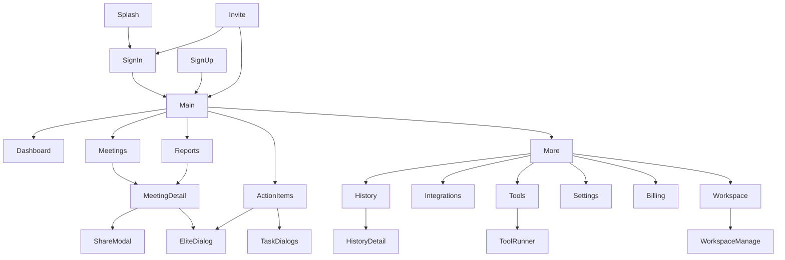

# Artivaa Android App — Complete UI Design Spec (Web Parity, No API)

> **Goal:** Pehle poora app **design + static screens** banao — bilkul web app jaisa color, font, layout, features.  
> **API:** Phase 1 (Sprint 3–7) mein **koi API nahi** — sirf mock data.  
> **Master plan:** [`artivaa-android-compose-plan.md`](./artivaa-android-compose-plan.md) — Sprint 1–2 ✅ done.  
> **Learning:** [`android_compose_learning.md`](./android_compose_learning.md) — AI agents isko pehle padhen.  
> **Web source:** `frontend/src/app/` + `globals.css` + `dashboard-sidebar.tsx`  
> **Last updated:** May 2026

---

## 1. Approach — Pehle design, baad mein API

```
Phase A (tum ab yahan ho)     Phase B (baad mein)
─────────────────────────     ───────────────────
✅ Design tokens              → Retrofit + Clerk auth
✅ Saari screens (mock)       → Real API wiring
✅ Navigation flow            → Plan gates live
✅ Empty / locked / dialog    → Push notifications
```

**Rule:** Har screen pe **hardcoded mock JSON** ya `MockData.kt` se data aaye. Buttons click pe navigation ya dialog dikhe — network call mat karo.

---

## 2. Design System (Web se 1:1 copy)

### 2.1 Colors — `res/values/colors.xml`

| Token | Hex | Android name | Web usage |
|-------|-----|--------------|-----------|
| Primary | `#6C3FF5` | `artivaa_primary` | Buttons, active nav, links |
| Primary Dark | `#5B2FE0` | `artivaa_primary_dark` | Pressed / hover |
| Primary Light | `#EDE9FE` | `artivaa_primary_light` | Active nav bg, badges |
| Elite Accent | `#7C3AED` | `artivaa_elite` | Elite badge |
| Background | `#F8F9FA` | `artivaa_bg` | Screen background |
| Surface | `#FFFFFF` | `artivaa_surface` | Cards |
| Surface Variant | `#F1F3F4` | `artivaa_surface_variant` | Inputs, switcher trigger |
| Border | `#DADCE0` | `artivaa_border` | Card borders |
| Text Primary | `#202124` | `artivaa_text` | Headings, body |
| Text Secondary | `#5F6368` | `artivaa_text_secondary` | Subtitles |
| Text Disabled | `#9AA0A6` | `artivaa_text_disabled` | Placeholders |
| Success | `#34A853` | `artivaa_success` | Done badges |
| Success Light | `#E6F4EA` | `artivaa_success_light` | Success bg |
| Success Text | `#137333` | `artivaa_success_text` | Done label |
| Error | `#EA4335` | `artivaa_error` | Delete, failed |
| Error Light | `#FCE8E6` | `artivaa_error_light` | Error banner |
| Error Text | `#C5221F` | `artivaa_error_text` | Error label |
| Warning | `#FBBC04` | `artivaa_warning` | Processing |
| Warning Light | `#FEF7E0` | `artivaa_warning_light` | Locked banner bg |
| Warning Text | `#B06000` | `artivaa_warning_text` | Processing label |
| Info Blue | `#1A73E8` | `artivaa_info` | In progress |
| Info Light | `#E8F0FE` | `artivaa_info_light` | Trial badge |
| Trial Blue | `#1967D2` | `artivaa_trial` | Trial pill |

**Platform badges (Meetings):**

| Platform | Text | Background |
|----------|------|------------|
| Google Meet | `#00AC47` | `#E8F5E9` |
| Zoom | `#2D8CFF` | `#E3F2FD` |
| Teams | `#6264A7` | `#EDE7F6` |
| Outlook | `#0078D4` | `#E3F2FD` |

**Tool accent colors:**

| Tool | Icon color | Icon bg |
|------|------------|---------|
| Meeting Summarizer | `#6C3FF5` | `#EDE9FE` |
| Task Generator | `#059669` | `#D1FAE5` |
| Document Analyzer | `#D97706` | `#FEF3C7` |
| Email Generator | `#2563EB` | `#DBEAFE` |

### 2.2 Typography — Google Fonts (web jaisa)

Download in `res/font/`:

| Role | Font | Size | Weight | Line height |
|------|------|------|--------|-------------|
| Page title | **Work Sans** | 22sp | Bold (700) | 28sp |
| Section heading | **Work Sans** | 16–18sp | SemiBold (600) | 24sp |
| Body | **Inter** | 14sp | Regular (400) | 20sp |
| Label caps | **Inter** | 12sp | SemiBold (600) | 16sp, letterSpacing 0.05 |
| Caption | **Inter** | 12sp | Regular (400) | 16sp |
| Button | **Inter** | 14sp | SemiBold (600) | — |

**Compose example:**
```kotlin
val ArtivaaTypography = Typography(
    headlineMedium = TextStyle(fontFamily = WorkSans, fontSize = 22.sp, fontWeight = FontWeight.Bold, color = ArtivaaColors.Text),
    titleMedium = TextStyle(fontFamily = WorkSans, fontSize = 16.sp, fontWeight = FontWeight.SemiBold),
    bodyMedium = TextStyle(fontFamily = Inter, fontSize = 14.sp, lineHeight = 20.sp),
    labelSmall = TextStyle(fontFamily = Inter, fontSize = 12.sp, fontWeight = FontWeight.SemiBold, letterSpacing = 0.6.sp)
)
```

### 2.3 Spacing & shapes

| Token | Value |
|-------|-------|
| Screen padding | 16dp (mobile), 20dp (tablet) |
| Card radius | 12dp (`RoundedCornerShape(12.dp)`) |
| Button radius | 8dp |
| Pill / search | full rounded |
| Card elevation | 1dp default, 4dp pressed |
| Bottom nav height | 64dp |
| Top app bar | 56dp |

### 2.4 Icons

Web **Material Symbols Outlined** use karta hai — Android pe bhi same:

```gradle
implementation "androidx.compose.material:material-icons-extended"
// ya Material Symbols font embed karo
```

**Sidebar icon mapping (web = Android):**

| Label | Material icon name |
|-------|-------------------|
| Dashboard | `Dashboard` |
| Meetings | `Videocam` |
| Reports | `BarChart` |
| Action Items | `Assignment` |
| History | `History` |
| Integrations | `Extension` |
| Tools | `Build` |
| Settings | `Settings` |
| Billing | `CreditCard` |
| Workspace | `WorkspacePremium` / `Group` |

---

## 3. Navigation Architecture (Mobile)

Web sidebar → Android **Bottom Nav + Drawer/More**

### 3.1 Bottom Navigation (5 tabs — primary)

| Tab | Icon | Screen |
|-----|------|--------|
| Home | dashboard | Dashboard |
| Meetings | videocam | Meetings List |
| Reports | bar_chart | Reports |
| Tasks | assignment | Action Items |
| More | menu | Drawer opens |

### 3.2 Drawer / More menu

| Item | Route |
|------|-------|
| History | HistoryListScreen |
| Tools | ToolsHubScreen |
| Integrations | IntegrationsScreen |
| Workspace | WorkspaceListScreen |
| Settings | SettingsScreen |
| Billing | BillingScreen |
| Sign Out | (mock dialog) |

### 3.3 Workspace switcher (Drawer header — web jaisa)

```
┌─────────────────────────────┐
│ [🟣] Artivaa AI             │
│      Personal          ▼    │  ← tap = bottom sheet
├─────────────────────────────┤
│ ○ Personal                  │
│ ○ Acme Team                 │
│ ○ Create workspace (Elite)  │
└─────────────────────────────┘
```

- Non-Elite user team select kare → **EliteRequiredDialog** (mock: plan = Pro)

### 3.4 Global App Bar (har screen)

```
[← Back?]  Page Title          [🔍] [🔔] [Avatar]
           Wed, May 19
```

Web `dashboard-header.tsx` jaisa — title + date subtitle.

---

## 4. Complete Screen List (42 screens)

Har screen ka **mock plan state** bhi likha hai taaki locked UI bhi design ho.

### 4.1 Auth & Onboarding (5 screens)

| # | Screen ID | Web route | UI elements |
|---|-----------|-----------|-------------|
| A1 | `SplashScreen` | — | Purple logo, "Artivaa AI", 1.5s → SignIn |
| A2 | `SignInScreen` | `/sign-in` | Dark bg `#030712`, email/password fields, Google SSO button, "Sign up" link |
| A3 | `SignUpScreen` | `/sign-up` | Same dark theme, name + email + password |
| A4 | `InviteScreen` | `/invite` | Light bg, workspace name, Accept / Sign in first |
| A5 | `InviteTokenScreen` | `/invite/[token]` | Loading, success, error, email mismatch states (4 variants) |

**Mock:** Sign in button → `MainActivity` (plan = Free default)

---

### 4.2 Dashboard (1 screen)

| # | Screen ID | Web route |
|---|-----------|-----------|
| D1 | `DashboardScreen` | `/dashboard` |

**Layout (scroll):**

```
┌─ Stats row (horizontal scroll, 4 cards) ─────────────┐
│ Total Meetings │ This Month │ Action Items │ Done   │
├─ Today's Meetings ─────────────────────────────────────┤
│ [Meet card] platform badge, time, Start Notetaker    │
├─ Recent Reports ─────────────────────────────────────┤
│ Table: Title | Date | Status | View                    │
├─ Meeting Progress card (purple gradient) ─────────────┤
│  % with AI summaries + progress bar + "X of Y meetings…" │
├─ Quick Actions: Record Audio | Connect Calendar ─────┤
└──────────────────────────────────────────────────────┘
```

**Mock data:** 2 today meetings, 3 recent reports, stats numbers hardcoded.

**Today's Meetings empty states (personal mode, in order):**
1. Has events → meeting cards
2. All calendars failed (`partialFailure`) → "Calendar needs reconnecting" + Reconnect CTA
3. No calendar connected → "No calendar connected" + Connect CTA
4. Calendar OK, 0 today → "No meetings scheduled today"

**Meeting Progress card (NOT "Weekly Efficiency"):**
- Title: Meeting Progress
- `{rate}%` + label "with AI summaries"
- Footer: `{completed} of {total} meetings processed with summaries or transcripts.`
- Do NOT show action-item count on this card (Free plan Action Items stat = 0 is OK).

**Full Cursor prompt:** [`artivaa-android-dashboard-cursor-prompt.md`](./artivaa-android-dashboard-cursor-prompt.md)

---

### 4.3 Meetings (4 screens)

| # | Screen ID | Web route |
|---|-----------|-----------|
| M1 | `MeetingsListScreen` | `/dashboard/meetings` |
| M2 | `MeetingDetailScreen` | `/dashboard/meetings/[id]` |
| M3 | `CalendarEventDetailScreen` | calendar-only meeting |
| M4 | `JoinWithCodeSheet` | modal from meetings |

**M1 — Meetings List**

- Segmented filter: All | Today | This Week | This Month
- Header buttons: "Schedule New", "Join with Code" (primary purple)
- Date-grouped list (`CalendarMeetingRow` style)
- FAB purple `+` bottom-right
- Empty state: "Connect your calendar" + CTA
- **Workspace mode variant:** shared meetings, READY/RECORDING badges

**M2 — Meeting Detail (main screen — 3 tabs)**

Top bar: Back | Share to Workspace | Download | Delete

Header card: status badge, platform, title, date, duration

**Tab 1 — Overview (`notes`)**
- AI Summary + Share Summary button (purple)
- Key Discussion Points (numbered circles `#EDE9FE`)
- Key Decisions (check icons)
- Risks & Blockers (amber left border)
- Action Items table: Task | Owner | Due | Priority | Action
- Copy as Markdown / Copy as Text buttons

**Tab 2 — Transcript**
- Audio player bar (mock waveform)
- Speaker distribution bars
- Transcript blocks: speaker name, timestamp, text

**Tab 3 — Insights**
- Engagement score, sentiment, topics, word cloud, chapters

**AI Notetaker card (bottom or top):**
- Start / Stop Recording (purple / red)
- Upgrade banner variant (Free limit / Pro limit)

**Modals:** ShareSummary, DeleteMeeting, EliteRequired (download/share)

**Mock:** 1 completed meeting with full data, 1 in-progress, 1 scheduled.

---

### 4.4 Reports (1 screen)

| # | Screen ID | Web route |
|---|-----------|-----------|
| R1 | `ReportsListScreen` | `/dashboard/reports` |

- Search bar + status filter + date filter
- 2-column card grid (phone: 1 column)
- Card: platform icon, title, date, status badge, summary preview
- Pagination dots
- **Locked variant (Free plan):** amber banner "Meeting reports require Pro or Elite" + Upgrade CTA

---

### 4.5 Action Items / Task Backlog (1 screen + 8 modals)

| # | Screen ID | Web route |
|---|-----------|-----------|
| T1 | `ActionItemsScreen` | `/dashboard/action-items` |

**Header**
- Breadcrumb: Workspaces › Personal › Task Backlog
- Buttons: Share | Export CSV | Create Task (purple)

**Tabs:** All | Assigned to Me | Created by Me

**Toolbar:** Search, Filter (priority/status/due/assignee), Member filter (admin)

**Stats row:** Total Issues | High Priority | In Progress | Completed

**Table (LazyColumn rows):**
| ☐ | KEY | SUMMARY | ASSIGNEE | PRIORITY | STATUS | DUE | ⋮ |

**Bulk bar (purple bg when selected):** Status | Priority | Delete

**Plan variants:**
- **Free:** Full-page amber locked banner
- **Pro:** Read-only banner purple + table view-only (dropdowns disabled, buttons show Elite dialog)
- **Elite:** Full edit

**Modals (separate composables):**
1. `NewTaskDialog`
2. `EditTaskDialog`
3. `DeleteConfirmDialog`
4. `BulkStatusDialog`
5. `BulkPriorityDialog`
6. `ExportCsvDialog`
7. `ShareIntegrationsDialog` (Slack, Jira, Gmail, Notion)
8. `EliteRequiredDialog`

**FAB:** Purple `+` bottom-right (same as web)

---

### 4.6 History (2 screens)

| # | Screen ID | Web route |
|---|-----------|-----------|
| H1 | `HistoryListScreen` | `/dashboard/history` |
| H2 | `HistoryDetailScreen` | `/dashboard/history/[id]` |

**H1**
- Filters: Run Type | Status | Timeframe (7d/30d/90d/all)
- Grid of run cards (tool icon, title, date, status badge)
- **Free locked:** amber banner

**H2**
- Header: tool name, title, date, status
- Download PDF | Share (purple) — Elite dialog on Pro
- Tool-specific output body (email / tasks / document / meeting summarizer layouts)
- Share modal bottom sheet

**Mock:** 1 card per tool type (4 cards minimum)

---

### 4.7 AI Tools (5 screens)

| # | Screen ID | Web route | Accent |
|---|-----------|-----------|--------|
| O1 | `ToolsHubScreen` | `/dashboard/tools` | — |
| O2 | `EmailGeneratorScreen` | `.../email-generator` | Blue |
| O3 | `TaskGeneratorScreen` | `.../task-generator` | Green |
| O4 | `DocumentAnalyzerScreen` | `.../document-analyzer` | Orange |
| O5 | `MeetingSummarizerScreen` | `.../meeting-summarizer` | Purple |

**O1 — Tools Hub**
- "Core Modules" — 4 tool cards + "Request Module" dashed card
- Enterprise gradient banner bottom

**O2–O5 — shared shell (`ToolPageShell`)**
```
Breadcrumb: Tools › {Tool Name}
[Icon] Tool Name          [Available ✓ badge]
Description text
─────────────────────────
Input form (tool-specific)
[Generate ▶] primary button
─────────────────────────
Results panel (mock output)
```

**All tools Free pe available** — koi lock nahi.

---

### 4.8 Integrations (1 screen)

| # | Screen ID | Web route |
|---|-----------|-----------|
| I1 | `IntegrationsScreen` | `/dashboard/integrations` |

**Section 1 — Calendar**
- Google Calendar card: Connect / Manage
- Microsoft Teams card
- Outlook card

**Section 2 — Productivity**
- Table rows: Slack | Gmail | Notion | Jira
- Toggle on/off + expandable Configure panel (fields, Save, Test)

**Toast mock:** top snackbar green/red

---

### 4.9 Billing (1 screen)

| # | Screen ID | Web route |
|---|-----------|-----------|
| B1 | `BillingScreen` | `/dashboard/billing` |

**Sections:**
1. Current plan banner + meetings used progress bar
2. Trial progress (if trial mock)
3. Plan cards: Free ₹0 | Pro ₹99 "Most Popular" | Elite ₹199 "Best Value"
4. Feature comparison table (scroll horizontal on phone)
5. Payment history list
6. Help footer links

**CTAs:** Current Plan (outlined) | Upgrade (purple) | Downgrade disabled on Free

---

### 4.10 Settings (1 screen, 6 tabs)

| # | Screen ID | Web route |
|---|-----------|-----------|
| S1 | `SettingsScreen` | `/dashboard/settings` |

**Tabs (horizontal scroll pills on phone):**

| Tab | Content |
|-----|---------|
| Profile | Avatar, name edit, email verified badge, member since, timezone |
| Account | Change password, connected accounts, delete account (red) |
| Subscription | Current plan card, upgrade links |
| Preferences | Notification toggles, AI tone/length/language, bot name, auto-share toggles |
| Integrations | Quick links to I1 |
| Usage & Limits | Meeting usage bar, stats, delete data button |

Sticky bottom bar: "Save preferences" (purple) when changes detected.

---

### 4.11 Workspace (2 screens)

| # | Screen ID | Web route |
|---|-----------|-----------|
| W1 | `WorkspaceListScreen` | `/dashboard/workspace` |
| W2 | `WorkspaceManageScreen` | workspace selected |

**W1**
- New Workspace button (Elite) / Elite upsell link
- Grid of workspace cards: name, role badge, member count
- Empty state + Elite CTA

**W2**
- Rename workspace (admin)
- Members list: avatar, name, role dropdown, remove
- Pending move requests
- Transfer ownership
- Invite members card
- Stats sidebar: members, shared meetings

---

### 4.12 Shared Dialogs / Overlays (6)

| Dialog | When |
|--------|------|
| `EliteRequiredDialog` | Export, share, edit tasks, team workspace |
| `UpgradeProDialog` | Free user on History / Action Items / Reports |
| `ConfirmDeleteDialog` | Delete meeting / task / account |
| `WorkspaceSwitcherBottomSheet` | Drawer header tap |
| `ShareSummaryBottomSheet` | Meeting share |
| `LoadingShimmer` | Skeleton placeholders (optional Sprint 1) |

---

## 5. Reusable Android Components (banao pehle — Sprint 0)

```
ui/components/
├── ArtivaaPrimaryButton.kt      // purple filled
├── ArtivaaSecondaryButton.kt    // white + purple border
├── ArtivaaCard.kt               // white, 12dp radius, border #DADCE0
├── ArtivaaStatCard.kt           // dashboard stats
├── ArtivaaBadge.kt              // status/platform/plan pills
├── ArtivaaEmptyState.kt         // dashed border + icon
├── ArtivaaSegmentedControl.kt   // All|Today|Week filter
├── ArtivaaSearchField.kt
├── ArtivaaTopBar.kt             // title + date + icons
├── ArtivaaBottomNav.kt
├── ArtivaaDrawer.kt
├── ArtivaaLockedBanner.kt       // amber Pro upgrade
├── ArtivaaReadOnlyBanner.kt     // purple Pro view-only
├── ArtivaaEliteDialog.kt
├── ArtivaaShimmer.kt
└── ArtivaaToast.kt
```

**Plan badge colors (sidebar footer jaisa):**

| Plan | Background | Text |
|------|------------|------|
| Free | `#F1F3F4` | `#5F6368` |
| Pro | `#EDE9FE` | `#6C3FF5` |
| Elite | `#F3E8FF` | `#7C3AED` |
| Trial | `#E8F0FE` | `#1967D2` |

---

## 6. Mock Data Layer (API ke bina)

```kotlin
// data/mock/MockData.kt
object MockData {
    val currentPlan = Plan.PRO  // switch karke UI test: FREE, PRO, ELITE, TRIAL
    val user = User(name = "Pulkit", email = "pulkit@example.com", plan = currentPlan)
    val meetings = listOf(/* 5 meetings */)
    val actionItems = listOf(/* 12 tasks */)
    val historyRuns = listOf(/* 8 runs */)
    val workspaces = listOf(/* 2 workspaces */)
    // ...
}

enum class Plan { FREE, PRO, ELITE, TRIAL }
```

**Plan switch:** Debug menu ya `MockData.currentPlan` change karke saari locked states test karo.

---

## 7. Sprint Plan — UI Only (No API)

> **Sprint 1 & 2 complete** — see [`artivaa-android-compose-plan.md`](./artivaa-android-compose-plan.md).  
> Neeche wale sprints ab **Sprint 3–7** ke saath align hain.

### ~~Sprint 0~~ — Foundation (merged into Sprint 1 ✅)

### ~~Sprint 1–2~~ — DONE (skeleton + meetings)

### Sprint 3 — Reports + Action Items (current)
- [ ] R1 Reports (cards + Free locked variant)
- [ ] T1 Action Items table + tabs + stats
- [ ] T1 Free locked + Pro read-only + Elite full
- [ ] All 8 action item dialogs
- [ ] Bottom nav Reports tab

### Sprint 4 — History + Tools
- [ ] H1 History list + Free locked
- [ ] H2 History detail (4 tool output layouts)
- [ ] O1 Tools hub
- [ ] O2–O5 Tool runner screens (mock input + mock output)

### Sprint 5 — Settings + Billing + Integrations (3–4 days)
- [ ] I1 Integrations (calendar + productivity toggles)
- [ ] B1 Billing (plan cards + comparison table)
- [ ] S1 Settings (6 tabs)
- [ ] A4–A5 Invite screens

### Sprint 6 — Workspace + Polish (3 days)
- [ ] W1 Workspace list
- [ ] W2 Workspace manage
- [ ] Elite / Pro dialogs wired everywhere
- [ ] Empty states all screens
- [ ] Loading shimmer
- [ ] Dark mode? (optional — web mein nahi hai, skip for v1)

**Total UI-only: ~6 sprints (~3 weeks part-time / 2 weeks full-time)**

---

## 8. Screen Flow Diagram



---

## 9. Web ↔ Android Screen Map

| Web route | Android screen |
|-----------|----------------|
| `/sign-in` | SignInScreen |
| `/dashboard` | DashboardScreen |
| `/dashboard/meetings` | MeetingsListScreen |
| `/dashboard/meetings/[id]` | MeetingDetailScreen |
| `/dashboard/reports` | ReportsListScreen |
| `/dashboard/action-items` | ActionItemsScreen |
| `/dashboard/history` | HistoryListScreen |
| `/dashboard/history/[id]` | HistoryDetailScreen |
| `/dashboard/tools` | ToolsHubScreen |
| `/dashboard/tools/*` | Email/Task/Doc/Summarizer screens |
| `/dashboard/integrations` | IntegrationsScreen |
| `/dashboard/billing` | BillingScreen |
| `/dashboard/settings` | SettingsScreen |
| `/dashboard/workspace` | WorkspaceList + Manage |
| `/invite` | InviteScreen |

---

## 10. QA Checklist (Design parity)

Before API sprint, verify:

- [ ] Primary purple `#6C3FF5` har CTA pe same hai
- [ ] Work Sans titles, Inter body — web jaisa
- [ ] Card radius 12dp, border `#DADCE0`
- [ ] Bottom nav 5 tabs match web sidebar order
- [ ] Free / Pro / Elite teen UI states Action Items pe test ho
- [ ] Elite dialog export/share/edit pe aata hai (Pro mock)
- [ ] Amber banner Free pe History, Reports, Action Items pe
- [ ] Meeting detail 3 tabs content web jaisa
- [ ] Tool cards 4 colors match web accents
- [ ] Plan pills sidebar/drawer footer mein sahi color

---

## 11. Recommended Project Structure

```
app/src/main/java/com/artivaa/
├── ui/
│   ├── theme/          # Color, Type, Theme
│   ├── components/     # Reusable UI
│   ├── navigation/     # NavHost, routes
│   ├── auth/
│   ├── dashboard/
│   ├── meetings/
│   ├── reports/
│   ├── actionitems/
│   ├── history/
│   ├── tools/
│   ├── integrations/
│   ├── billing/
│   ├── settings/
│   └── workspace/
├── data/mock/          # MockData.kt — NO API YET
└── MainActivity.kt
```

**Tech stack (recommended):**
- Kotlin + Jetpack Compose
- Navigation Compose
- Material 3 (colors override karke web palette)
- No ViewModel network calls until Phase B

---

## 12. Next Step After UI Complete

1. Clerk Android SDK → auth
2. Retrofit → `artivaa-backend.onrender.com`
3. Plan limits → `SubscriptionRepository`
4. Replace `MockData` with API one screen at a time (Meetings first)

---

*Yeh document web app ke saath aligned hai. Web change ho to `globals.css` + `dashboard-sidebar.tsx` check karo aur is spec ko update karo.*
